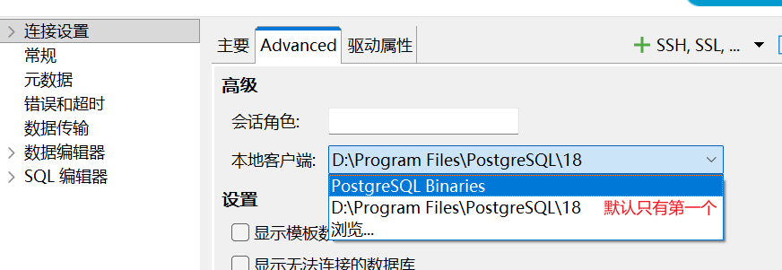
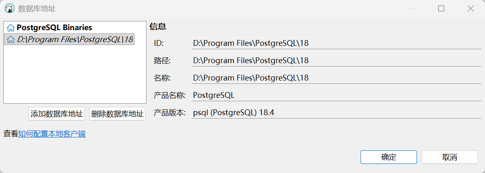

# dbeaver本地客户端升级18
dbeaver的本地客户端自动下载的是17版本，但是服务器安装的最新的pgsql是18版本，会导致dbeaver无法备份数据库，需要将dbeaver升级到18版本。
1. 去pgsql官网下载最新的pgsql，向下兼容的。https://www.postgresql.org/download/windows/
2. 安装后记住安装目录，如`D:\Program Files\PostgreSQL\18`
3. 打开dbeaver，找到连接的pgsql数据库，右键选择`编辑连接 F4`。
4. 在编辑连接界面，选择 Advanced 选项，本地客户端中点击浏览。
      
5. 添加安装的pgsql目录：
      
6. 回到上个界面，本地客户端选择我们自己的，确定。

# 添加bin目录
安装pgsql后默认不会添加bin目录到环境变量，导致无法使用pgsql的命令行工具。
1. 打开环境变量，在系统变量中找到`Path`变量，编辑。
2. 添加pgsql的bin目录，如`D:\Program Files\PostgreSQL\18\bin`

在 DBeaver 中`右键数据库-工具-备份`，然后在弹出的窗口中勾选完整备份，这样备份数据库和使用`pg_dump`命令备份是一差不多的，貌似就多了些注释。
如果选`全局备份`则是备份所有数据库，而不是当前选择的数据库。