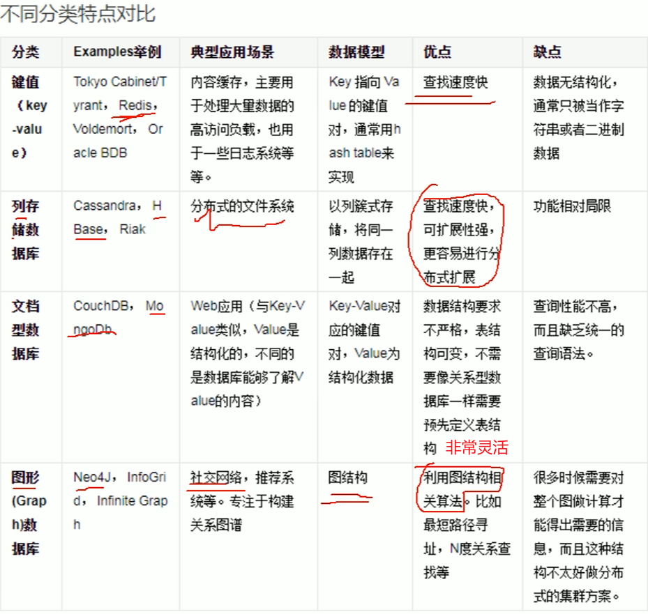

[Redis极简入门](https://www.bilibili.com/video/BV15L411D7yo/?vd_source=8220e726dcb3a350fd156cea947bd58b)

# 什么是Redis
Redis是一个开源的内存数据结构存储系统（一种NoSQL数据库），可以用作数据库、缓存和消息中间件。它支持多种数据结构，如字符串、哈希、列表、集合、有序集合等。Redis以其高性能、丰富的数据类型和简单的使用方式而闻名，广泛应用于各种场景，如缓存、排行榜、实时分析等。

普通关系型数据库如MySQL，数据是存在硬盘上的，读写很慢，一般单表数据量需控制在千万条以内；一般的服务器处理sql语句为2000-4000条/s。而Redis是存在内存中的，读写速度快，数据量可以达到上亿条，处理速度可以达到100000条/s。

## NoSQL数据库分类
  

## Redis的特点
1. 单线程：Redis使用单线程模型，避免了多线程带来的复杂性和性能问题。通过事件循环机制，Redis能够高效地处理大量的并发请求。Redis6.0版本开始支持多线程，但是同一时刻只能处理一个请求。
2. Redis不建议存敏感数据，因为数据是存在内存中的，服务器宕机会导致数据丢失。可以通过持久化机制将数据保存到磁盘上，或者使用主从复制等方式来提高数据的可靠性。