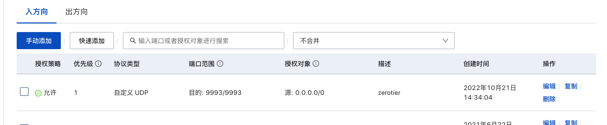
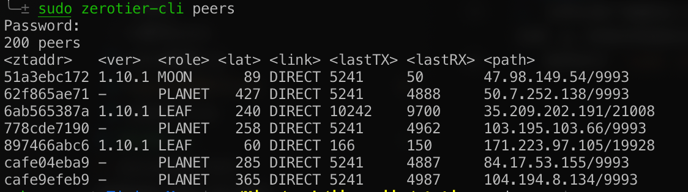

# zerotier 安装
基本的安装使用看这篇就行了：[一个能用的 Moonlight + Zerotier 游戏串流教程](https://gump.cloud/2022/02/24/%E4%B8%80%E4%B8%AA%E8%83%BD%E7%94%A8%E7%9A%84%20Moonlight%20+%20Zerotier%20%E6%B8%B8%E6%88%8F%E4%B8%B2%E6%B5%81%E6%95%99%E7%A8%8B/#Moonlight)

1. 前往 zerotier 官网注册，并下载客户端安装。[官网地址](https://my.zerotier.com/network/6ab565387a15de2b)
2. 在 zerotier 官网上创建一个网络（应该默认就有一个，可以不用创建），记住 network id。
3. 在客户端上启动 zerotier，并通过 network id 加入网络。加入后需要去官网中勾选 auth，允许主机。

由于 zerotier 服务器在国外，直接使用会出现连不上的情况，所以需要购买云服务器并安装 zerotier moon 作为中转。

这里介绍下 zerotier 服务器的一个概念：  
PLANET: 行星服务器，即 zerotier 的根服务器（国外那个）
MOON: 卫星服务器，即我们自己搭建的服务器
LEAF: 叶节点，即各个客户端

# zerotier moon 安装
1. 连上阿里云，运行 `curl -s https://install.zerotier.com | sudo bash` 等待安装完成。
2. `sudo zerotier-cli join xxxxxx`(官网上的 network id)，加入网络
3. 进入官网允许加入
4. `cd /var/lib/zerotier-one` 进入 zerotier 安装目录
5. `sudo zerotier-idtool initmoon identity.public >> moon.json` 生成配置文件
6. `sudo vi moon.json` 编辑配置文件
7. 将配置文件中的 `"stableEndpoints": []` 修改成 `"stableEndpoints": [“ServerIP/9993”]`，将 ServerIP 替换成云服务器的公网 IP。
8. `sudo zerotier-idtool genmoon moon.json` 生成 .moon 文件
9. `sudo mkdir moons.d` 创建 moon.d 目录
10. `sudo mv 000000xxxxxxxxxx.moon moons.d` 将上面生成的 .moon 文件移到 moons.d 目录
11. `sudo systemctl restart zerotier-one` 重启 zerotier
12. 在阿里云控制台-安全组-配置规则中，配置防火墙，允许 9993 端口，协议为 UDP：
  

至此，我们的 moon 服务器就搭建好了。

# 客户端连接 moon 服务器
我们在客户端上安装了 zerotier 后，就拥有了 zerotier-cli 命令。

在客户端控制台运行命令：  
`sudo zerotier-cli orbit 【moon的网络号】 【moon的网络号】`  
moon 的网络号即上面生成的 moon.json 文件中的 id。

查看是否生效：
`sudo zerotier-cli listpeers`  
moon 服务器的 ID 、IP 地址出现在列表中，证明连通 moon 服务器。

# 连接测试
1. 当两台客户端都连入自建的 moon 服务器后，可以通过 ping 对方客户端的内网 ip 来测试网络延迟。
2. 使用命令 `sudo zerotier-cli peers` 查看所有设备连接状态，link 项为 DIRECT 时表示 P2P 连接成功。
  
