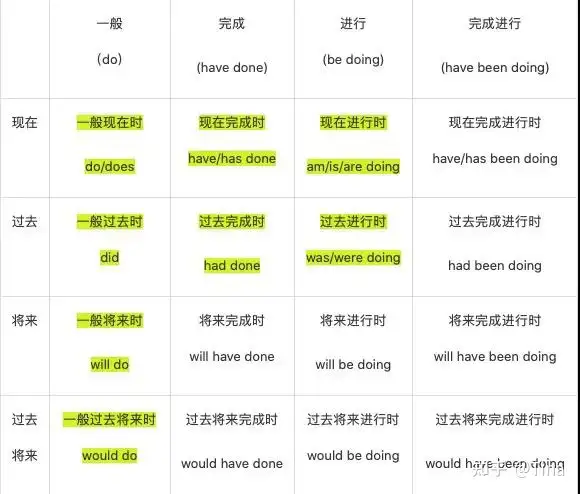

你可以把时态想象成代码里的 **`Timestamp`（时间戳）** 和 **`State`（状态）**。

英语中共有 16种时态，由4种时间（现在、过去、将来、过去将来）与4种体态（一般、进行、完成、完成进行）组合而成。在日常学习和交流中，最核心、常用的为八大时态，涵盖了绝大多数的动词时态形式。
  

---

## 一、 现在时态 (Present) —— 关注“当下”

### 1. 一般现在时 (Simple Present)

* **结构：** `Subject + 动词原形` (注意：主语是 He/She/It 时，动词加 `-s/es`)
* **用法：** 1.  **客观真理/常态：** 永远不变的事情。
2.  **习惯动作：** 每天骑车上班。
3.  **程序逻辑：** 这个函数实现什么功能。
* **例子：**
* *Life:* I **ride** my bike to work every day. (习惯)
* *Code:* This API **returns** a JSON object. (函数功能)
* *Fact:* The Earth **moves** around the Sun. (真理)

### 2. 现在进行时 (Present Continuous)

* **结构：** `am/is/are + 动词-ing`
* **用法：** 1.  **正在发生：** 此时此刻。
2.  **阶段性动作：** 这段时间我正在开发这个模块。
* **例子：**
* *Life:* I **am listening** to English now. (正在听)
* *Code:* The system **is downloading** the update. (正在下载)

### 3. 现在完成时 (Present Perfect) —— **重点 & 难点**

* **结构：** `have/has + 动词过去分词 (V3)`
* **用法：** 1.  **动作结束，影响还在：** 强调“结果”。比如：我修好Bug了（结果是代码现在能跑了）。
2.  **人生经历：** 我去过北京。
* **例子：**
* *Life:* I **have lost** my key. (钥匙丢了，现在进不去门，强调对现在的影响)
* *Code:* We **have deployed** the new version. (已经部署好了，现在用户可以用了)

---

## 二、 过去时态 (Past) —— 关注“以前”

### 4. 一般过去时 (Simple Past)

* **结构：** `Subject + 动词过去式 (V2)`
* **用法：** 1.  **过去发生的特定动作：** 必须有一个具体的过去时间（或语境）。
2.  **已结束的状态：** 以前是，现在不是了。
* **例子：**
* *Life:* I **bought** a new bike yesterday. (昨天买的)
* *Code:* The server **crashed** two hours ago. (两小时前崩的)

### 5. 过去进行时 (Past Continuous)

* **结构：** `was/were + 动词-ing`
* **用法：** 1.  **过去某刻正在做：** 像照片快照一样记录那个瞬间。
2.  **背景描述：** 我正在写代码时，老板进来了。
* **例子：**
* *Life:* I **was sleeping** at 10 PM last night. (昨晚十点那个瞬间，我正在睡)
* *Code:* The program **was running** when the error occurred. (报错时，程序正在运行)

### 6. 过去完成时 (Past Perfect) —— **“过去的过去”**

* **结构：** `had + 动词过去分词 (V3)`
* **用法：** 1.  **动作发生在另一个过去动作之前：** (A 动作 -> B 动作 -> 现在)。A 就是过去完成时。
* **例子：**
* *Life:* When I got to the station, the bus **had left**. (我到车站是“过去”，车开走是“过去的过去”)
* *Code:* I **had saved** the file before the system shut down. (关机前，我已经存过档了)

---

## 三、 将来时态 (Future) —— 关注“以后”

### 7. 一般将来时 (Simple Future)

* **结构：** `will + 动词原形` 或 `be going to + 动词原形`
* **用法：** 1.  **预测：** 以后会发生。
2.  **打算/承诺：** 我会修好它的。
* **例子：**
* *Life:* It **will rain** tomorrow. (明天会下雨)
* *Code:* This feature **will be** available next month. (下个月上线)

### 8. 过去将来时 (Past Future)

* **结构：** `would + 动词原形`
* **用法：** 1.  **从过去看未来：** 常出现在 "He said..." "I thought..." 之后。
* **例子：**
* *Life:* I knew you **would come**. (我当时就知道你会来)
* *Code:* I thought the update **would fix** the bug. (我原以为这次更新能修好那个Bug，结果没修好)

---

## 四、 总结与速记表

| 维度 | 时间 | 结构 | 核心逻辑 |
| --- | --- | --- | --- |
| **一般** | 现在 | `do/does` | 常态、规律、逻辑定义 |
|  | 过去 | `did` | 过去某时发生的动作（已结束） |
|  | 将来 | `will do` | 以后要发生的动作/计划 |
| **进行** | 现在 | `is doing` | 正在运行，还没停 |
|  | 过去 | `was doing` | 当时正在运行（快照） |
| **完成** | 现在 | `have done` | **做完了！**（看现在的结果） |
|  | 过去 | `had done` | **在那之前就做完了！** |
| **过去将来** | 过去看以后 | `would do` | 站在过去预测未来 |

---

## 专家给程序员的特别建议：

在写代码注释时，你其实只需要这三个时态就能解决 90% 的问题：

1. **一般现在时：** 描述函数“是干嘛的”。 (`Returns the user status.`)
2. **一般将来时：** 描述“待办事项”。 (`TODO: will implement this later.`)
3. **一般过去时/现在完成时：** 描述“修了什么”。 (`Fixed the memory leak.` 或 `Have fixed...`)

---

### 今天的练习 (Exercise)

别再只看不写了！尝试用你今天新学的词 **glance** 或 **glimpse**，结合上面的时态，把下面两句话翻译成英文注释：

1. **（现在完成时）：** 我已经快速扫了一眼代码。(用 `glance`)
2. **（一般将来时）：** 明天我会详细查看这个 Bug。

**把你的答案写出来发给我。同时，别忘了贴一段你最近在写的中文代码注释，我来教你怎么用正确的“时态”把它们写漂亮！**