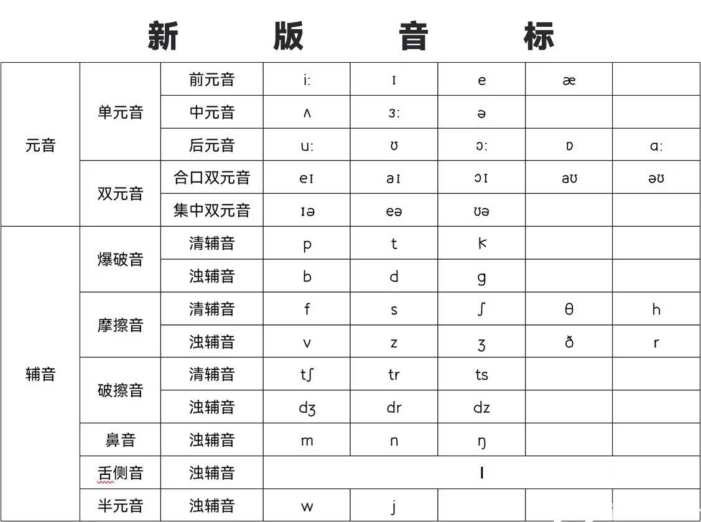

## DJ 音标 和 KK 音标
1. KK音标用“//”标注，而DJ音标是用“[]”标注的。
2. 使用":"表示长元音（紧元音）的不是KK音标。KK音标不使用符号":"，DJ音标使用。DJ音标有长音符号 , KK音标没有。
3. 使用/ɛ/、/ᴜ/的不是DJ音标。KK音标使用这两个符号，而DJ音标使用/e/、/ʊ/。
4. KK音标中，/e/ 、/o/其实是双元音，分别对应DJ音标中的[eɪ]、[oʊ]。
5. 有些卷舌音，KK音标弄了个小尾巴，DJ音标就没有标注（英音是几乎不卷舌的）

#### DJ 音标和 KK 音标详情及对比表：
**元音**
| DJ | KK | 示例 |
|:--:|:--:|:--:|
|ʌ|	ʌ|	cup, luck|
|ɑː|	ɑ|	arm, father|
|æ|	æ|	cat, black|
|e|	ɛ|	met, bed|
|ə|	ə|	away, cinema|
|əː|	ɝ/ɚ|	turn, learn, farmer, waterfall|
|i|	ɪ|	hit, sitting|
|iː|	i|	see, heat|
|ɔ|	ɑ|	hot, rock|
|ɔː|	ɔ|	call, four|
|u|	ʊ|	put, could|
|uː|	u|	blue, food|
|ai|	aɪ|	five, eye|
|au|	aʊ|	now, out|
|ei|	e|	say, eight|
|əu|	o|	go, home|
|ɔi|	ɔɪ|	boy, join|
|eə|	ɛr|	where, air|
|iə|	ɪr|	near, here|
|uə|	ʊr|	pure, tourist|

**辅音**
|DJ|	KK|	示例|
|:--:|:--:|:--:|
|b|	b|	bad, lab|
|d|	d|	did, lady|
|f|	f|	find, if|
|g|	g|	give, flag|
|h|	h|	how, hello|
|j|	j|	yes, yellow|
|k|	k|	cat, back|
|l|	l|	leg, little|
|m|	m|	man, lemon|
|n|	n|	no, ten|
|ŋ|	ŋ|	sing, finger|
|p|	p|	pet, map|
|r|	r|	red, try|
|s|	s|	sun, miss|
|ʃ|	ʃ|	she, crash|
|t|	t|	tea, getting|
|tʃ|	tʃ|	check, church|
|θ|	θ|	think, both|
|ð|	ð|	this, mother|
|v|	v|	voice, five|
|w|	w|	wet, window|
|z|	z|	zoo, lazy|
|ʒ|	ʒ|	pleasure, vision|
|dʒ|	dʒ|	just, large|

  

## 次重读音节
次重读音节是在下面有一瓢，读音应该比重读低，比弱读高。但是实际上也没比弱读高多少，实在不能区分甚至可以忽略，就读成弱读。

university: `/ˌjuːnɪˈvɜːrsəti/`
possibility: `/ˌpɑːsəˈbɪləti/`
represent: `/ˌreprɪˈzent/`

个人感觉弱读和次重读很像轻声和二声的区别。

另外，重读音节在最后一个和不是最后一个的发音也不一样。如上面的例子中最后一个，重读音节就在末尾的音节上，所以是类似四声。而前面两个都不是在末尾，则不是四声而是类似于发音比较重的一声。

所以，弱读音节发音类似于轻声；次重读音节发音类似于二声；重读音节发音类似于一声，在末尾是四声。

另外对于没有重音的单音节单词，如 die, he, dark, meet 则看做重音就是它自身，既是第一个音节，也是最后一个音节，结果就是作为最后一个音节发四声。

## /i:/ 和 /i/
/i:/ 和 /i/ 的发音是不一样的，长音 /i:/ 是类似中文的发音 yi 的长音，而短音 /i/ 则不是 yi 变短，而是舌头在 yi 相同的位置，进行自然的吐气的一种音，发音在 yi 和 ye 之间的一个声音。
比如 live，不是发“力v”，而更类似于“猎v”。

## /æ/
梅花音发音不是“啊”，而是嘴巴往两边张开，自然的往外吐气的发音。声音位于 /a:/ 和 /e:/ 之间。

## /ʌ/
这个发音不是“啊”，发音方式是嘴巴上下张开，不要张到发“啊”音的那么大，张开一些即可，然后自然的吐气的一个声音。是一种比较模糊的“啊”的声音。这个音发音时就是要注意嘴巴不能张太大发成“啊”。美式发音中，在弱读音节发音会类似于 /ə/，在重读音节时嘴巴要稍微张大一点，发音更像“啊”一些，但是也只是自然的张大一点，和“啊”还是有很大的区别，如 enough。

## /ə/ 和 /ɜ:/
/ə/ 的发音类似于“额”，但是却有区别。“额”的舌头是靠下放在下齿的，但是 /ə/ 是中央元音，舌头应该抬起来放在口腔中间悬空，类似 /ʌ/ 的位置。
/ɜ:/ 是 /ə/ 的长音，没有 /ə:/ 和 /ɜ/。发音分为英式和美式，英式没儿化音为“额”，美式有儿化音为“而”。
/ə/ 在结尾时美式发音通常会弱化为类似 /ʌ/ 的发音，如 data, comma。美式的 /ə/ 和 /ʌ/ 在弱读音节时，发音也是很相似的。

## /ʊ/
发音像“屋”那样嘴巴翘起，但是不要翘那么大，然后自然吐气的一个音，声音在“屋”和“哦”之间。比如 book 不是“不可”。

# /ʃ/ 和 /ʒ/
/ʃ/ 的发音不是中文的 xi。中文的 xi 舌头是放在下齿的，当发 /ʃ/ 的时候这样发，音就不对。应该是最微微张圆，类似噘嘴的样子（噘嘴音），舌头往上抬，悬空在上齿后面，但是不会碰到上齿，类似吹口哨的位置，然后吹气就行了。/ʒ/ 的口型是一样的，只是需要声带振动发浊辅音。

# /tʃ/ 和 /dʒ/
注意点和上面的 /ʃ/ 和 /ʒ/ 一样，注意舌头的位置，不是发 qi。

## 长元音和短元音
长元音 就是[i:] [ɜː] [a:] [ɔ:] [u:] 有 5 个。
短元音 就是[ɪ] [ə] [ʌ] [ɔ] [ʊ] [e] [æ] 一共是 7个。
短元音并不是长元音直接声音变短。长元音发音会比较饱满，而短元音嘴型会收一点，然后直接吐气，相对于长元音是更快速且省力的发音，所以音素与长元音是不一样的。

## 发音浊化
p - b, t - d, k - g, tr - dr.
在 s 后面大部分情况就会发生浊化。

## /ɔɪ/
这是一个双元音，发音是“哦诶”而不是“哦移”。如 boy 发音是“波诶”，point 不是发“破吟特”，从 choice 和 noise 的发音就更能分辨出来。

## /θ/ 和 /ð/
发音不是 /s/ 和 /z/，这两个音发的时候舌头要放在上下牙齿中间，而 /s/ 和 /z/ 不需要这样做。

## w
w 的发音是 /ˈdʌbljuː/，看到这个发音我们常会发为 /ˈdʌb ljuː/，实际上这个音应该发 /ˈdʌbl juː/。

## 连读
两个单词，前一个是辅音结尾，后一个是元音开头，那么就可以连读。注意这里是以音标为准，而不是单词的拼写。
如：take it, stop it, in an hour

## 关键
语言的关键就是好读，所以上面的发音，连读什么的，都是为了好读。

## /əʊ/ /o/ /oʊ/
DJ 音标：英式 /əʊ/；美式 /oʊ/。美式发音更圆润，更靠后点，更像“偶”的发音
KK 音标：/o/
如：
DJ音标（英音）：/bəʊt/
DJ音标（美音）： /boʊt/
KK音标（美音）： /bot/