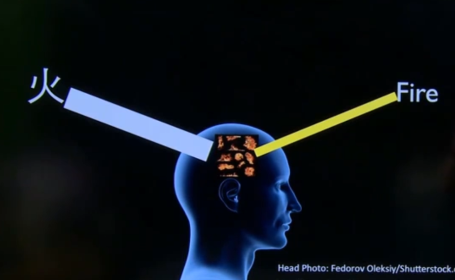

https://www.bilibili.com/video/BV1Et421u7nq?p=1&vd_source=8220e726dcb3a350fd156cea947bd58b

英语单词的意思是抽象的，去理解的时候走意识流路线。

## 学习英语前，必须懂的理念
#### 下意识的重要性
不要经过中译英的过程，而是通过下意识的直接使用英语。也是一种熟能生巧的过程，就像 hello，ok，how are you 这些，我们不需要通过中译英的过程也知道它的意思。形成语感，相信从自己大脑跳出来的自然反应。

#### 信息网
通过一个单词进行联想出相关的单词，如 water-ocean-ship。单词、语句之间是个信息网，网中心的是更高频的单词，更多的单词会与之关联，从网内部往外部学习就能更轻松，因为新学的单词与已有信息网有关联，就更容易记忆。如果学一个毫无关联的词，就需要更长的时间来记忆。

#### 明确目标
没有目标便会东一下西一下的学习，导致效率低下迷失方向。有目标就更有动力，驱使自己前进。
目标不能太低，要有足够的挑战。目标要对自身有吸引力。目标要有价值，如能找到更好的工作，能和外国妹子聊天，能在外网吹逼等。
再将目标划分为“能消化”的小目标。如掌握所有发音，掌握一个固定词组，听懂一首英文歌等。

#### 成年人的优势
成年人学习英语并不比孩子慢，成年人反而更有优势，只是成年人在生活中需要花费大量时间在各种事情上，所以感觉学习很慢。
成年人可以用各种技巧来提高学习效率，如词语和画面的联想，自言自语，与AI交流，外网冲浪等，小孩反而没有这些能力。
成年人可以利用已经会的信息，利用自己对世界的认识提高理解力和学习速度。
合适的记笔记能提高效率，有时记一遍就能记住了，而只是看一遍就记住不。

#### 大脑的特点
大脑会对它觉得更重要的东西记忆更深刻，而不是你觉得重要的东西。通常自己更干兴趣的东西大脑就会觉得它更重要，更容易记住，而别人强行让你记住的东西反而总是记不住。
学习的时候要让大脑不处于疲惫状态，要激发自身的好奇心去学习。

#### 合适的学习材料
太难的和太容易的，对学习效率都不高，合适的才能最大化学习效率。
学习英语必须使用可理解输入的内容，如果学的东西自己无法理解，那么怎么学业没用。就像一直看英文书而不理解其意思，看再多也没用。
使用音频和视频资料为主，这样能让大脑多方面的感受，更容易吸收。

#### 必须练习
英语是一项技能，也要像其它技能一样需要不断的练习才能越来越得心应手。

## 学习英语要建立的8个习惯
一个习惯可以让你学习英语的效率提高一点，更多的习惯会让你学习效率更高。可以先养成一个习惯，一段时间后再养成第二个习惯，这样形成更多的习惯，那么效率就会越来越高了。

1. 每天听一些英语，没听懂也没关系，主要目的是让大脑能习惯英语这种声音环境。最终达到一天不听就感觉缺了点啥，这就养成习惯了。
2. 形成英语思维。养成英语思维才能更有效率的学英语，而不是学了很多英语才会养成英语思维。
    1. 遇到不懂的东西使用英语去问，这样才能更快的形成英语思维。
    2. 看到的东西使用英语去认识，在家里使用英语贴。
3. 将耳朵与嘴巴连接起来，通过听到的声音去感受发声方式，从而使发音更标准。
4. 通过画面和感觉来学习英语。
5. 自言自语。从单词到简单语句再到复杂语句。
6. 玩儿词。将不同的单词组合成句子。
7. 使用英语和别人正式沟通。可以通过AI或论坛等。
8. 使用碎片化时间练习发音。

## 初期阶段学习要点
* 不要分解成单词，理解一句话的意思即可，马上去用就可以。
* 把注意力用到高频词上。
* 用高频词组合短句。

## 70个胶水词
* 方位表达：top, bottom, left, right, in front, behind, inside, outside
* 大小：big, small, tall, short, long
* 颜色：red, orange, yellow, green, blue, purple, black, white, gray
* 小逻辑：
    * 链接类：so, because, and, but, although, however
    * 情态类：can, can't, should, shouldn't, must, sometimes, never, always

## 同一个盒子不同的路
学习英语不是把英语翻译成中文，而是把英语在大脑里形成一幅画面。当我们说“火”的时候大脑里就出现的是某种形状的火，说 fire 的时候不是要先将它翻译成火，再在大脑里出现火，而是 fire 就直接对应火的形状。大脑就像一个装满各种东西的盒子，每种语言与大脑直接沟通，是一条自己的路，而不是一种语言到另一种语言的路再到大脑，这样学习效率低下，并且无法形成下意识的理解。
  

## 多听英语
如果只看英语文字，不用耳朵和嘴巴，那么就会导致很大的缺陷，不仅形成哑巴英语，效率也更低，因为我们在学习时少用了两个重要的人体器官。比如古代很多文盲不识字，但是他们依然能听能说，可见听和说的学习成本更低。

## 创造可理解输入的环境
可理解输入：明白一句话的含义，可能其中某个单词不会，但是通过上下文、动作等能猜到即可。这样，这个不会的单词也能被大脑理解而记忆。比如在雪地里，一个人抖着说 I'm so cold. 即使你不懂 cold 这个单词的意思，但是也能明白 cold 这个发音表示冷，多次重复后大脑就理解并记住了。可以通过中英对照学习的方法，不懂的英文句子，看中文后形成画面再看英文，这样反复进行记忆。

## 词组非常重要
在英语中，词组的重要性可能比单词还重要。一句话中，单词都认知，但是这句话用到的词组不认识，可能也无法理解这句话的含义。其实词组可以看成是一个单词，只是由多个单词组合成，像中文里每个字有自己的意思，组合成一个词语意思也会有相应的变化一样。**学习词组的时候也要整体记忆，不要想着分解成单独的单词来理解。**

## 语法很重要
一句话需要通过正确的语法组合在一起才能表达正确的意思，比如 I give you money，和 You give me money. 就是相反的意思。语法分析是一种模式识别的过程，就像正则一样，不过我们也可以通过多看多理解形成语感后，就能自然而然的了解语法的使用。

## 英语词粒子
### ...ing, ...ed, ...er, ...est
...ing 是现在进行时
...ed 过去式，等于中文的“了”，表示已经做完了
尽量用画面和感觉去感受使用时的状态。

...er 比较级，等于中文的“更”。常用词组：`...er than...`，表示比 than 后面的那个更...，如 `They are richer than us.` 表示他们比我们更富有。

...est 表示“最”。richest 就是最富有，`He is the richest man in China.`

### un..., in..., im..., dis...
他们都是表示否定/相反，如中文表示否定也有“不”，“没”，“别”等。
un... 如 unhappy, undo, uninterested...
in... 如 inhumane, indecent, indestructible
im... 如 impossible, improbable, impatient
dis... 如 disappear, disable, disagree

### ...ly, ...ness
...ness 让形容词变名词。
如：
happy -> happiness
* I am happy. 我很开心。开心是个形容词
* I am full of happiness. 我充满幸福感。幸福感是个名字，幸福感这个东西把我填满了。

selfish -> selfishness
* He is selfish. 他是自私的。
* His selfishness is obvious. 他的自私是显而易见的。自私是个名字，是他的一个叫“自私”的东西。

slow -> slowness
* Bikes are slow. 自行车很慢，用复数表示自行车这个品类。这里如果要用单数应该是 a bike is slow 或 the bike is slow. 特指一辆。
* I don't like the slowness of bikes. 这里使用 the slowness 名词短语，表示“缓慢”的抽象概念，用作名词。

...ly 表示中文的“地”，将形容词变成副词。**副词是用来修饰动词、形容词等的。**
如：
happily 开心地。She sings happily. 她开心地唱着歌
friendly 友好地。We paly football friendly. 我们友好地踢足球
slowly 慢地。He is riding the bike slowly. 他正慢慢地骑自行车