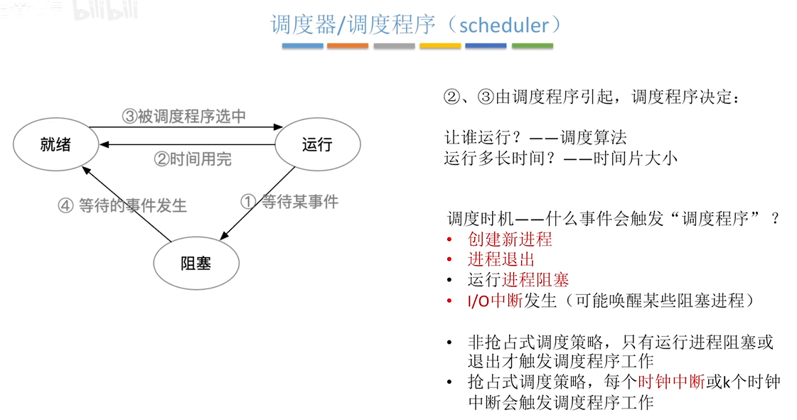
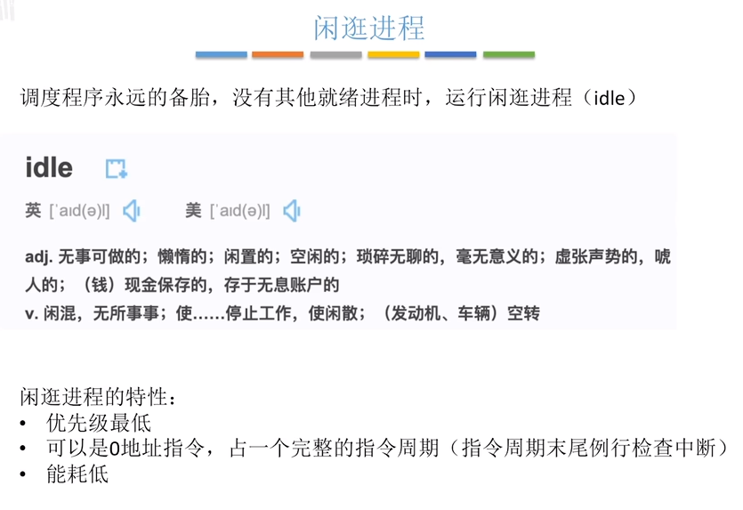
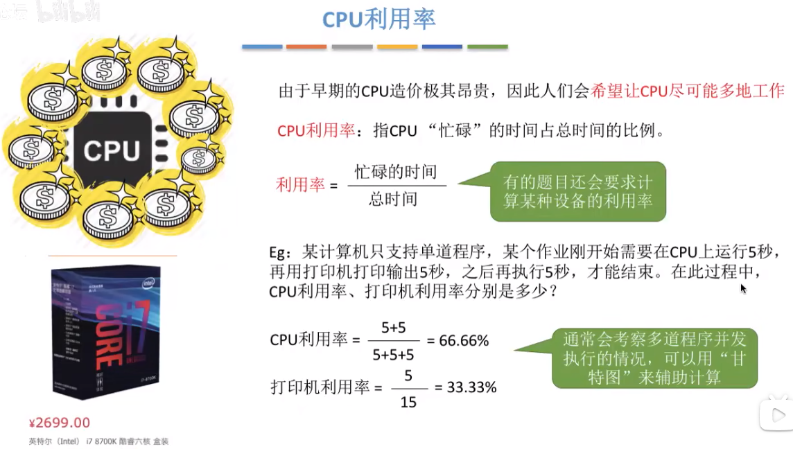
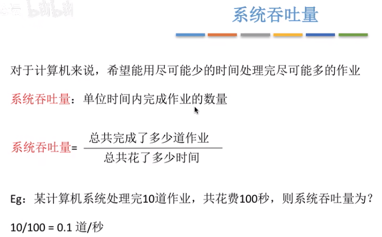
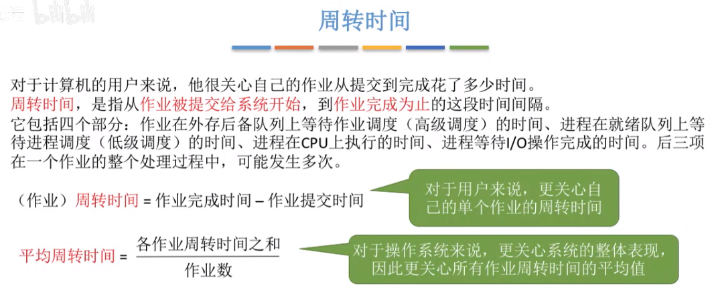
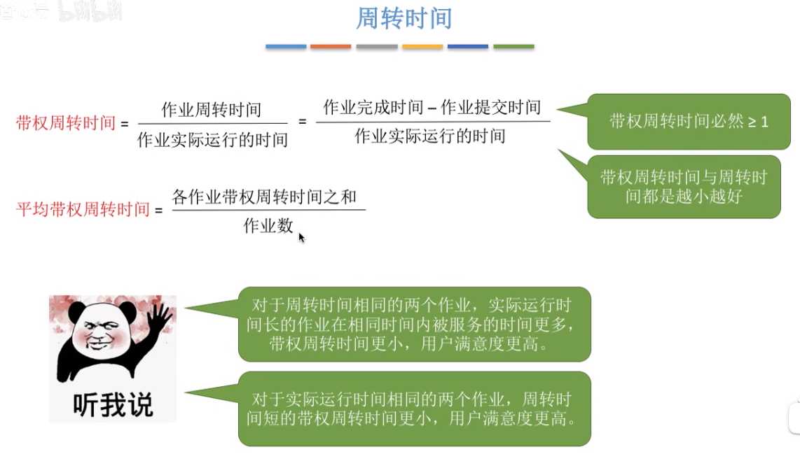
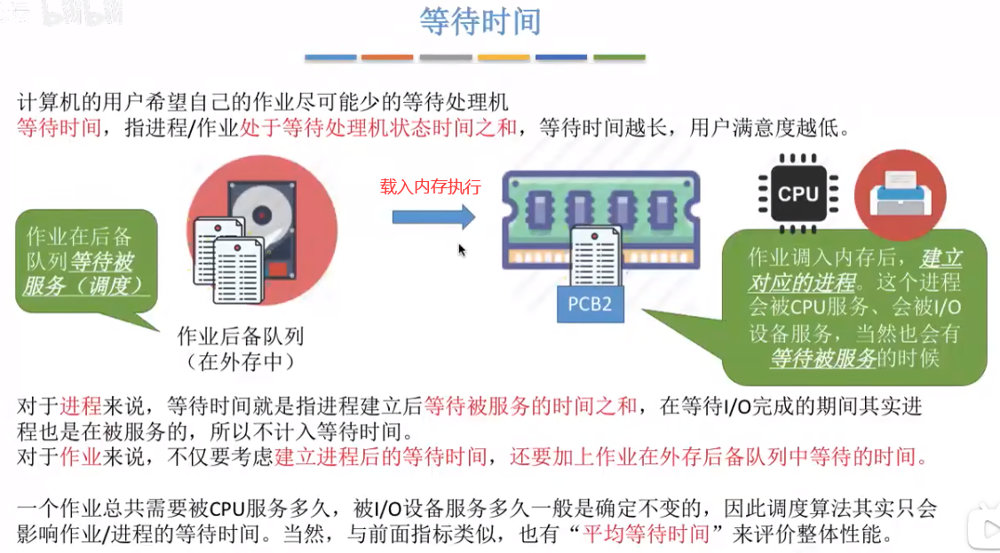

## 什么是调度程序
  
拥有线程的操作系统上，调度对象是线程，反之则为进程。

## 闲逛进程
  

## 调度算法评价指标
#### CPU 利用率
CPU 使用时间占总时间的比例。利用率越高越好。
  

#### 系统吞吐量
单位时间内完成作业的数量。越多越好。
  

#### 周转时间
作业被提交给系统开始，到作业完成为止的这段时间间隔。越短越好。
  
有的作业运行时间长，等待时间短；有的作业等待时间长，运行时间短；总时间相同——即周转时间相同，那么允许时间长，等待时间短的作业拥有更好的体验。

带权周转时间更能体现作业运行的实际感受。
  

#### 等待时间
作业被执行会先进入外存中的作业后备队列，等待 CPU 空闲时开始执行，当 CPU 空闲时就将其调入内存中，开始创建 PCB 等执行工作。
  

#### 响应时间
对于计算机用户来说，会希望自己的提交的请求(比如通过键盘输入了一个调试命令)尽早地开始被系统服务、回应。
响应时间，指从用户提交请求到首次产生响应所用的时间。
