## 进程同步
进程具有异步性的特征，因此如果放任不管，在一些情况下可能会导致问题，如写进程和读进程，需要写进程执行后才执行读进程，这就是进程同步所解决的问题。进程同步功能通常由操作系统提供。

## 进程互斥
我们把一个时间段内只允许一个进程使用的资源称为临界资源。许多物理设备(比如摄像头、打印机)都属于临界资源。此外还有许多变量、数据、内存缓冲区等都属于临界资源。
对临界资源的访问，必须互斥地进行。互斥，亦称间接制约关系。进程互斥指当一个进程访问某临界资源时，另一个想要访问该临界资源的进程必须等待。当前访问临界资源的进程访问结束，释放该资源之后，另一个进程才能去访问临界资源。
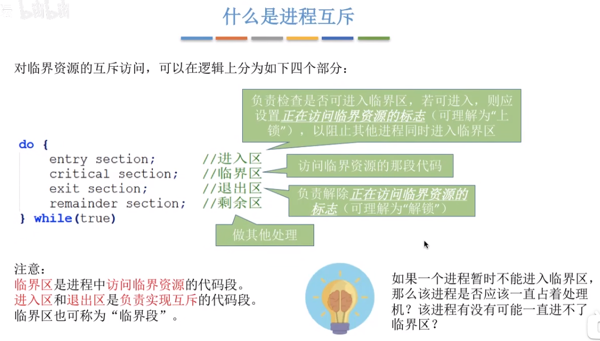  
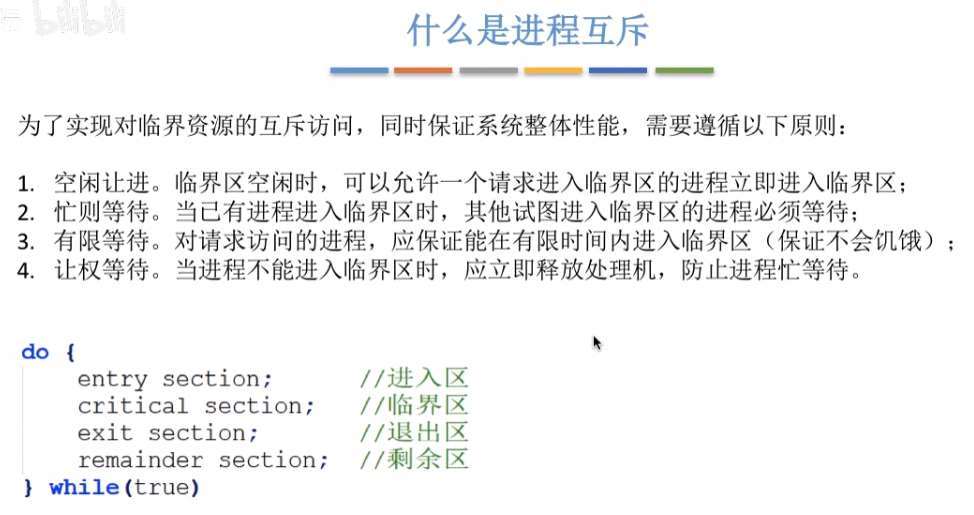  

## 进程互斥的软件实现
### 单标志法
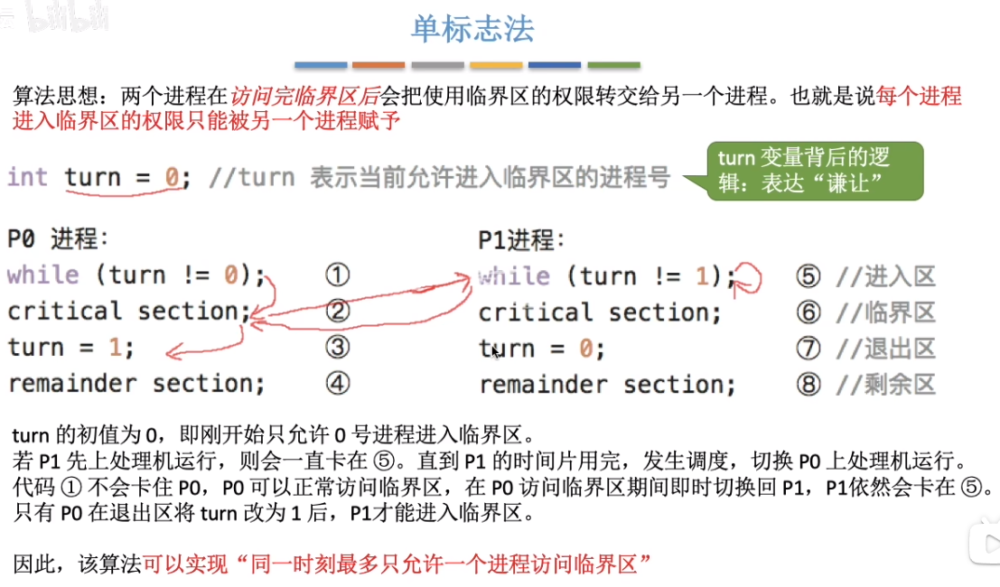  
使用进程号指定哪个进程可以使用。
单标志法存在的主要问题是：违背了“空闲让进”原则——`turn = 1`让给了进程号为1的进程，但是进程1如果做其他事去了没使用，别的进程也无法使用。

### 双标志先检查法
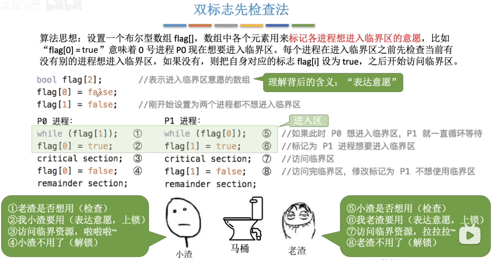  
先检查别的进程是否要使用，没有其它进程想使用则自己使用。
并发执行的时候可能导致开始时都没进程使用，两个进程同时查询有没有其它进程使用，会得到没有，所以两个进程都会去使用。违反了“忙则等待”原则。

### 双标志后检查法
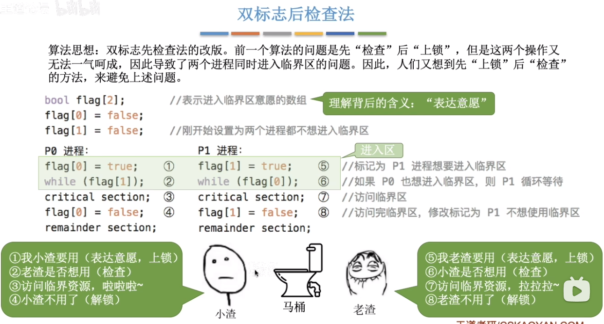  
  

### Peterson 算法
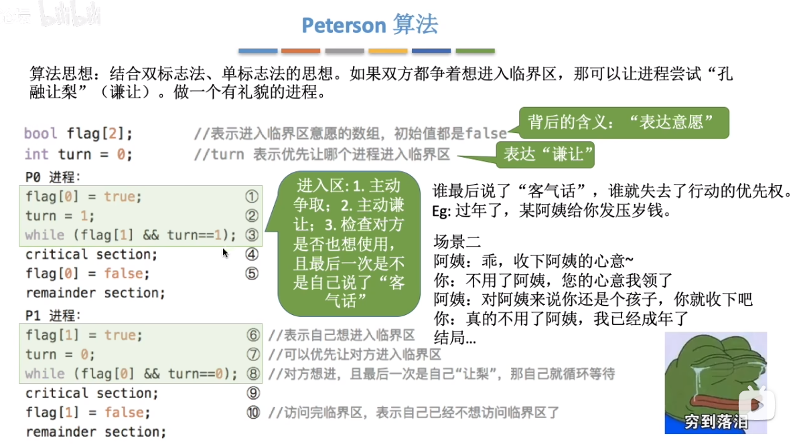  
这里主要要注意1,2,6,7,3和1,2,6,7,8的执行顺序并不会导致都不执行，因为最后谦让的那一方会把主动权交出去。7执行后就让给了进程0，那么到3时进程0就会发现进程1没在执行，自己就会执行。8时因为自己最后谦让出去了，turn=0，自己卡在 while 循环不会执行。
Peterson 算法用软件方法解决了进程互斥问题，遵循了空闲让进、忙则等待、有限等待 三个原则，但是依然未遵循让权等待的原则。
Peterson 算法相较于之前三种软件解决方案来说，是最好的，但依然不够好。

## 进程互斥的硬件实现方法
### 中断屏蔽方法
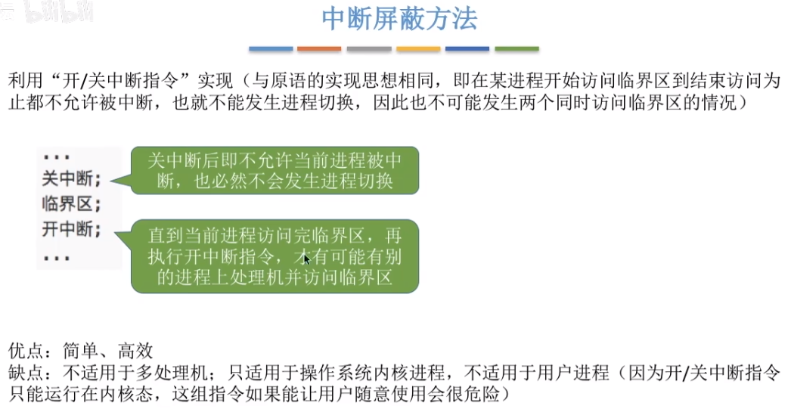  

### TestAndSet 指令
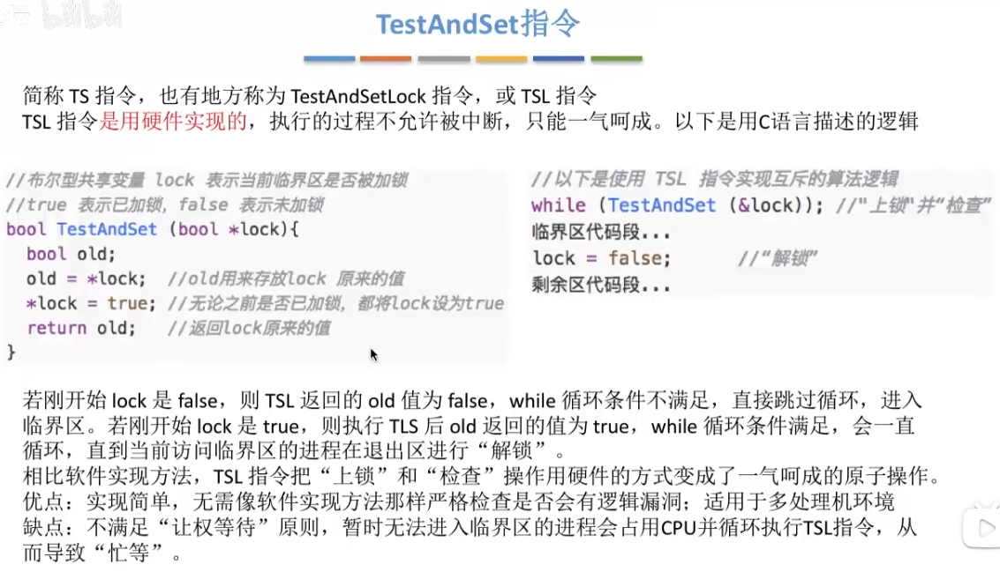  
相对于软件实现的“双标志先检查法”，此方法由于是硬件级的，就能通过原语等方式实现检查、上锁一起执行完后再执行其它功能，所以不会出现并发问题。

### Swap 指令
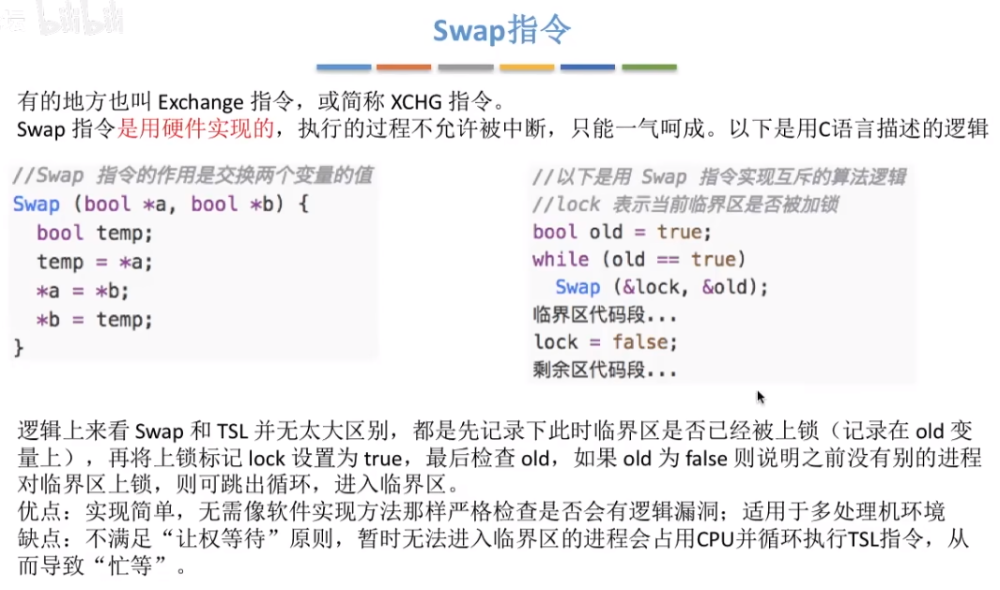  

## 互斥锁
总结锁的概念。
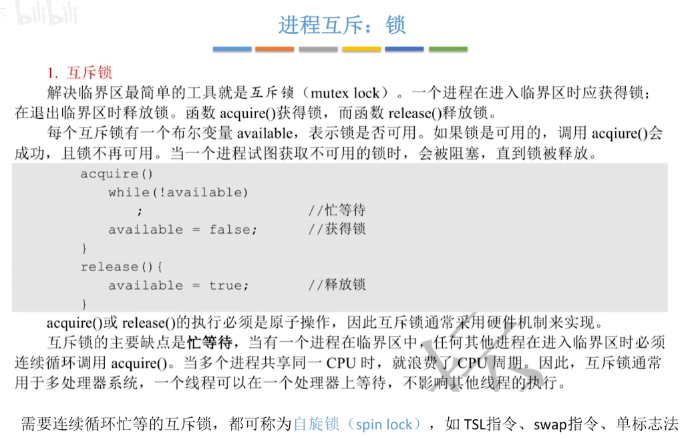  
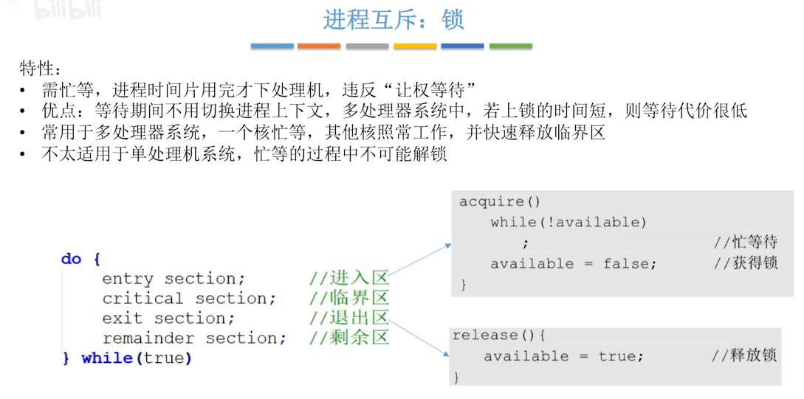  
多核处理器中，一个进程在自旋等待（循环检查）时只会占用一个处理器的资源，通常对性能不会造成太大影响，并且在时间切片用完时，也会下处理机。