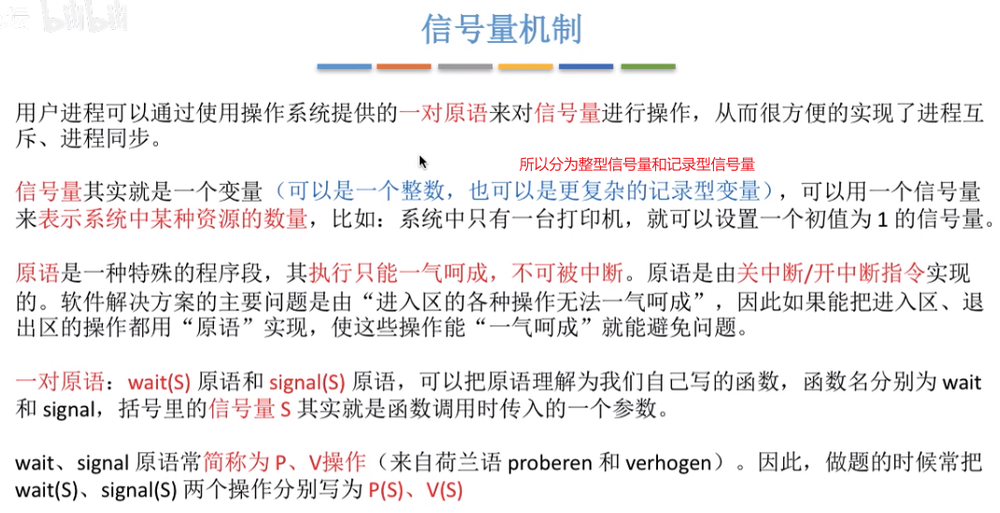
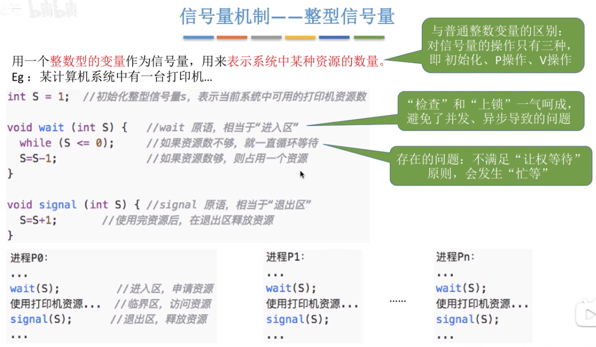
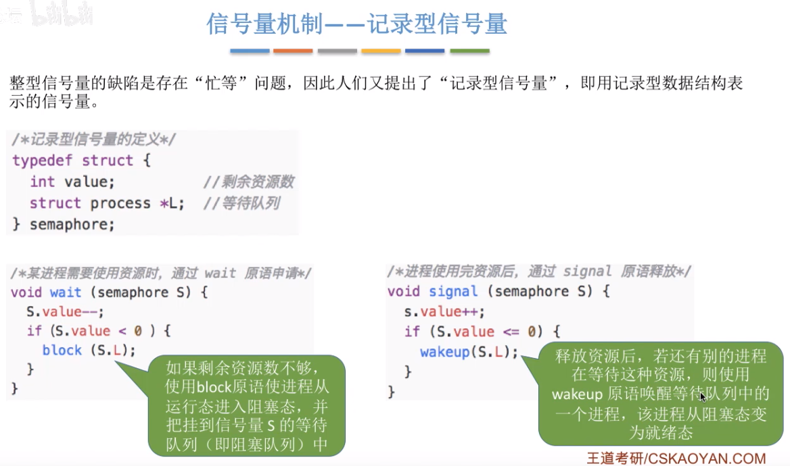
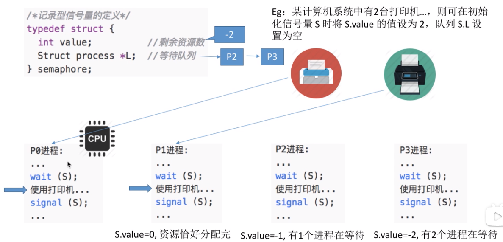
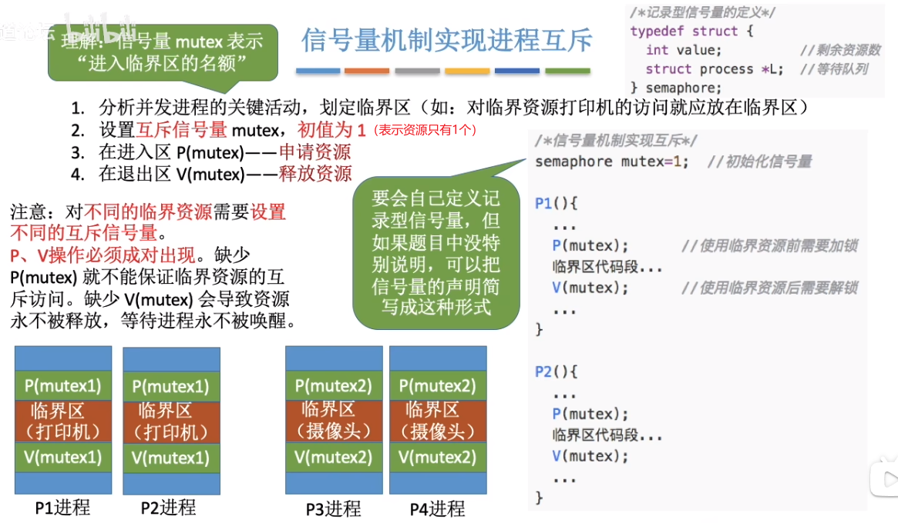
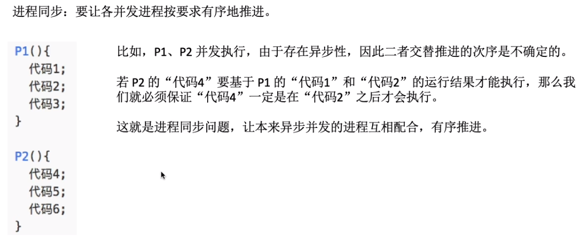
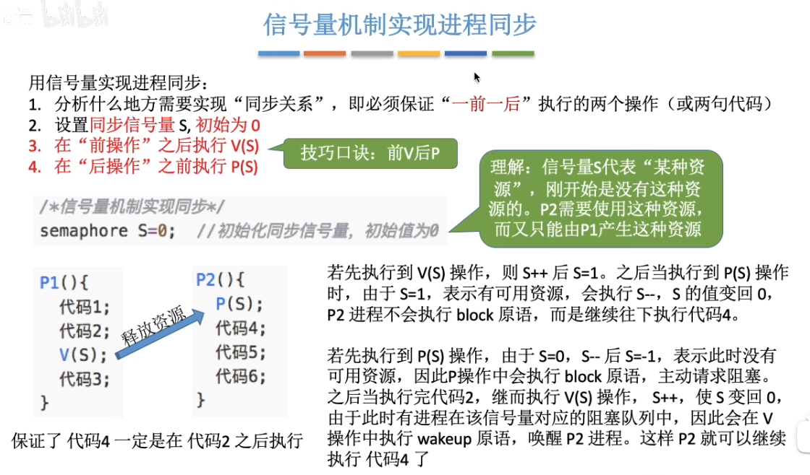
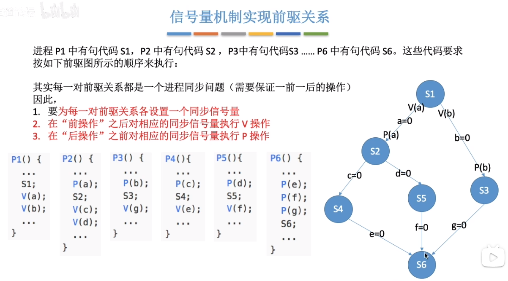

## 简介
分为整型信号量和记录型信号量。
  

## 整型信号量
就类似开关变量。
  

## 记录型信号量
  

记录型信号量的运行过程：
  
这里有2个打印机设备，设备被申请运行时 value 减1，当 value 为0时两个打印机设备都被使用。此时又有其它进程申请使用打印机，则 value 还会减1成为-1，并且这个进程会进入等待队列；又有进程申请打印机继续减1为-2，并且此进程进入等待队列。当使用打印机的进程使用完后释放打印机，会判断 value 是否小于0，小于0则说明有等待进程，value++ 并且从等待队列中取出一个使用打印机。当进程使用打印机完毕后，如果 value 是0，则说明没有等待进程，不用从等待队列中取出，value++为1表示有1个打印机空闲。以此类推即可。

现代计算机通常都会使用记录型信号量，不用忙等，wait 时加入等待队列中（进程进入阻塞态，而不是一直循环占用 CPU），使用时从阻塞态变为就绪态执行。

## 用信号量实现进程互斥、同步、前驱关系
要注意理解信号量背后的含义，一个信号量对应一种资源。
信号量的值 = 这种资源的剩余数量(信号量的值如果小于0，说明此时有进程在等待这种资源)。
* P(S)——申请一个资源S，如果资源不够就阻塞等待。
* V(S)——释放一个资源S，如果有进程在等待该资源，则唤醒一个进程。

### 信号量机制实现进程互斥
  

### 信号量机制实现进程同步
  
  

### 信号量机制实现前驱关系
  
