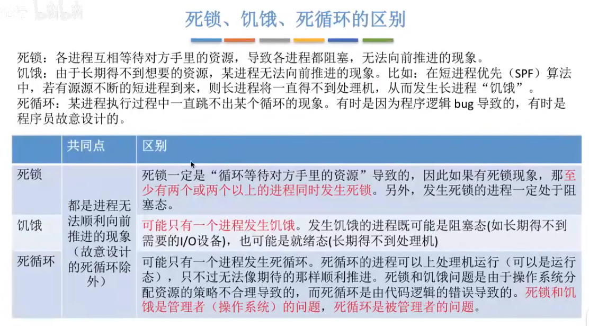

## 什么是死锁
在并发环境下，各进程因竞争资源而造成的一种互相等待对方手里的资源，导致各进程都阻塞，都无法向前推进的现象，就是“死锁”。发生死锁后若无外力干涉，这些进程都将无法向前推进。

## 死锁、饥饿、死循环的区别
  

## 死锁产生的必要条件
产生死锁必须同时满足一下四个条件，只要其中任一条件不成立，死锁就不会发生。
* 互斥条件：只有对必须互斥使用的资源的争抢才会导致死锁(如哲学家的筷子、打印机设备)像内存、扬声器这样可以同时让多个进程使用的资源是不会导致死锁的(因为进程不用阻塞等待这种资源)。
* 不剥夺条件：进程所获得的资源在未使用完之前，不能由其他进程强行夺走，只能主动释放。
* 请求和保持条件：进程已经保持了至少一个资源，但又提出了新的资源请求，而该资源又被其他进程占有，此时请求进程被阻塞，但又对自己已有的资源保持不放。
* 循环等待条件：存在一种进程资源的循环等待链，链中的每一个进程已获得的资源同时被下一个进程所请求。
> 注意！发生死锁时一定有循环等待，但是发生循环等待时未必死锁(循环等待是死锁的必要不充分条件)

## 什么时候会发生死锁
1. 对系统资源的竞争。各进程对不可剥夺的资源(如打印机)的竞争可能引起死锁，对可剥夺的资
源(CPU)的竞争是不会引起死锁的。
2. 进程推进顺序非法。请求和释放资源的顺序不当，也同样会导致死锁。例如，并发执行的进程P1、P2分别申请并占有了资源 R1、R2，之后进程P1又紧接着申请资源R2，而进程P2又申请资源R1,两者会因为申请的资源被对方占有而阻塞，从而发生死锁。
3. 信号量的使用不当也会造成死锁。如生产者-消费者问题中，如果实现互斥的P操作在实现同步的
P操作之前，就有可能导致死锁。(可以把互斥信号量、同步信号量也看做是一种抽象的系统资源)

总之，对不可剥夺资源的不合理分配，可能导致死锁。

## 死锁的处理策略
1. 预防死锁。破坏死锁产生的四个必要条件中的一个或几个，
2. 避免死锁。用某种方法防止系统进入不安全状态，从而避免死锁(银行家算法)
3. 死锁的检测和解除。允许死锁的发生，不过操作系统会负责检测出死锁的发生，然后采取某种措施解除死锁。