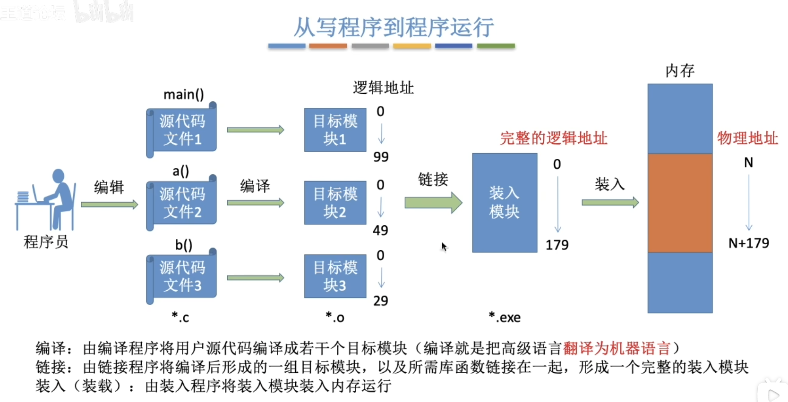
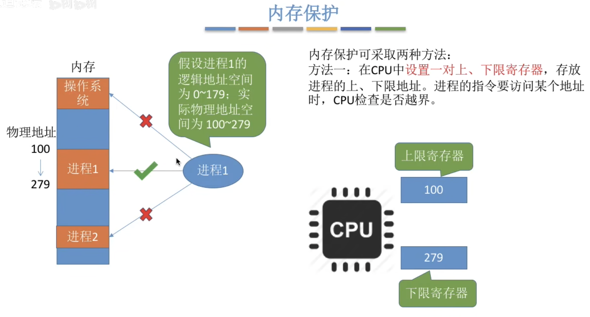
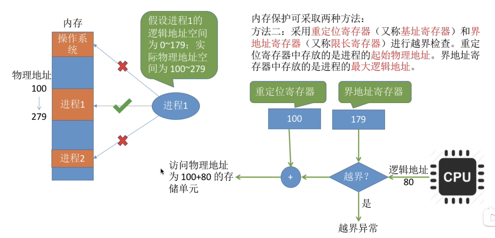
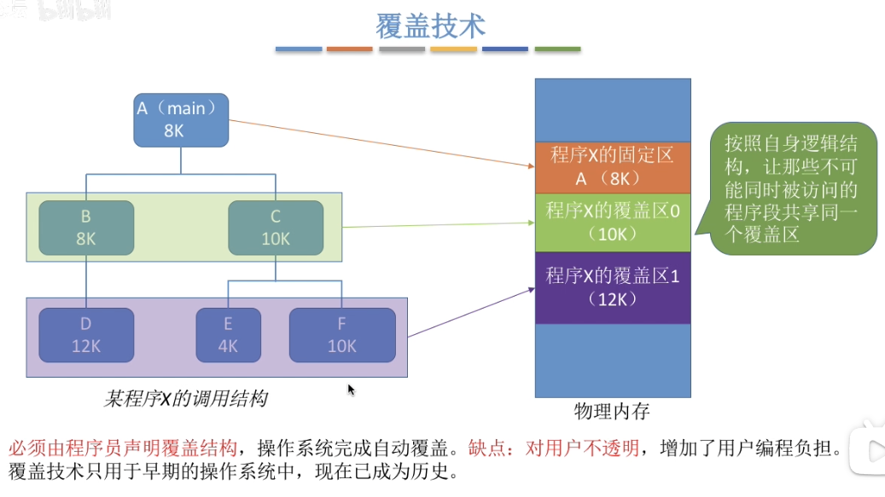

## 物理地址和逻辑地址
* 物理地址：内存每个单元是真实地址，从0开始到内存大小的最大值。
* 逻辑地址：每个进程都有自己的虚拟地址，也是从0开始，但是是相对于这个进程而言的，实际会位于内存中的中间某段地址。

## 从写程序到程序运行
  
>注意：每个源代码编译成的目标模块都有自己的逻辑地址。

**GPT:**
在一个C程序的开发和编译过程中，每个.c文件通常会被单独编译成一个目标文件（.o或.obj文件），这个目标文件包含该源文件的编译结果。在编译的过程中，每个目标文件确实有自己的逻辑地址空间。
以下是一些关键点：
1. 独立编译阶段：
    * 每个.c文件在编译时会生成一个相应的目标文件，这个过程中编译器会为每个目标文件分配自己的逻辑地址空间。
    * 这些逻辑地址是相对于该目标文件的，而不是整个程序的最终地址。
2. 链接阶段：
    * 所有的目标文件在链接阶段会被合并成一个可执行文件。
    * 链接器会重新分配全局逻辑地址空间，以确保所有目标文件的代码和数据可以无冲突地存在于同一个地址空间中。
    * 链接器处理符号解析和地址重定位，使得所有目标文件中的引用都正确指向最终的地址。
3. 最终可执行文件：
    * 最终生成的可执行文件具有一个统一的逻辑地址空间，这个地址空间由链接器统一管理。
    * 程序运行时的逻辑地址空间是由操作系统和加载器分配和管理的。
    
总结来说，在编译阶段，每个.c文件确实有自己的逻辑地址，但在链接阶段，所有这些地址会被重新分配和调整，最终形成一个统一的逻辑地址空间供程序运行使用。

#### 装入
程序在装入内存时有三种装入方式：
* 绝对装入：早期的单道程序使用，这个阶段还没有操作系统，由于只有一个程序运行，所以在编译时就指定了内存物理地址。
* 可重定位装入：早期的操作系统使用，在装入时由操作系统将逻辑地址转换为物理地址。不可动态扩展。
* 动态运行时装入：现代操作系统使用，运行时将逻辑地址转换为物理地址，需要一个“重定位寄存机”辅助确认逻辑地址与物理地址的对应关系。

## 内存管理
操作系统作为系统资源的管理者，当然也需要对内存进行管理，要管些什么呢?
1. 操作系统负责内存空间的分配与回收。
2. 操作系统需要提供某种技术从逻辑上对内存空间进行扩充。（虚拟内存）
3. 操作系统需要提供地址转换功能，负责程序的逻辑地址与物理地址的转换。
4. 操作系统需要提供内存保护功能。保证各进程在各自存储空间内运行，互不干扰。

### 内存保护
一个进程只能访问自己使用的内存，不能访问操作系统或是别的进程的内存。
1. 使用上下限寄存器限制进程对内存的访问。
  
2. 重定位寄存器和界地址寄存器进行越界检查。
  

## 覆盖与交换
### 覆盖技术
当程序大小超过物理内存大小时，没法将整个程序都加载到内存中运行，此时可以使用覆盖技术解决。
覆盖技术的思想：将程序分为多个段(多个模块)常用的段常驻内存，不常用的段在需要时调入内存。
内存中分为一个“固定区”和若干个“覆盖区”。
需要常驻内存的段放在“固定区”中，调入后就不再调出(除非运行结束)。
不常用的段放在“覆盖区”，需要用到时调入内存，用不到时调出内存。

如下示例，A模块载入内存后，B模块和C模块不会同时访问，它们就可以使用覆盖技术。
  

### 交换技术
前面调度中“中级调度”就是交换技术的使用。当内存不足时，将进程的数据从内存调到外存中，内存只保留PCB相关信息，当需要时又通过PCB信息从外存调入内存继续执行。

**问题**
1. 应该在外存(磁盘)的什么位置保存被换出的进程?
2. 什么时候应该交换?
3. 应该换出哪些进程?