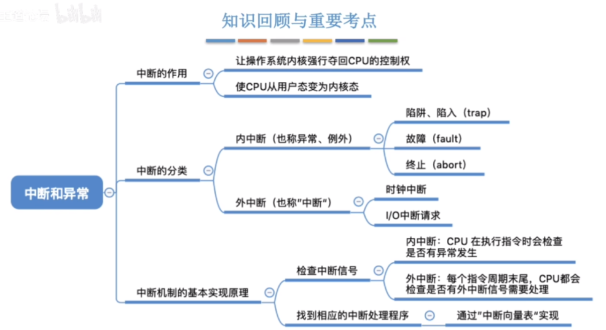

### 运行机制
* 两种程序
    - 内核程序（kernel，运行在核心态）
    - 应用程序（普通开发者开发的应用程序）
* 两种指令
    - 特权指令：只有内核程序才能使用的指令，应用程序中不能使用
    - 非特权指令：应用程序中可以使用的指令
* 两种处理器状态：CPU 的程序状态寄存器（PSW）中存储了一个状态，用于判断当前所处的状态，会根据情况进行切换
    - 核心态（管态）：执行内核程序时会切到核心态再执行，执行完成后切换到用户态执行普通程序
    - 用户态（目态）：执行普通程序时的状态，执行过程中如果发现程序中包含特权指令，就会报错终止执行

### 中断和异常
#### 中断机制的诞生
- 操作系统介入，开展管理工作
- “用户态—>核心态”是通过中断实现的。并且只能通过中断来切换。
#### 中断的分类
内中断（异常）：与当前执行的指令有关，中断信号来源于 CPU 内部。如执行的程序中包含特权指令、一个数除以0等，是当前执行程序的错误导致中断
* 陷阱、陷入（trap）：程序故意触发，如应用程序想要请求内核程序的一些功能时，需要先中断切到核心态才能执行内核程序的功能
* 故障（fault）：由错误条件引起的，可能被内核程序修复。内核程序修复故障后会把 CPU使用权还给应用程序，让它继续执行下去。如:缺页故障
* 终止（abort）：由致命错误引起，内核程序无法修复该错误，因此一般不再将CPU使用权还给引发终止的应用程序，而是直接终止该应用程序。如:整数除0、非法使用特权指令

外中断（CPU外部）：如时钟中断，由计算机的时钟部件每隔一段时间就会给 CPU 发送中断信号
* 时钟中断
* I/O 中断请求
#### 中断机制的基本原理
不同的中断信号，需要用不同的中断处理程序来处理。当CPU检测到中断信号后，会根据中断信号的类型去查询“中断向量表”，以此来找到相应的中断处理程序在内存中的存放位置，然后执行此中断处理程序。

  
