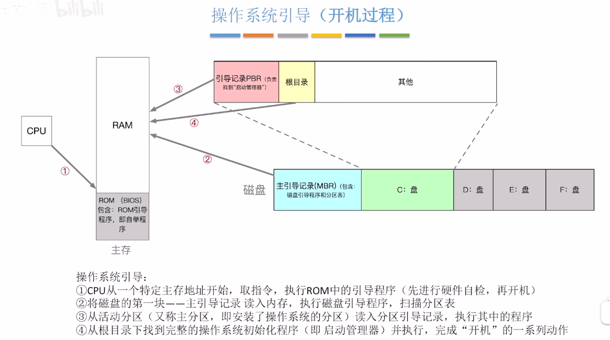
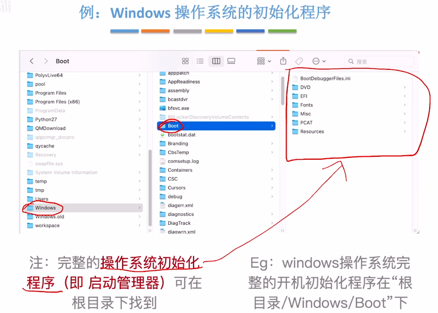

操作系统引导（Boot）——开机的时候，如何让操作系统运行起来？

ROM(BIOS)中，包含ROM引导程序（自举程序）。开机时首先就会将主板的 BIOS(ROM) 中的 ROM 引导程序加载到内存中并执行，此程序会将磁盘中的主引导记录（MBR）读取到内存（RAM）中，然后开始执行磁盘引导程序；磁盘引导程序会找到系统盘中的引导记录（PBR），读取到内存中并执行，引导记录程序会找到启动管理器（启动管理器是安装操作系统后在系统盘里的一个程序），将启动管理器读取到内存中并执行，从而开始操作系统的初始化等一系列的工作。
  
  
