## 进程的概念、组成、特征
一个程序可创建多个进程，每个进程有唯一的 PID(process id)。进程的 ID 通常是递增的，并且不会减少，不会被复用——关闭一个进程后，这个 PID 就不会再使用了，新的进程会在最新的 PID 上+1。所以运行中的进程的 PID 通常都不是连续的，因为很多进程会被关闭，这个 PID 就空出来了。

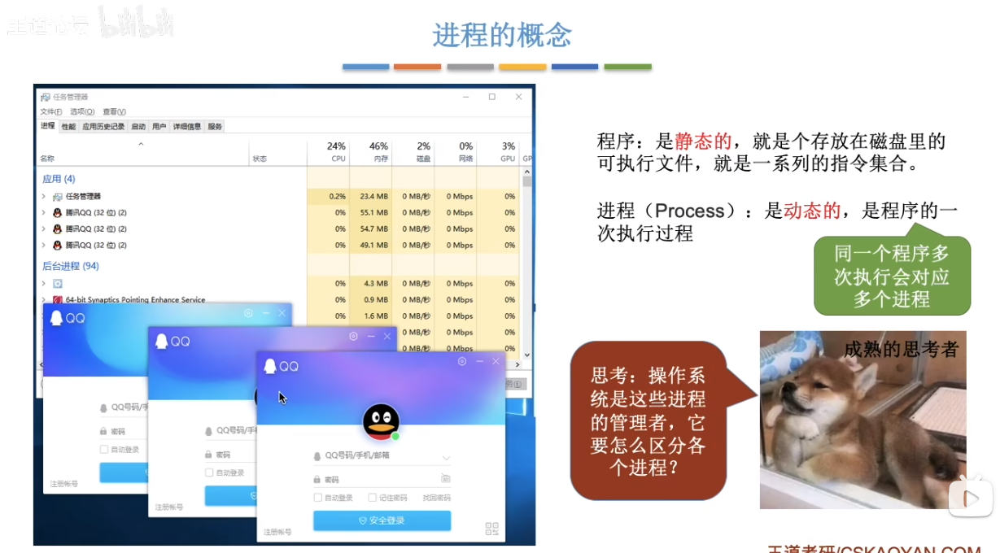  

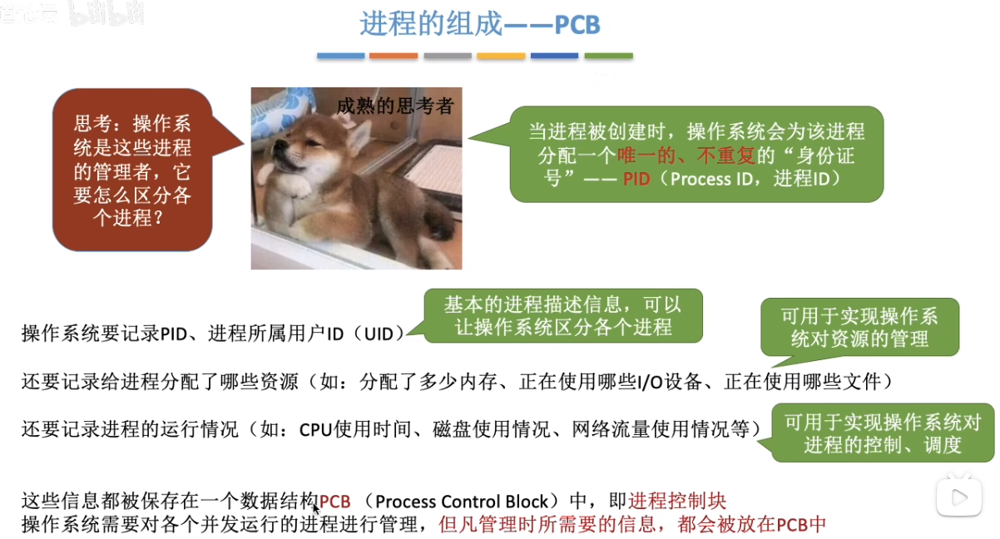  

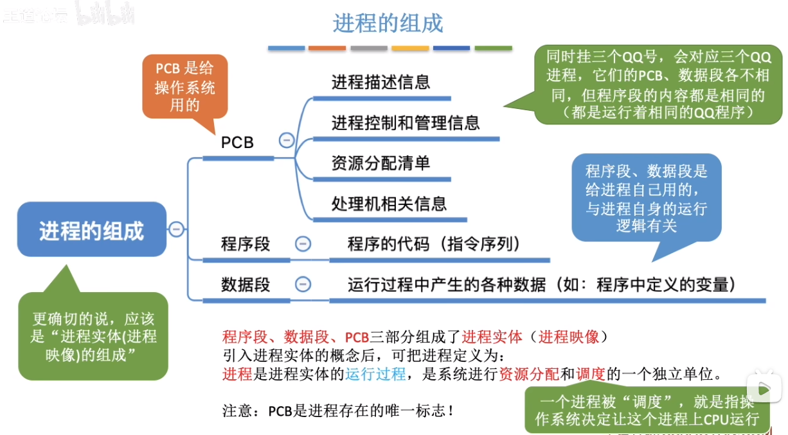  

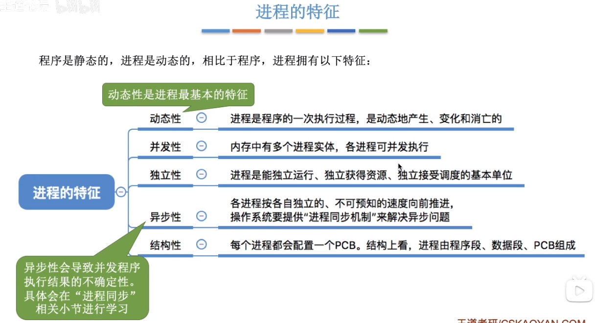  

## 进程的状态与转换
* 当运行一个程序时，这个程序会被加载到内存中执行，执行时首先会为这个程序分配资源并初始化 PCB——即这个程序的进程，此时进程正被创建，它的状态是“创建态”。
* 当进程创建完成后，便进入“就绪态”处于就绪态的进程已经具备运行条件，但由于没有空闲 CPU，就暂时不能运行。
* 当CPU空闲时，操作系统就会选择一个就绪进程，让它上处理机运行，此时这个进程就变成了“运行态”，这个进程对应的程序就开始运行。
* 在进程运行的过程中，可能会请求等待某个事件的发生(如等待某种系统资源的分配，或者等待其他进程的响应。这里比如请求打印机，打印机又正在被使用)在这个事件发生之前，进程无法继续往下执行，此时操作系练会让这个进程下CPU，并让它进入“阻塞态”，CPU 在此时又会去执行其它进程。
* 当“阻塞态”的进程等待的事件发生时（打印机空闲了），操作系统会将这个进程从“阻塞态”转变为“就绪态”，当 CPU 空闲时就会加载此进程去继续执行相应的事件（使用打印机）。
* 当进程执行结束时，进程可以执行一个 exit 系统调用，请求操作系统终止该进程此时该进程会进入“终止态”，操作系统会让该进程下 CPU，并回收内存空间等资源，最后还要回收该进程的 PCB。
* 另外，进程在运行时，当 CPU 的执行时间达到了当次时间切片的时间，时钟部件发送时钟中断信号，或是有其它更高优先级的进程要执行，此时当前执行的进程就会下 CPU，从“运行态”变为“就绪态”。
（注：React 执行时的时间切片就类似进程的执行，不过更简单一些）
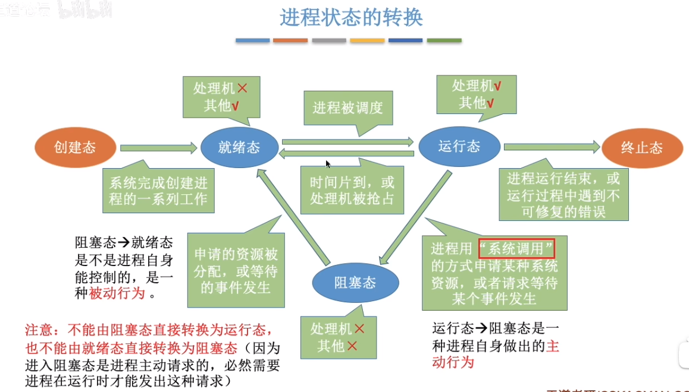  

## 进程的组织方式
主要分为链接方式和索引方式。链接方式就是分别为每种状态下的进程用链表的方式组织；索引方式便是每种状态下的进程用索引表的方式组织。通常使用链接方式，扩展性更好。

## 进程控制
进程的创建、状态转换等，也是由程序实现，只不过是内核程序的功能，内核程序的执行也会受到 CPU 时钟切片的影响，除非是“原语”。进程在创建、状态转换时不能在执行时中断，所以需要用“原语”来实现这些功能。
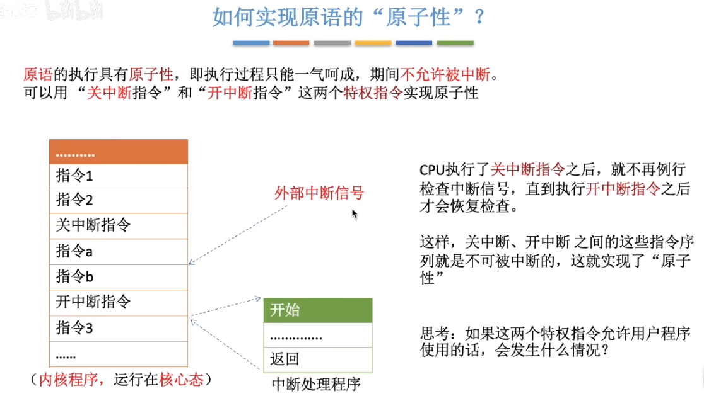  

#### 进程的创建
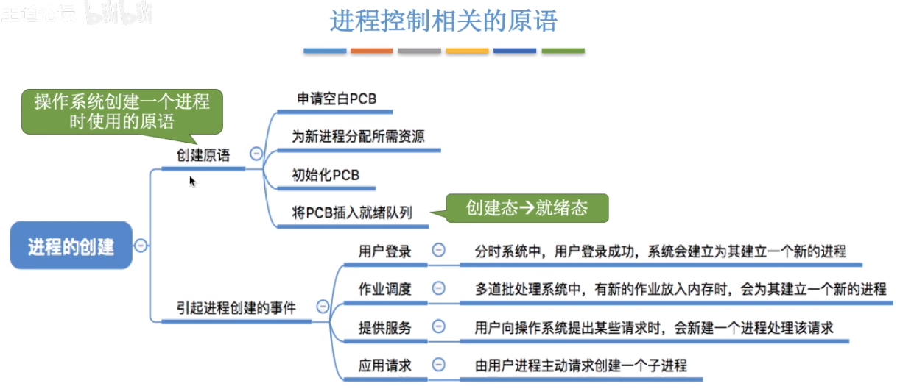  

#### 进程的终止
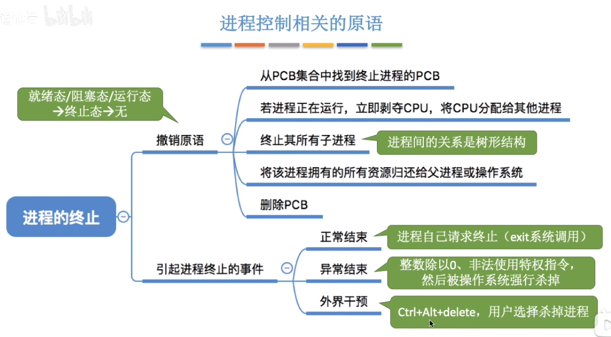  

#### 进程的阻塞和唤醒
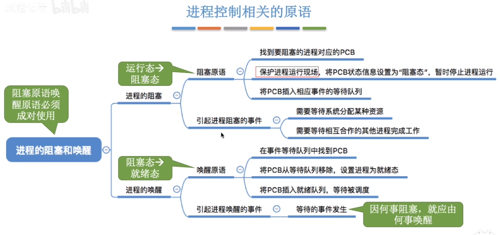  

#### 进程的切换
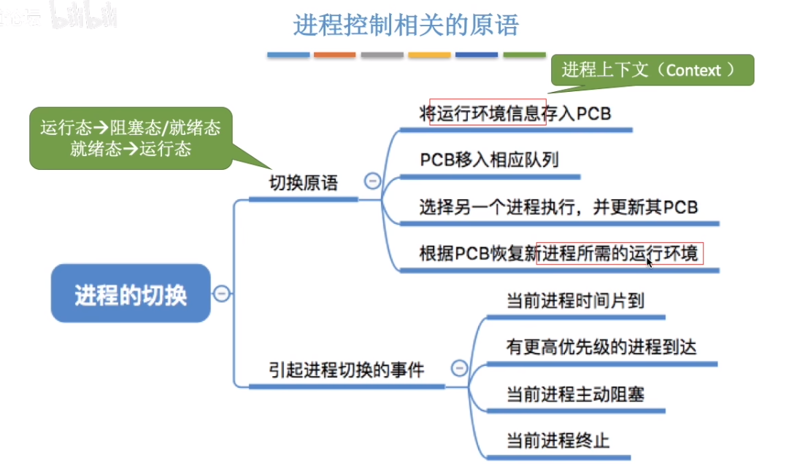  
进程切换时，CPU 寄存器或其它数据会被替换成新的进程的数据，如 PC(程序计数器)、通用寄存器的数据，那么为了当进程能在切换回之前运行的进程后能继续从之前运行到的位置继续运行，就需要先将这些数据保存下来，当切换回来时读取这些数据放回 PC、通用寄存器中。
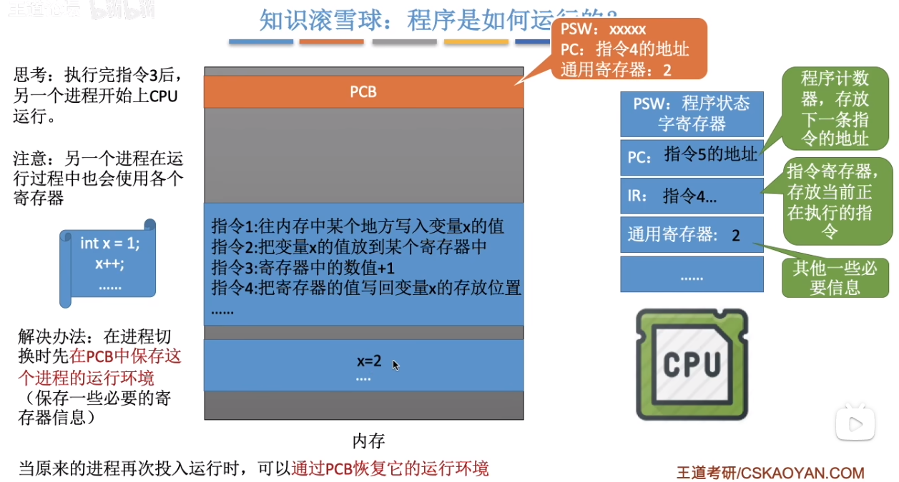  

## 进程通信
进程间通信(Inter-ProcessCommunication，IPC)是指两个进程之间产生数据交互。如知乎分享内容到微信就需要知乎进程和微信进程进行通信。
进程通信需要操作系统支持。各个进程自身的内存空间是相互独立不能互相访问的，只能通过操作系统提供的方式来通信。主要包括：共享存储、消息传递和管道通信。

#### 共享存储
操作系统提供了共享存储区，所有进程都可以访问，从而实现进程之间的通信。
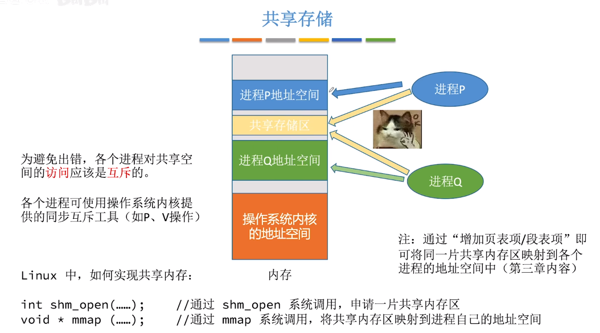  

#### 消息传递
操作系统提供进程之间的消息传递服务，从而实现进程的通信。
  

#### 管道通信
也是从内存中划出一片区域用于进程通信，但是这个区域在分配给进程使用时具有单向数据流，数据有先进先出的特性（循环队列）。这也是与共享存储的区别。
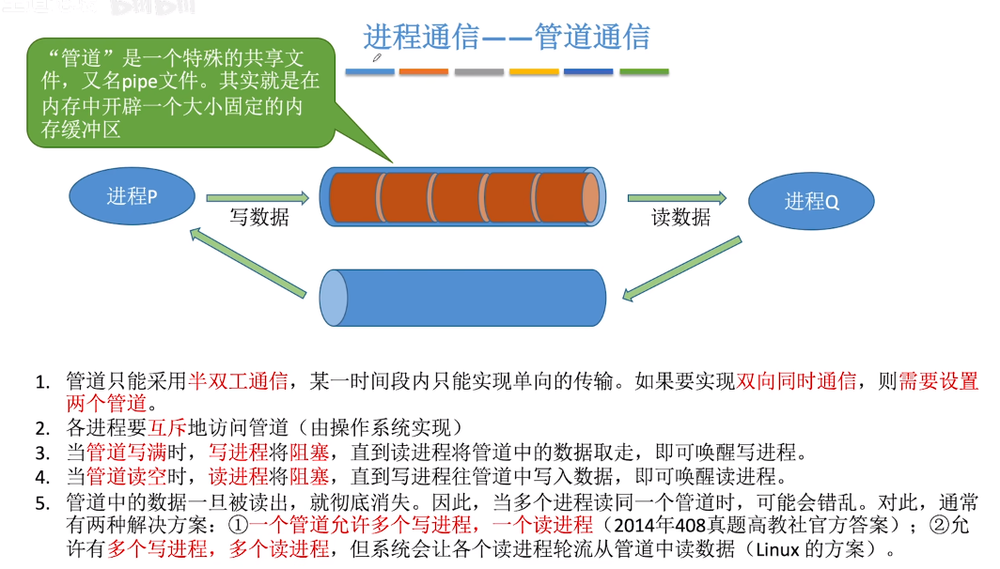  
