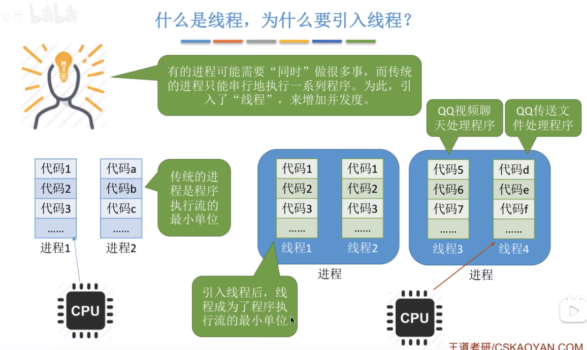
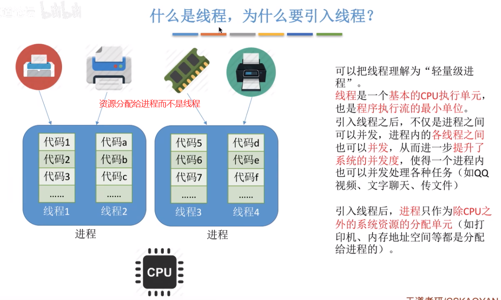
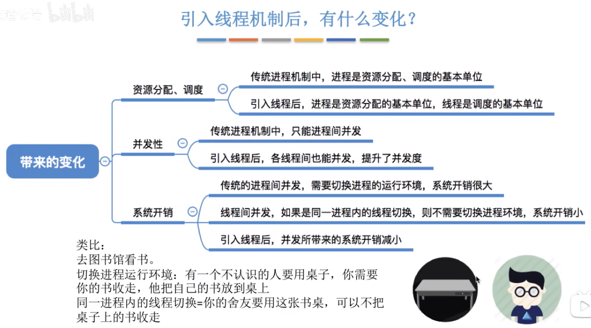
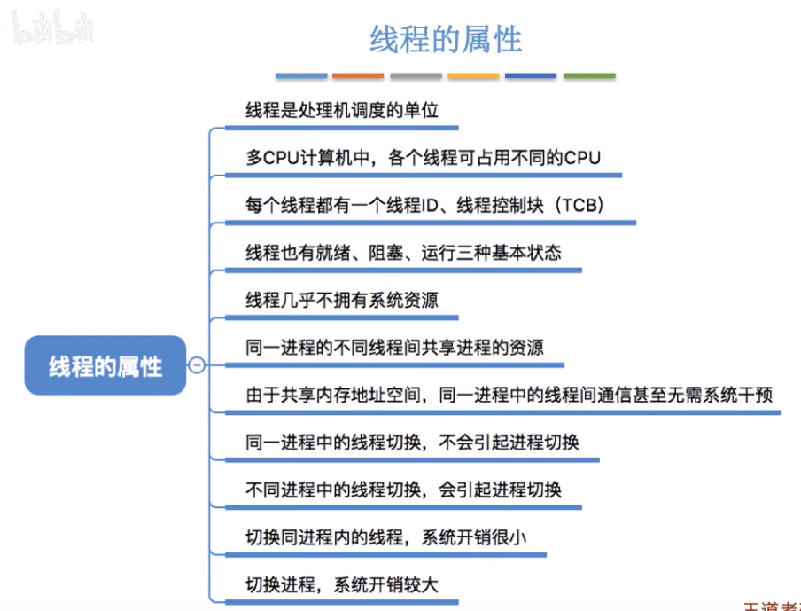
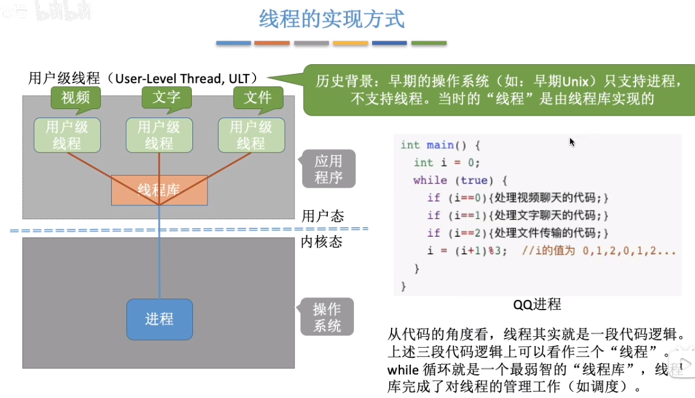
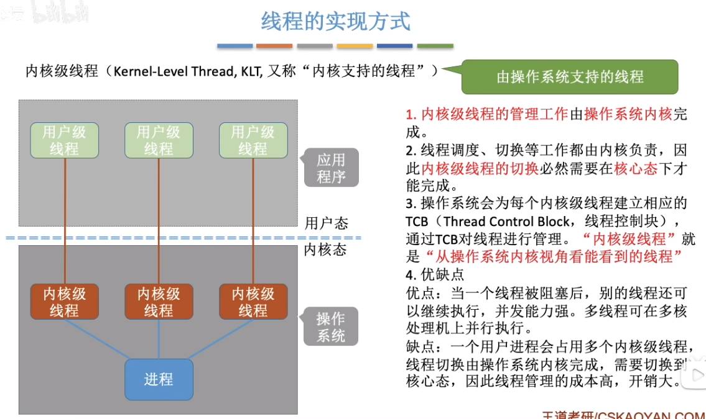
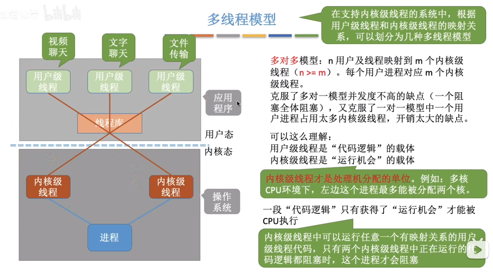
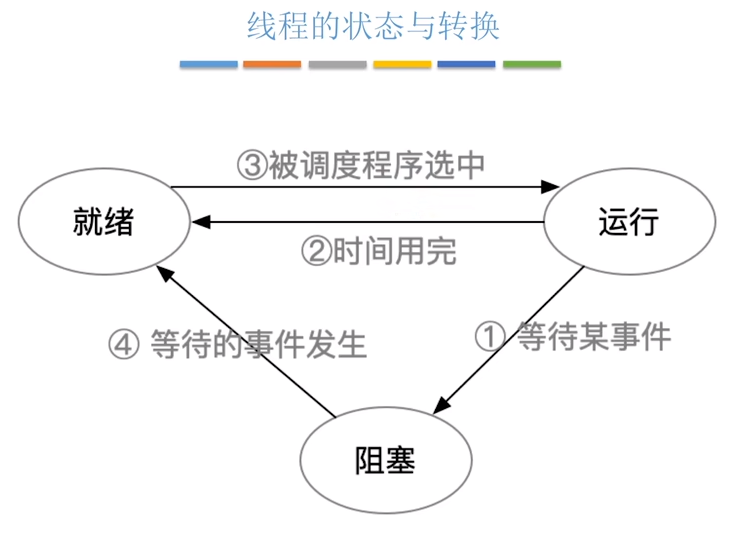
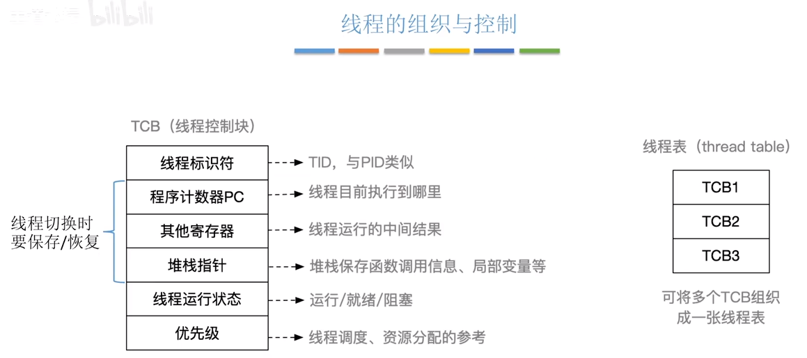

## 为什么要引入线程
传统的进程是程序执行流的最小单位，一个程序的执行就在一个进程中依次执行代码。那么 QQ 这个程序如果只有一个进程，就无法做到一边视频聊天，一边文字聊天，一边传文件了。所以，进程之中引入了线程，CPU 不再是轮流的执行每个进程，而是执行每个进程里的线程。线程就成为了程序执行流的最小单位。
  
  

#### 引入线程后的变化
  

#### 线程的属性
  

## 线程的实现方式
#### 用户级线程
只有进程的上古时期，程序员通过代码实现类似线程的运行机制，那个时期很多编程语言都实现了线程库来方便程序员开发类似线程的功能。（比如 react 中实现时间切片一样）
  
1. 用户级线程由应用程序通过线程库实现所有的线程管理工作都由应用程序负责(包括线程切换)
2. 用户级线程中，线程切换可以在用户态下即可完成，无需操作系统干预。
3. 在用户看来，是有多个线程。但是在操作系统内核看来，并意识不到线程的存在。“用户级线程”就是“从用户视角看能看到的线程”
4. 优缺点
    * 优点:用户级线程的切换在用户空间即可完成，不需要切换到核心态，线程管理的系统开销小，效率高
    * 缺点:当一个用户级线程被阻塞后，整个进程都会被阻塞，并发度不高。多个线程不可在多核处理机上并行运行。

#### 内核级线程
由操作系统实现、管理的线程。线程在切换时需要 CPU 由用户态切换为内核态后再切换线程。
  

#### 多线程模型
在现代计算机上，操作系统实现了线程，用户依然可以实现用户级线程，从而实现每个线程上还有类似线程的执行（也叫微线程，如 React 实现的 Fiber 架构）。
* 进程：独立的资源分配单元，隔离性强，开销较大。
* 线程：共享进程资源，轻量级并发单元，开销较小。
* 微线程：用户态管理的更轻量级并发单元，开销最小，适用于高并发场景。

线程模型包括：
* 一对一模型：一个进程运行多个内核级线程，一个内核级线程只运行一个用户级线程。
* 多对一模型：一个进程运行一个内核级线程，一个内核级线程运行多个用户级线程。（退化为了原始的用户级线程）
* 多对多模型：一个进程运行多个内核级线程，程序通过线程库实现用户级线程，并且可以将不同的功能动态分配到空闲的内核级线程上（具有负载均衡功能）。
  

## 线程的状态与转换
和进程的状态与转换基本一样。
  
  
