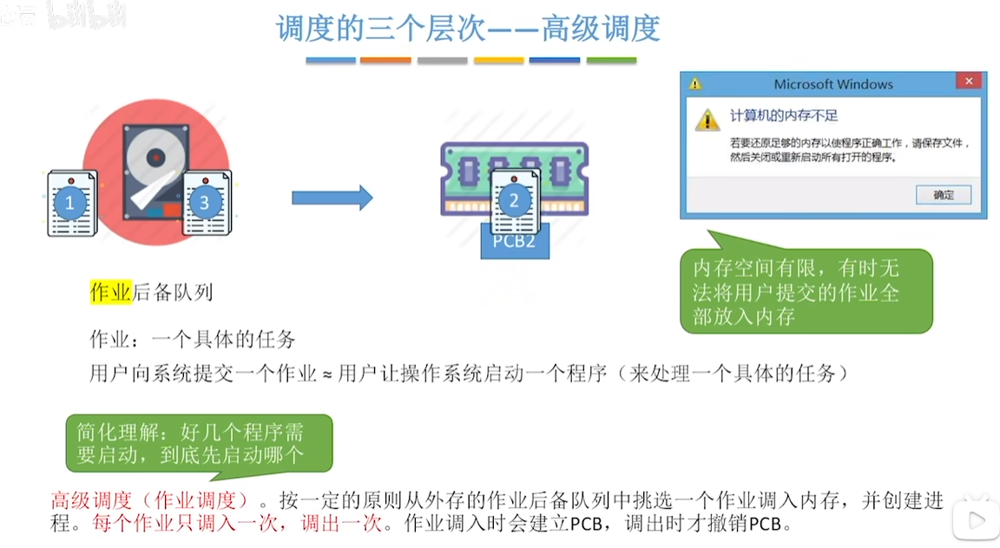
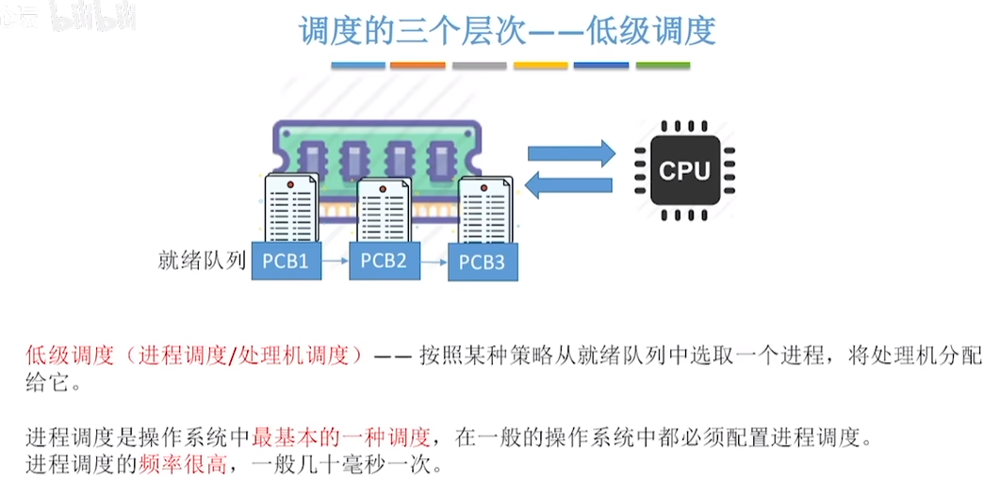
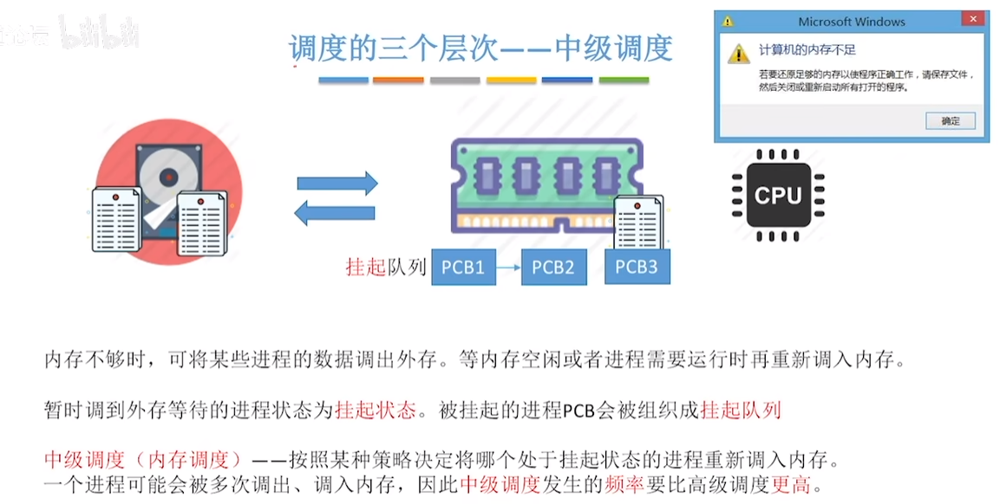
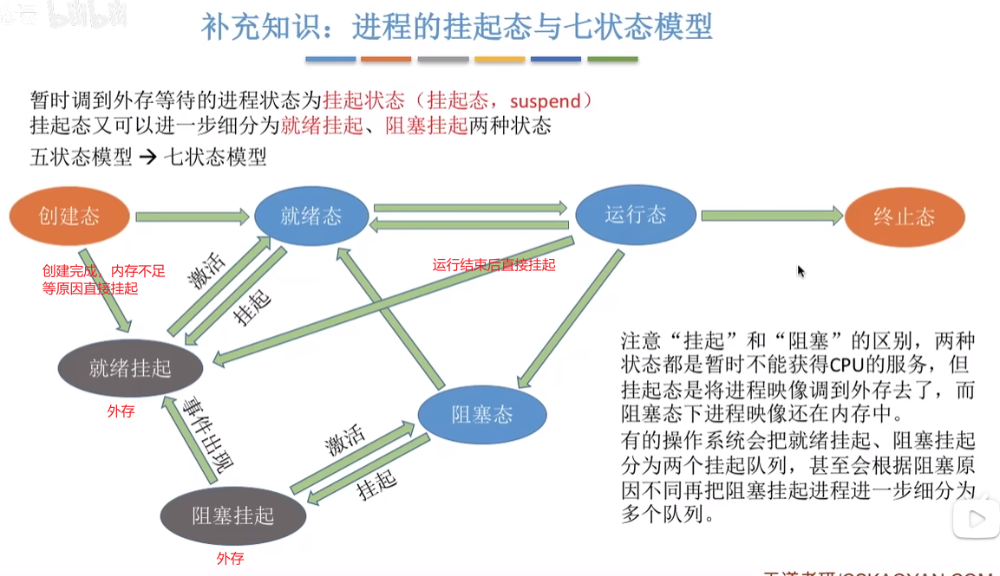
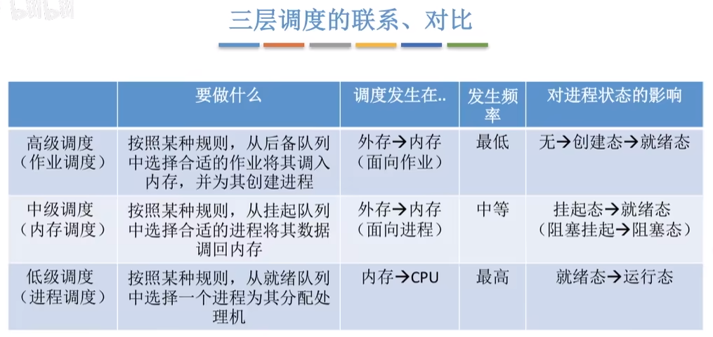
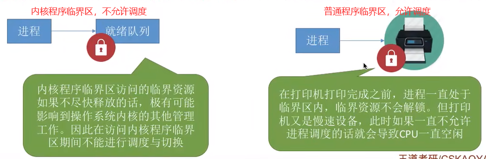

## 调度的基本概念
程序执行的过程中，可以按照指定的规则决定处理任务的顺序，这就是调度的作用。
  

## 调度的三个层次
#### 高级调度
作业：一个具体的任务。
高级调度就是程序启动进入内存创建进程时的调度。
  

#### 低级调度
对进程上 CPU 进行调度。
  

#### 中级调度
将进程在内存和外村之间进行调度。比如手机上处于后台的程序，有时切回会感觉较慢，就可能是进程被调度到外存了，切回时需要从外存调回内存使用。
  

## 进程的挂起态与七状态模型
  
进程挂起，进程的相关数据会被存储到外存中，从而减少内存占用。主要包括两种情况：
* 内存不足时，创建的新进程会进入挂起态，等待内存足够时再载入。
* 运行完成、就绪态、阻塞态的进程，在内存不足时进入挂起态，腾出空间运行别的进程。

## 三层调度的对比
  

## 进程调度的时机、方式与过程
#### 进程调度的时机
  

* 临界资源:一个时间段内只允许一个进程使用的资源。各进程需要互斥地访问临界资源。
* 临界区:访问临界资源的那段代码
* 内核程序临界区一般是用来访问某种内核数据结构的，比如进程的就绪队列(由各就绪进程的PCB组成)

所以操作系统在执行内核程序临界区的代码时，不能进行进程调度。
  
普通临界区访问的临界资源不会直接影响操作系统内核的管理工作。因此在访问普通临界区时可以进行调度与切换。

#### 进程的调度方式
  

#### 进程的切换与过程
  
