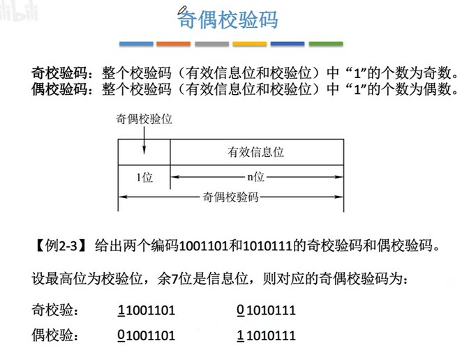
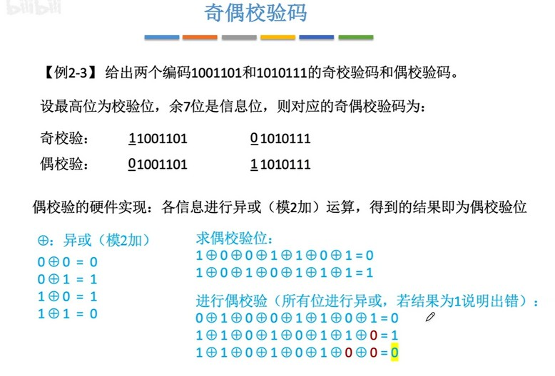

信息传输过程中，传输的数据可能因为元器件故障或干扰倒是传输的二进制码发生了变化，所以接收时需要进行校验本次传输的数据是否正确。奇偶校验就是其中的方式之一。
  

使用奇校验的方式时，传输的二进制数据必须保证1的个数为奇数，如果二进制中1的个数为奇数，则在高位补0；如果1的个数为偶数，则在高位补1，让其为奇数。接收放接收到数据时，就会校验1的个数是否为奇数，为奇数说明传输的数据正确。所以，如果传输过程中，某位发生了变化，从0变成1或者从1变成0，那么就不再是奇数，说明传输数据错误，需要重新发送。这种校验方式的局限性在于，如果两个位都发生了变化，不会影响奇偶性，那么就检查不出来了。
偶校验和奇校验类似，只是将1补全为偶数进行校验。

  
计算机通过对接收到的数据每一位依次进行异或运算，就能知道是否出错。