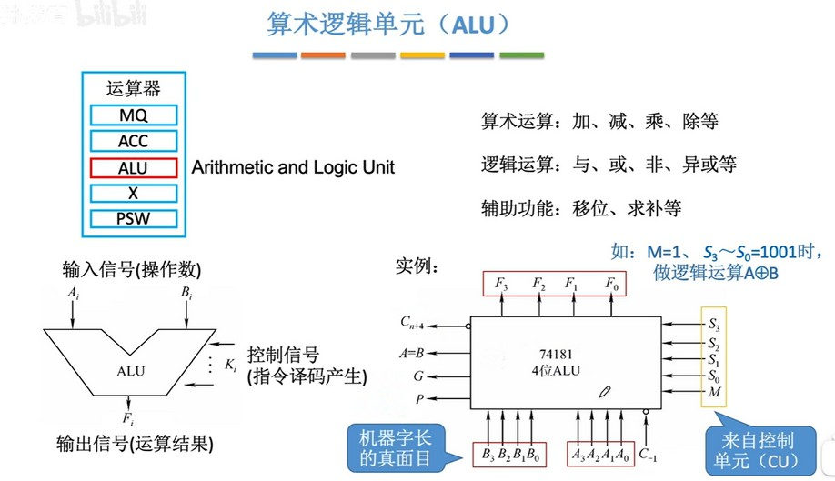
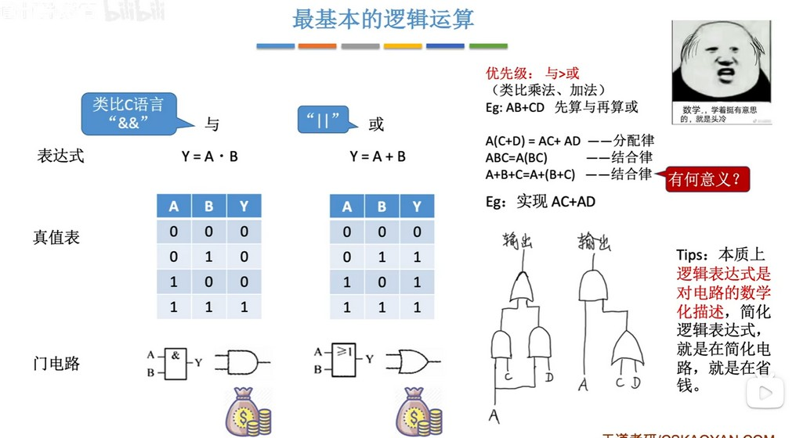

### 算术逻辑单元（ALU）
ALU 负责算术运算、逻辑运算、移位等。接收两个输入 A 和 B，进行运算后得到一个输出 F。输入和输出的长度都是机器字长，下图以4个字长简要说明。
如：CU 里的 M 为1时表示逻辑运算，为0时表示算术运算。$S_0 - S_3$根据 M 的值来表明是执行算术运算（加减乘除等）还是逻辑运算（与或非异或等），各最大支持16种运算。
  

### 最基本的逻辑运算
  
与门：两个输入都是1（高电频信号），输出才是1（高电频信号）。
或门：只要一个是1，输出就是1。
非门：输入的是1（5v高电频），输出就是0（1v低电频）；输入是0，输出是1。
注意非门的图上使用了个小圆点表示。

  
使用`·`表示与，使用`+`表示或。与的优先级大于或，与或运算适用普通运算的分配率、结合律。设计电路时用上这些定律可以节省原件。

### 复合逻辑
使用与、或、非门元器件组合实现的逻辑元器件。
 
非运算在表达式中使用上划线表示。
与非、或非都是和非门元器件（图上表示为小圆点）结合就能实现。异或就比较复杂，需要5个元器件才行。

### 奇偶校验器
  
从图中可以看出，通过不同的结合律可以设计出布局不同的校验器，他们的结果是相同的。