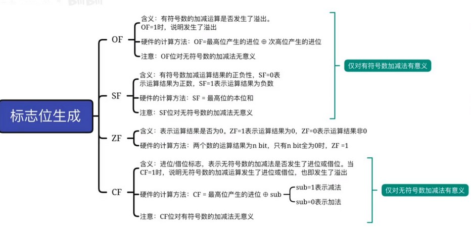

加法器相加后输出的结果，除了和输入相同位数的值以外，还有四个标志位信息。
  
  

### OF 溢出标志
  
通过将进位的最高位和次高位进行异或，为1则溢出，0未溢出。

### SF 符号标志
取结果中的最高位即可（溢出位不算）。即1为负，0未正。

### ZF 零标志
结果中所有位都为0，ZF 为1，否则为0。

### CF 进位标志
最高位产生的进位和控制信号进行异或（控制信号为加法时为0，减法时为1）。
  
加法器中，sub 和 cin 是相同的，并且会产生最高位进位 cout，所以用 cin 和 cout 进行异或就行了。