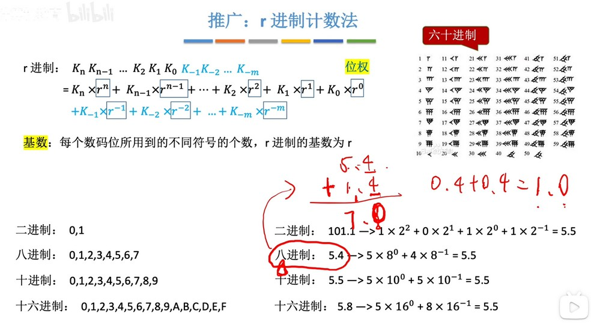
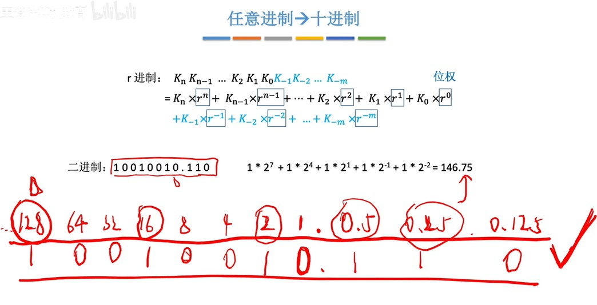
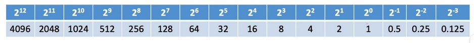
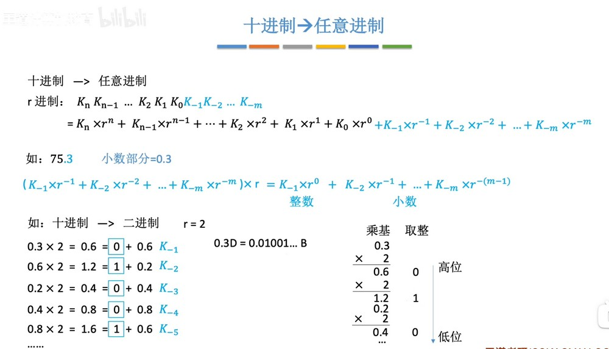

### r 进制计数法
  
1. 负数第几位就是对应进制的 -n 次方。
2. 小数位和整数位一样，逢 n 进1。

  
  
二进制计算时可以记住常用位置对应的十进制数，先把各个位置转换成对应的十进制数，然后相加即可。

### 二进制和八进制、十六进制的转换
  

### 各种进制的常见书写方式
  

### 十进制转换任意进制
##### 整数部分：
  
除基取余法——用十进制数除以要换算的进制，余数从低位到高位排列，直到余数小于要换算的进制，作为最高位。

##### 小数部分：
  
乘基数取整法——小数部分乘以要转换的进制，将整数部分取出，从第一位小数位开始往后排，再用小数位乘以进制，直到相乘后小数位为0（可能出现小数位永远不为0的情况，说明此进制无法用有限的小数表示此十进制小数，也就是无限(不)循环小数）。

### 拼凑法
  
十进制转二进制还可以使用拼凑法比较快的转换，在对应关系中选出十进制的数为1，其它位为0即可。

### 总结
  

  
八卦也是二进制