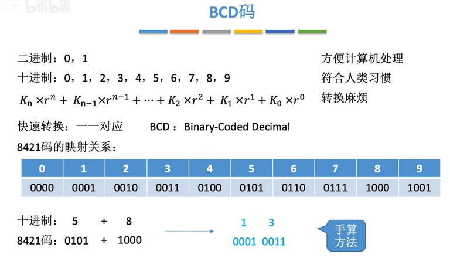
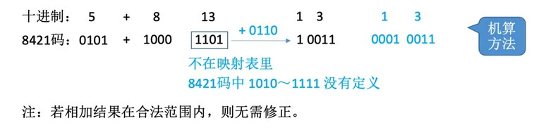
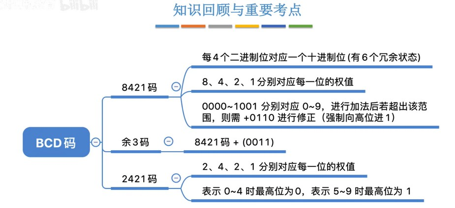

### BCD 码
用4个二进制位来表示十进制的方式。4位最大能表示15，所以就能表示0-9。BCD 码就是直接把十进制的每位像16进制那样转换成二进制。
用4个二进制位表示十进制的方式有很多种，其中最常用的是8421码。因为4位二进制的每位表示8421。我们只需要将十进制像十六进制那样将每个数按常规算法转换为二进制即可。
如：985 -> 9-1001,8-1000,5-0101 -> 100110000101。可以看出，BCD 码的二进制用在普通码上，会比985更大。所以，使用 BCD 码时需要指明这是 BCD 码，BCD 码之间的运算也是专门的运算方式。
普通二进制的 100110000101 转换为十进制是2437，转换为16进制才是985，因为我们是把985按16进制转换为的二进制。

  
人工运算只需十进制相加后再将结果转换为8421码即可。

  
计算机运算时，两个数相加后结果在1010-1111（如5+8）或超过4位（如9+9），也就是相加的值不是0-9，那么就需要将二进制结果加6即0110。
上图中5+8得到13，普通二进制表示是1101，不在超过了9，所以需要加6，得到10011，然后高位补0，得到8421码。

  
