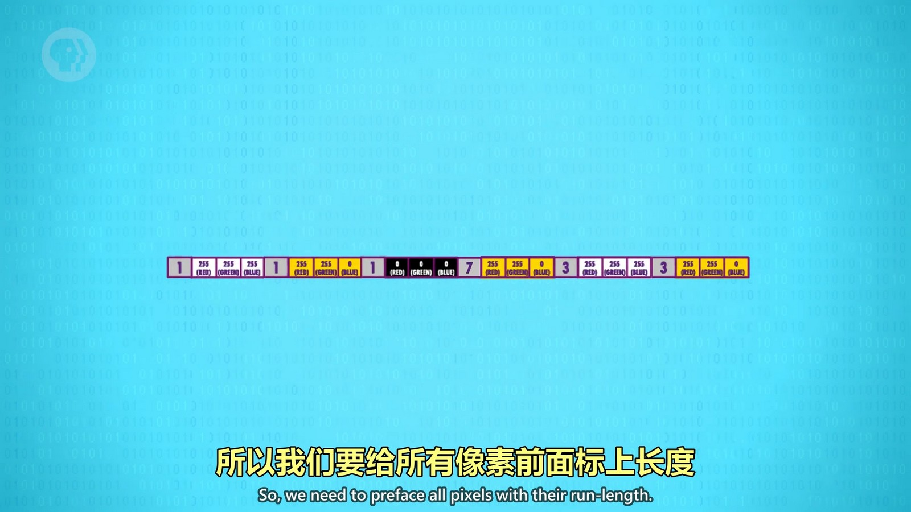
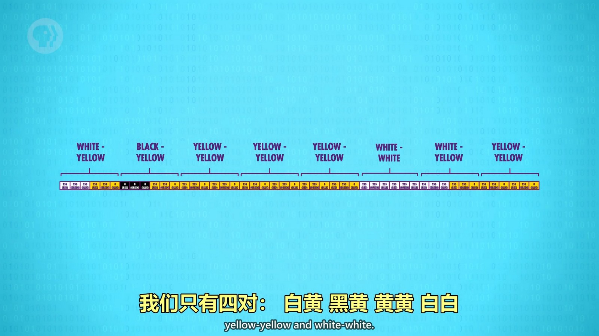
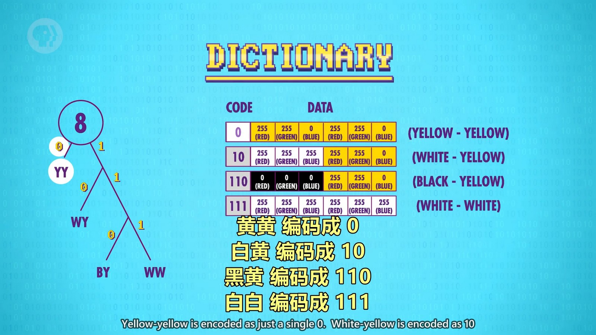
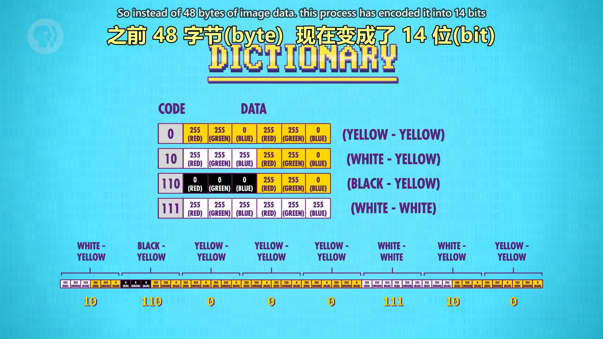
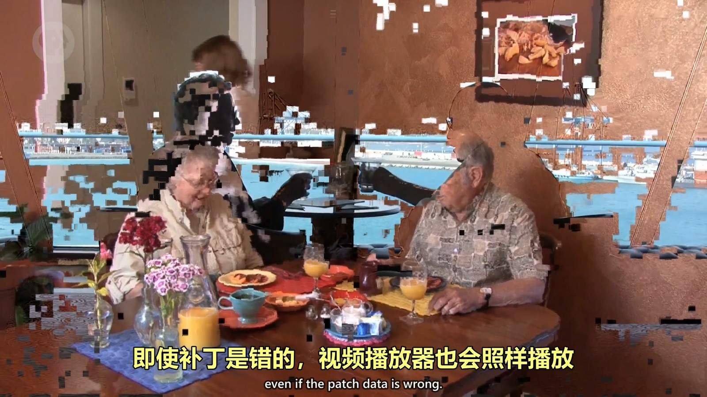

## 游程编码
适合经常出现相同值的文件。
比如有连续7个相同的黄色，可以存1个黄色值，然后再存一个次数7来表示。为了方便计算机处理，需要将每个颜色前使用空间来存储连续出现的次数，所以如果没有连续出现的颜色，反而会增加大小。这是一种“无损压缩”，没有丢失任何数据。
  

## DFTBA
需要一个字典存储“代码”和“数据”之间的对应关系。

如：把图像看成一块一块，而不是一个个像素。为了简单，先把2个像素当成1块（占6个字节）。
  
此图片中，2个像素作为1块有4种情况。使用“霍夫曼树”：
  
存储霍夫曼树的层级关系：
  
还需要把字典写入数据中用于还原：
  

**上面两种都是无损压缩。**

## 有损压缩
比如音乐，录制的音频数据中可以过滤掉人类无法感知的频率，比如超声波；人类对人声很敏感，所以应该尽可能保持原样。有损音频压缩利用这点，用不同精度编码不同频段。
这种删掉人类感知力较弱的数据的方法，叫“感知编码”。当然，如果压缩率太高了也就很容易感知了，但是也属于感知编码，因为算法是尽量保持人类所感知的部分。如 Skype 电话会根据网络状况进行压缩，网络较差时压缩率就会很高，声音听起来也就更奇怪。JPG 也是使用这样的压缩方式，对人类视觉感知不明显的地方进行压缩优化。
视频也是连续图片的集合，所以图片的压缩通常也可以用在视频上，不过视频压缩可以做一些小技巧，因为帧和帧之间通常有很多像素一样。视频压缩可以使用存储两帧之间的变化部分的方式。更高级的视频压缩甚至可以复用不同帧之间相似的部分，对这部分进行移动、旋转等操作来更新画面，不过这样的压缩方式可能出现对相似部分的算法有问题，但是视频依然会继续播放，就导致了画面问题：
  
