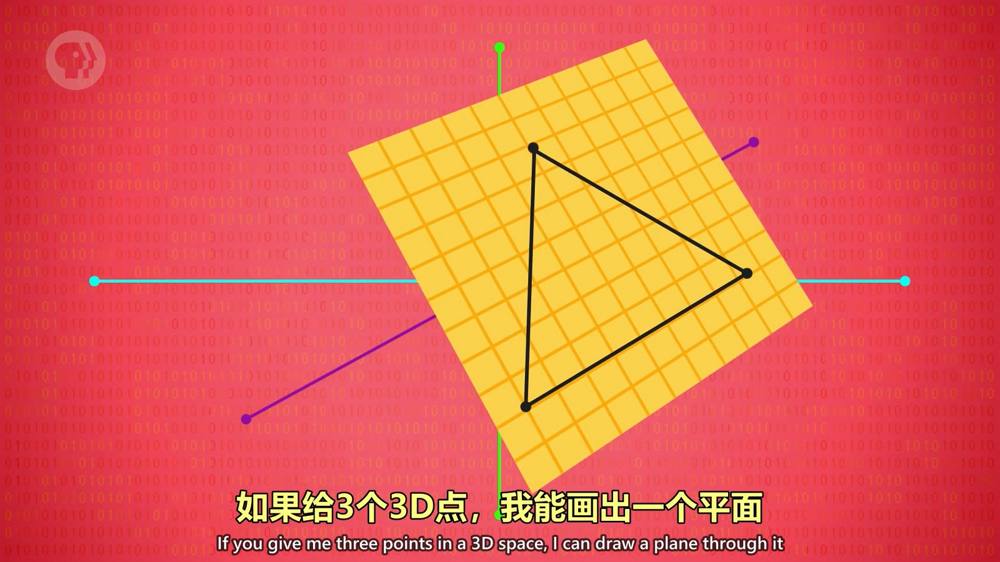
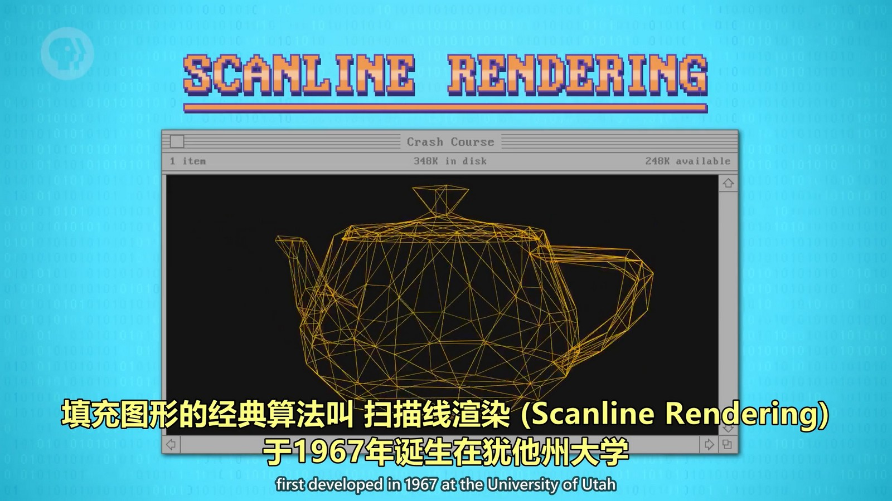
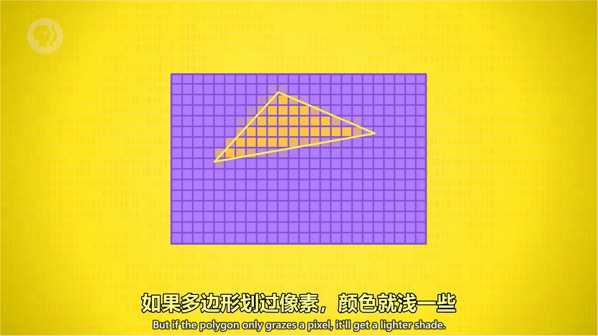
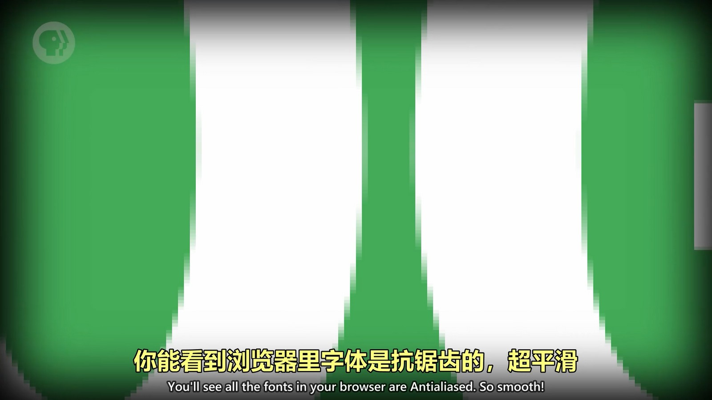
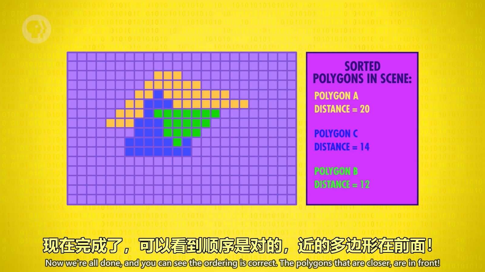
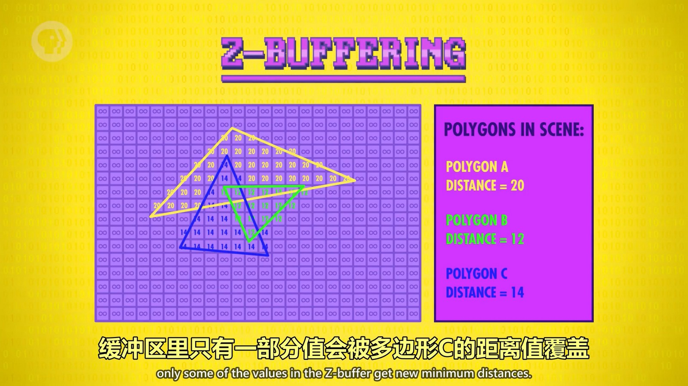
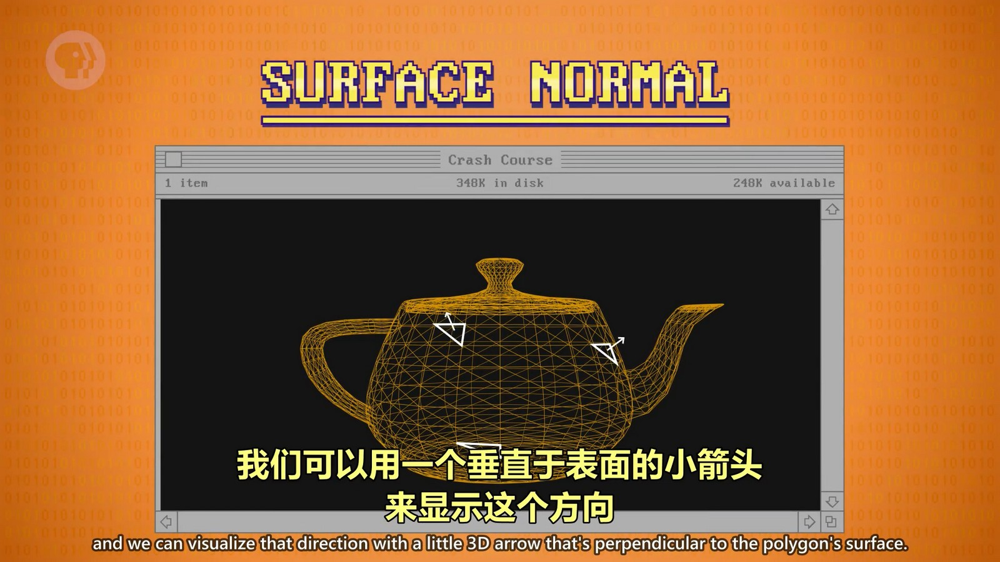
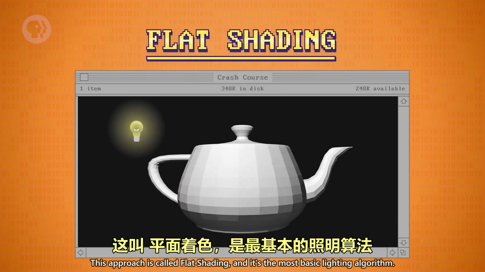

## 3D 图形中的三角形
绘制3D图形时，会使用很多个三角形来绘制，而不是四边形、五边形。为什么会使用三角形呢？
使用两个点能绘制一条线段，而三个点绘制的是一个面，三个点也组成了一个三角形，所以一个面就是个三角形。如果是四个点，并不能保证四个点都在一个面上。
  

## 3D 图形的填充
使用三角形绘制了一个面的线框，还需要对这个面进行颜色填充，填充图形的经典算法叫“扫描线渲染”。
  
将一个面使用网格划分，由于是三角形，所以一行中存在其中一条边的点，那么肯定存在另一条边的点（一行中只有个顶点，这个顶点也是两条边的点汇聚在一起，所以是两个点），将这两个点之间的网格绘制上色就完成了填充渲染。
不过这种方式会产生很明显的锯齿感，那么就需要抗锯齿技术，比如将完全在三角形内部的填充指定颜色，和三角形边相交的填充带半透明的颜色以减少锯齿感。
  

不仅3D图形会使用这样的抗锯齿技术，2D图形也会用到，比如字体渲染等。
  

## 遮挡
3D图形之间会有远近，也就会发生遮挡，处理遮挡的方式就是由远到近绘制图形，近处的图形后绘制，颜色覆盖远处的，就实现了遮挡的效果。
  

上面的方法需要对距离进行排序后线绘制远处的，另一个方法是“深度缓冲（Z-buffering）”，不需要进行排序，所以速度更快。实现方式是遍历各个绘制的图形，并对填充部分标记距离，当另一个图形也用到了相同的填充部分，就会判断这个图形设置的距离是否更近，更近才会更新距离。
  

## 明暗
每个三角形面对不同的方向，他们面对的方向叫“表面法线”，如下图中垂直于三角形的箭头。
  

由于三角形面对的方向不同，就可以根据是否面对光源以及和光源的距离等计算出亮度，这叫平面着色。
  
这种着色是最简单的算法，会让每个面颜色一样，边界很明显，看起来是一块一块的。所以有更多更高级的着色算法来实现更好的效果，如“高洛德着色”，“冯氏着色”。

## 纹理
纹理即纹理贴图，是将图案绘制到三角形上的功能，使用的技术叫“纹理映射”。
首先，要绘制的图案可能会很大，占据多个三角形，所以需要个算法计算出每个三角形对应的图案中哪个部分的映射关系。在扫描线算法中，绘制的时候也不是把使用的纹理图案一个像素一个像素的绘制到三角形中，而是根据扫描线中的一块区域对应纹理中的一块区域，然后计算纹理中这块区域颜色的平均值，将这个颜色填充到扫描线对应的区域中。
  

## GPU 加速渲染
可以看出，在渲染3D图形时计算量是非常大的，使用 CPU 这种通用型计算机来计算会很慢，GPU 因此应运而生。GPU 对图形渲染做了很多设计和优化，让其能并行、高效的对多边形进行渲染计算。