## 以太网
局域网是 LAN，以太网是一种如今仍在广泛使用的局域网技术。
局域网中的各台计算机通过网线连接，一台计算机使用电信号通过网线给另一台计算机发送数据，由于所有的计算机都使用网线互联着，那么按理说其它的计算机也能收到这些数据的电信号。为了指定接收的计算机和判断是否是传给自己的数据，所以每台计算机都有唯一的媒体访问控制地址，简称 MAC 地址。将 MAC 地址放在数据的头文件中，接收数据的计算机就能判断是否是发送给自己的数据，从而判断是否需要接收。
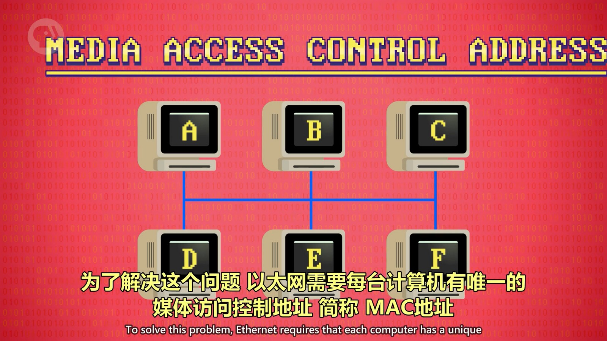  

此时，如果同时有两台计算机要发送数据，那么就出现冲突了。计算机会通过电信号检测是否出现冲突，如果出现冲突，计算机就会暂定传输数据并等待一段时间后再发送数据，并且在发送数据时会检测局域网中是否有其它计算机在传输数据，如果没有才开始发送数据。
计算机发现冲突的等待时间是以指数级递增的，如第一次等待1秒，再次尝试发送数据时发现还有别的电脑在传输数据，就会再等待2秒，下次就会是4秒。这是为了减少不必要的检测次数，叫做“指数退避”。

## 冲突域 与 交换机
如果一个局域网内计算机多了，那么发生冲突的可能性就会大大提升，这也形成了一个冲突域，这个域里的计算机之间传输数据会出现冲突的情况。解决办法是将多台计算机拆分为更小的域，此时就需要使用交换机。
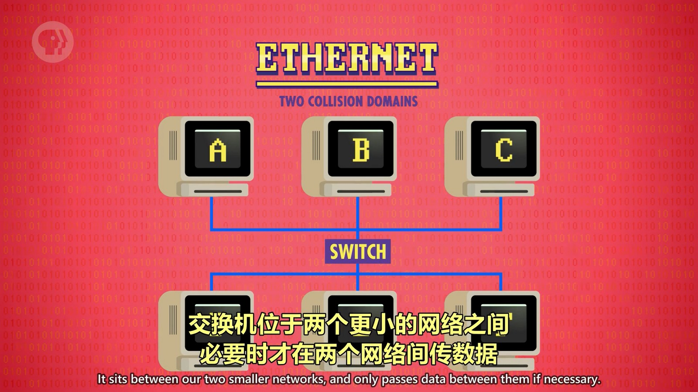  

交换机会记录不同域的 MAC 地址列表，在同一个域中的计算机之间传输数据，交换机会知道这是在同一个域中的计算机，因此可以控制网络数据不会影响到另外的域。
  

不同如果一个域的计算机要往另一个域的计算机发送数据，就要通过交换机，此时这两个域的网络都会被占用，其它计算机就不能发送数据了。当然，这也不会影响到其它域中的计算机。
  

所以，交换机在提升大型局域网中的数据传输性能是非常有用的。

## 广域网
广域网的运作模式和局域网是类似的，只是通过路由连接着各个区域。从某个区域发送数据到另一个区域就要通过路由一级一级的查找目标计算机，
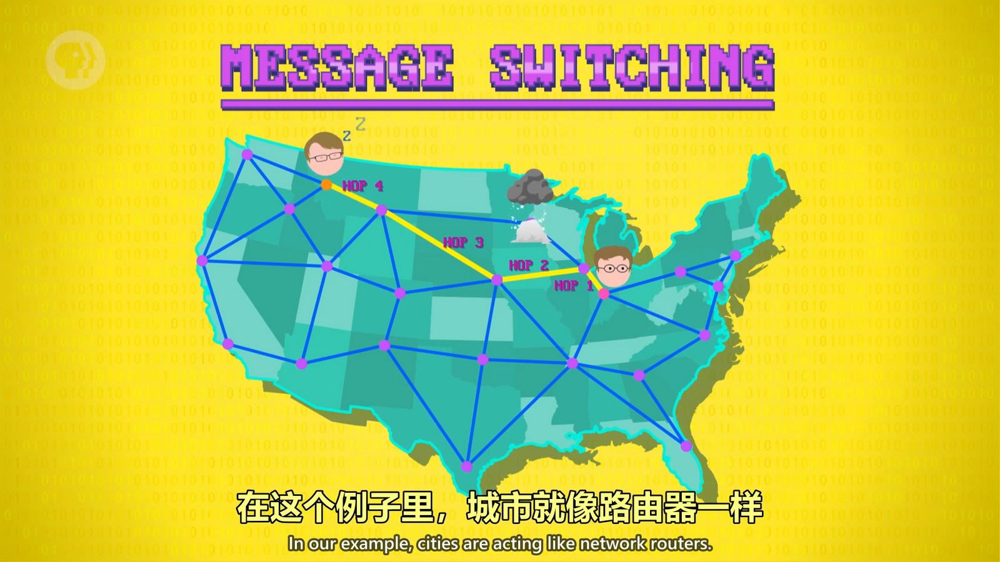  
数据沿着路由跳转的次数叫“跳数”（hop count），记录跳数可以分辨出下级路由是否出问题，如果有问题就通过其它路由传输。如果看到跳数很高，就可以推断出是路由出现问题了。

当要传输一个很大的文件时，需要等这个文件传输完后，别的计算机才能传输自己的文件，即使别的计算机只传输个1KB的文件也要等待，这是不合理的。所以，在传输文件时会把数据拆分成很多个“数据包”，每个数据包都携带了要到达的目标计算机地址（IP 地址），并且路由器可以根据网络情况将不同的数据包通过不同的路线传输，最终都会到达目标计算机。但是由于不同数据包的路线不同，到达的顺序就可能错乱，因此在 IP 之上诞生了 TCP/IP，可以在接收到数据包后对数据包进行排序。
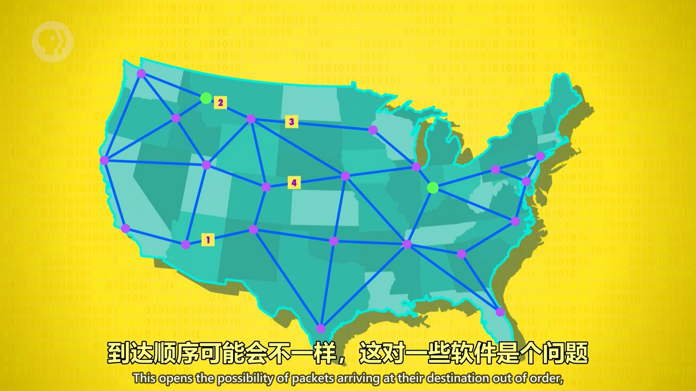  

## 互联网
当我们要访问 YouTube 的时候，数据需要先经过家用路由器到达光猫，光猫通过运营商的线路到达街区路由器，街区的路由器再将数据传输给城市路由器，城市路由器可能又经过几次跳转后将数据传输给互联网主干，互联网主干由一群超大型、带宽超高的路由器组成，然后又通过几次跳转到 YouTube 所在的城市 -> 街区 -> 服务器。
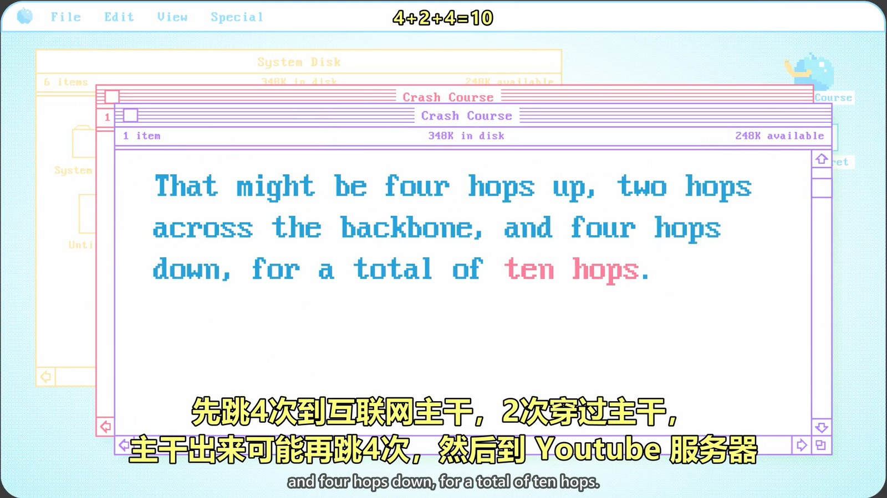  
可以使用 traceRoute 软件来看跳了几次。

## IP
IP 即 Internet protocol，互联网协议，是一个非常底层的协议。协议的头部存储的“关于数据的数据”，也叫元数据。元数据中含有目标地址，但是传输到了目标计算机，目标计算机并不知道是哪个程序需要接收这个数据。
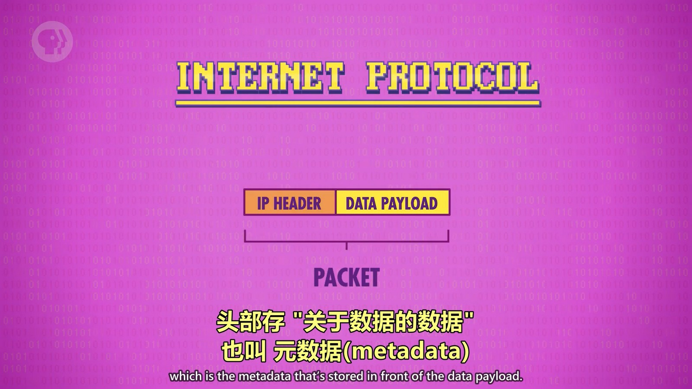  

## UDP
因此，在 IP 之上开发了更高级的协议如 UDP（用户数据报协议），UDP 的头文件在 IP 头文件后面，其中描述了接收方计算机使用的端口号，而每个网络程序都会在计算机中占用一个端口号，所以通过 UDP 头文件中的端口号就可以将数据发送给指定的程序了。
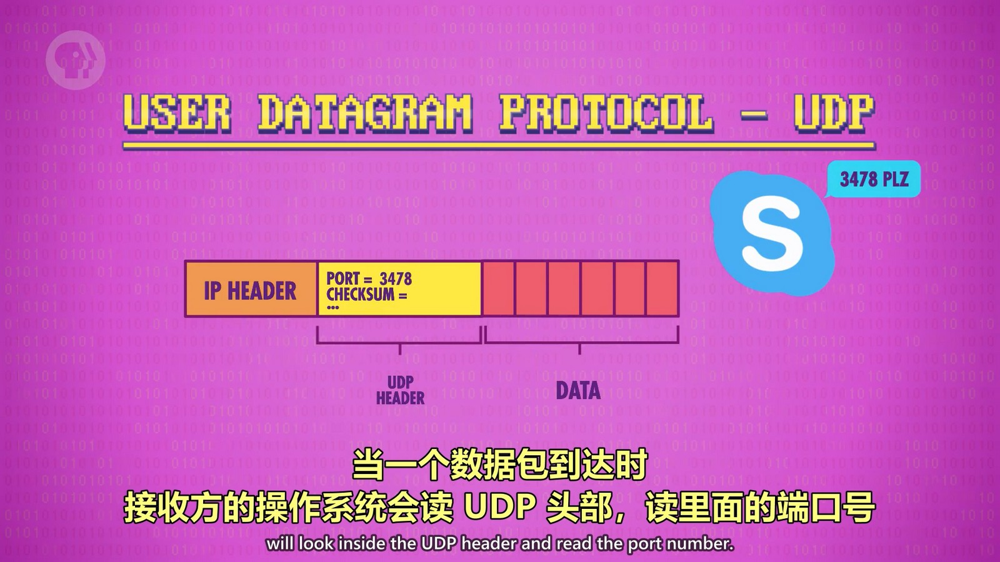  
**一个端口号不能被相同的协议绑定两次，但是可以被不同的协议绑定。如端口号7890被一个使用 UDP 协议程序绑定了，另一个使用 UDP 协议的程序就不能再使用这个端口了，但是另一个使用 TCP 协议的程序还可以使用这个端口，因为数据传输不仅会根据端口号，还会根据协议传输给相应的程序，所以不同协议绑定相同的端口号并不会导致冲突。**

UDP 头文件中还有个重要的字段是 CHECKSUM（校验和），用于校验此数据包中传输的数据是否正常。数据包在传输时会使用16进制将数据计算出一个数值即校验和，使用16位形式存储，如果值超过了16位能表示的最大值，则高位数会被扔掉保留低位。接收方接收到数据后也会使用相同的算法计算接收到的数据的值，和校验和进行比较，如果相同则表示数据正常，不同则说明数据传输中出现了错误。UDP 协议发现有错误就会将数据扔掉而不会重新获取此数据包，而 TCP 就会重新要求传输方再次发送此数据包。
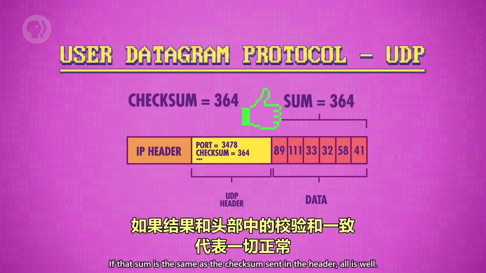  

## TCP
Transmission control protocol “传输控制协议”简称 TCP，它能控制传输的数据以保证全部内容都能接收到。
1. TCP 数据包有序号，接收方可以把数据包排成正确的顺序。
2. TCP 要求接收方校验数据包完整无误后，给发送方发送一个确认码（ACK）代表收到了。得知上一个数据包成功抵达后，发送方会发送下一个数据包。如果过了一定时间还没收到确认码，发送方会再发一次。
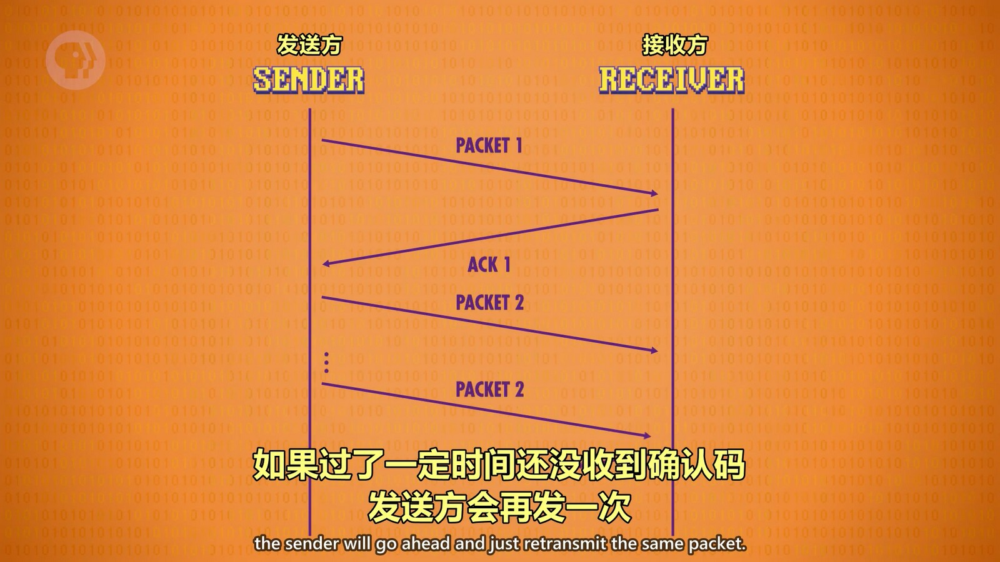  
    当然，也有可能是接收方收到了数据，但是发送确认码时失败了，导致发送方重复发送数据，此时接收方收到重复的数据就可以根据序号将重复数据丢掉。
3. TCP 可以同时发送多个数据包，收多个确认码，这也大大提高了效率，并且最终接收到的数据可以通过序号进行排序。

## DNS
“域名系统”简称 DNS，用于管理域名和 IP 的系统。DNS 会根据域名查到对应的 IP，然后返回给浏览器，浏览器再用这个 IP 向对应的服务器发送数据。
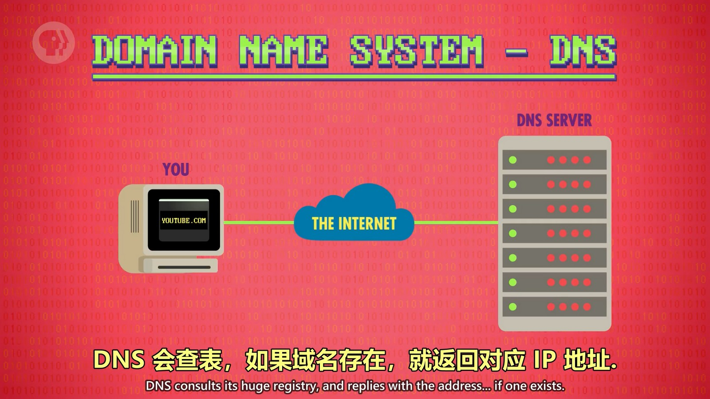  
DNS 是以树状结构存储的，并且这个树超级大，因此使用不同的 DNS 服务器管理不同的子树，可以提高性能。
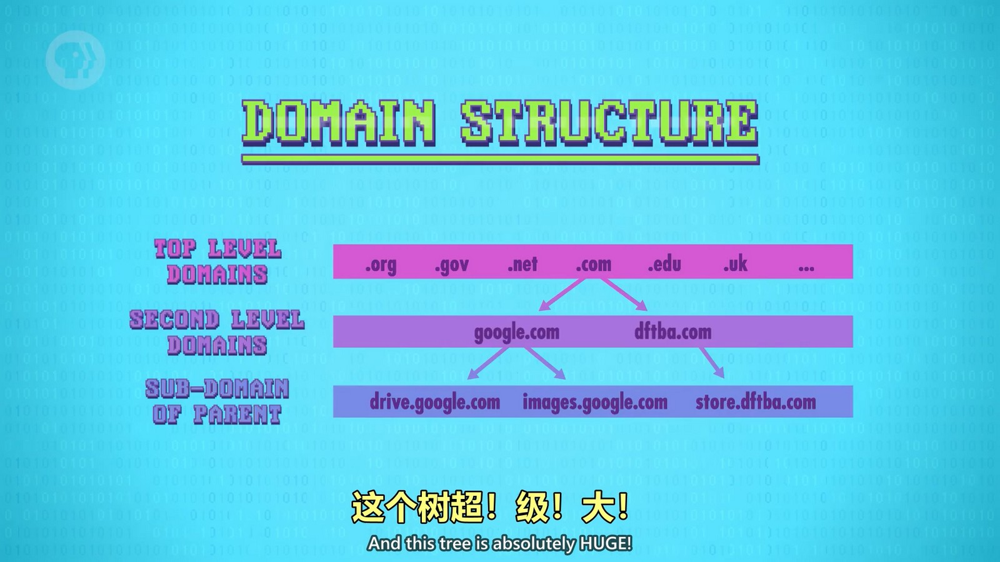  

## OSI 分层模型
从计算机硬件到网络到软件应用，每一部分都是相当复杂的，因此计算机科学家们将数据的传输经过的各部门进行了分层，提供了抽象能力，负责各自那层的专业人员也可以将重心聚焦到自己关注的部分，从而降低了心智负担。
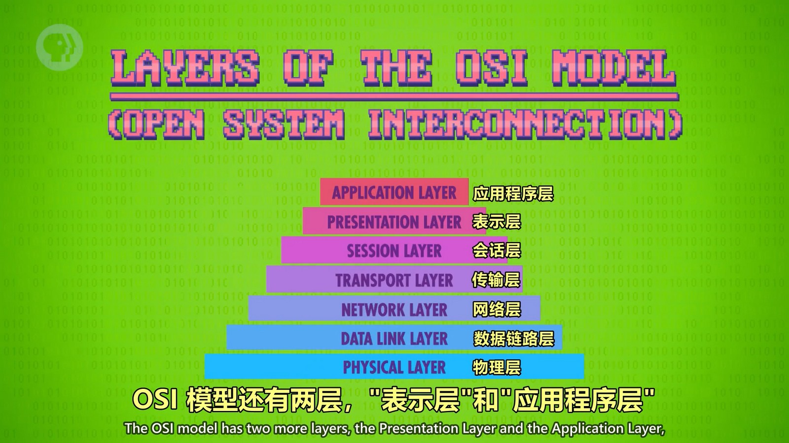  
实际很少用到完整的OSI模型，通常会使用五层模型，分别是物理层、数据链路层、网络层、传输层和应用层。物理层和数据链路层又合并为网络接口层，成为TCP/IP协议。
[从双绞线到TCP/IP协议](https://www.bilibili.com/video/BV1Jw411y7qP?spm_id_from=333.788.videopod.sections&vd_source=8220e726dcb3a350fd156cea947bd58b)

## 万维网
万维网并不等价于互联网，通过浏览器访问的网站才是万维网，而互联网是各种网络应用的总称。我们在浏览器中通过各种超链接可以在各个网站之间跳转，所以叫做万维网。
每个网页都需要有个唯一的地址，这个地址叫“统一资源定位器”，简称 URL。