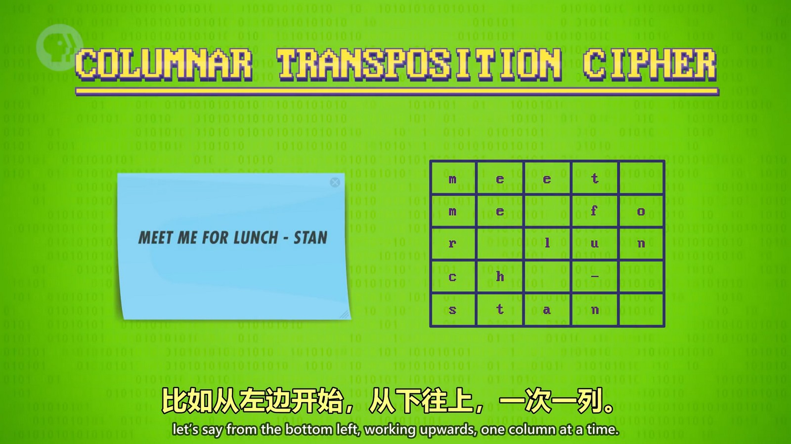
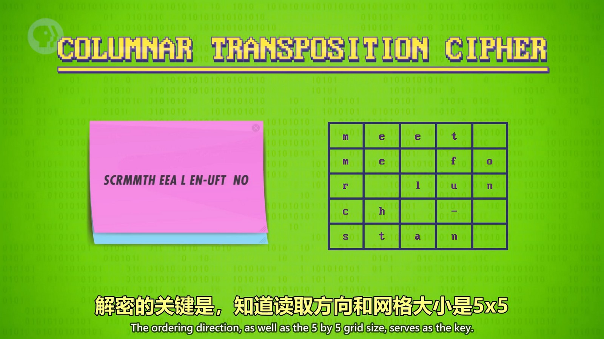
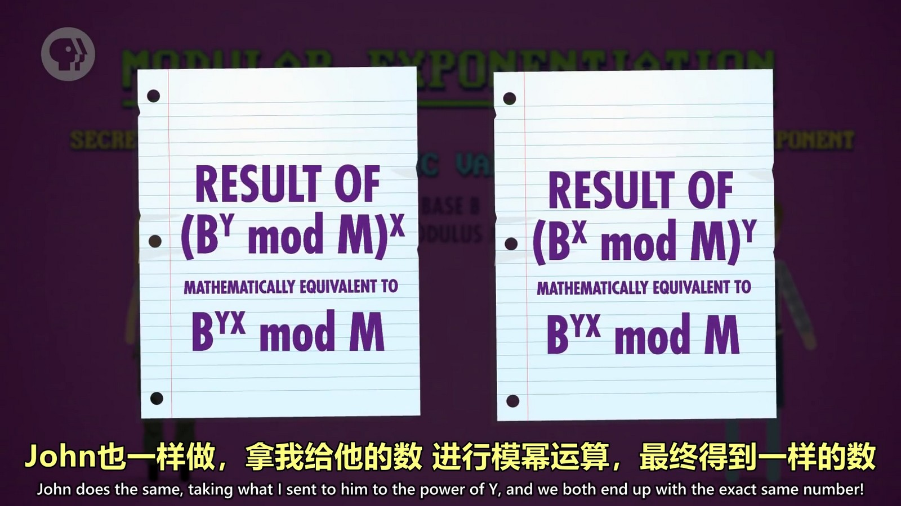

## 替换加密
将每个字母替换成其它字母，最简单的加密方式之一，容易被破解。

## 移位加密
按照一定的行列数进行书写后，以不同的顺序读取。
如：一行5个字符进行书写，然后从下往上一列列读取：
  
  

## 单向函数
使用私钥和公钥的一种对称加密方式。比如公钥是 A，我的私钥是 B，服务器的私钥是 C。那么将公钥加上我的私钥发送给服务器，也就是 AB 发送给服务器，服务器会再加上自己的私钥，也就是 C 得到 ABC 作为与我通信的密钥；服务器也会将它的私钥和公钥结合得到 AC 发送给我，我拿到 AC 后也会将我的 B 加进去得到 ACB 这个密钥。实际上公钥和私钥结合需要通过算法结合，而结合的算法就类似颜色的结合，ABC 三种颜色合在一起和 ACB 三种颜色合在一起的结果是相同的，所以 ABC == ACB，我和服务器的密钥是相同的，我们通过这个密钥就能进行通信了。
这个将公钥和私钥结合的函数就是单项函数，通常通过模幂运算计算出私钥。
  
上图中 B 是公钥，X 和 Y 是私钥。

## 非对称加密
另一种使用私钥和公钥的加密方式。用户的密码通过公钥和加密算法进行加密后发送给服务器，而解密只能通过服务器的私钥和解密算法才能得到用户输入的密码。所以当用户输入的数据被黑客拦截后，黑客没有服务器的私钥也无法解密出用户的密码。因为加密和解密使用的公钥和私钥是不同的，所以交非对称加密。

还有种使用私钥加密后，用公钥解密的方式，这种做法用于签名。服务器用私钥加密后，用户使用公钥解密，解密出的结果是正确的密码，说明来自正确的服务器。而别的服务器由于没有私钥，所以无法正确的加密。

目前最流行的“非对称加密”技术是 RSA。

  
