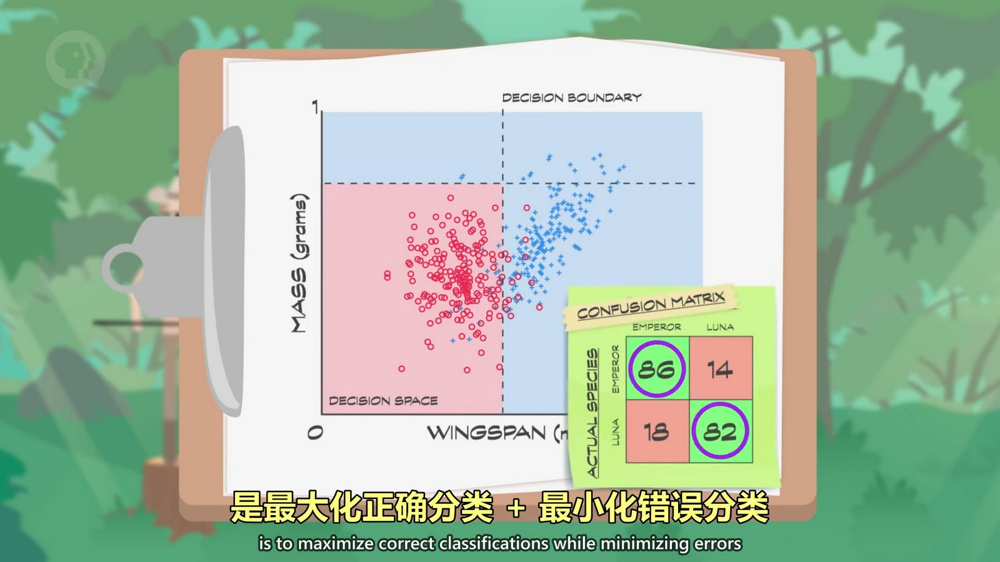
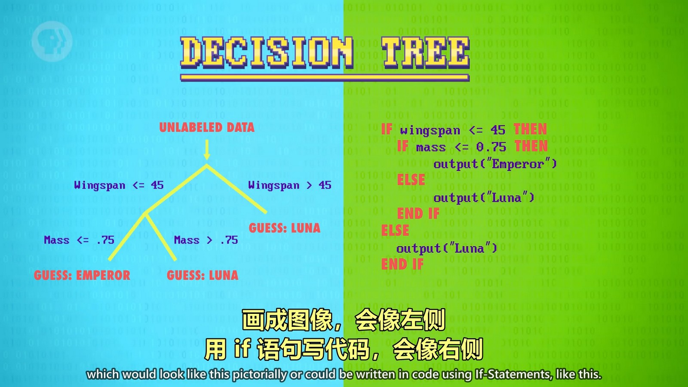
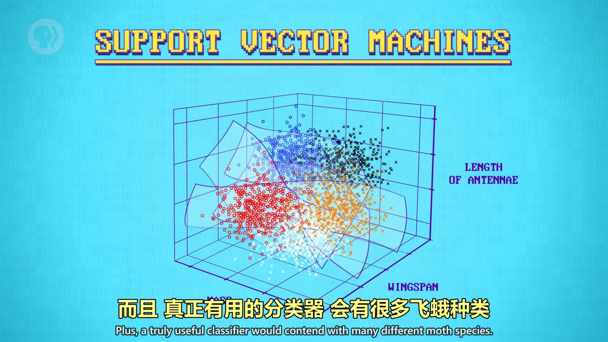
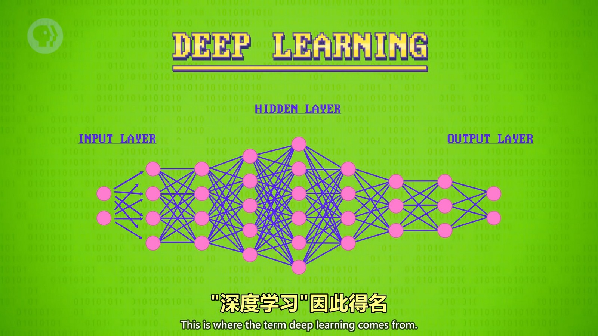

## 机器学习
机器学习算法让计算机可以从数据中学习，然后自行做出预测试决定。机器学习是实现人工智能的技术之一。
首先要将数据简化成“特征”，通过特征进行“分类”。但是通过特征数据进行分类后，也不能保证所处分类的数据就是正确的数据。机器学习只能尽可能的最大化正确分类和最小化错误分类。
  

## 决策树
当我们获取到一个新数据要想知道它所属的分类时，可以使用“决策树”这样的算法来进行预测，决策树由机器学习算法生成。
  
一些算法可能会使用多个决策树来预测，所以也叫做“森林”。预测算法也不只是决策树这一种，有各种各样的算法。
随着特征和分类的增加，算法会变得非常复杂。
  

## 神经网络
也是将数据通过各种复杂算法后得到分类，只是这种算法过程类似神经元，所以叫做神经网络。
  
  

这种只能做特定任务的 AI 叫“弱 AI”或“窄 AI”，通用型 AI 叫“强 AI”，目前还未诞生。