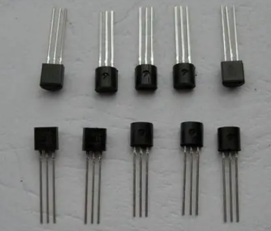
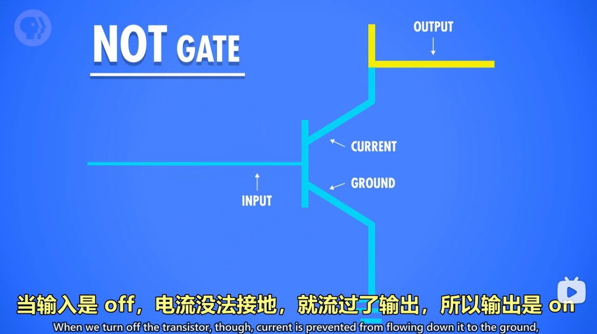
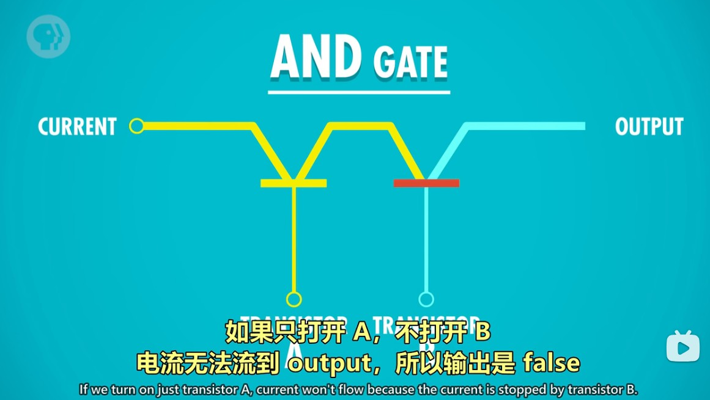
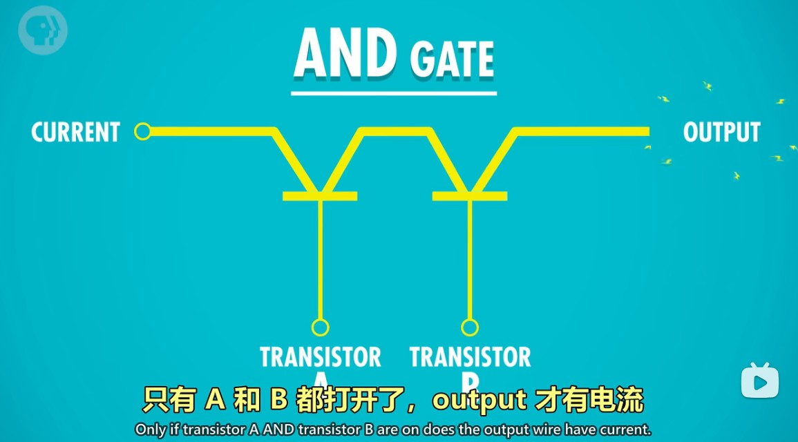
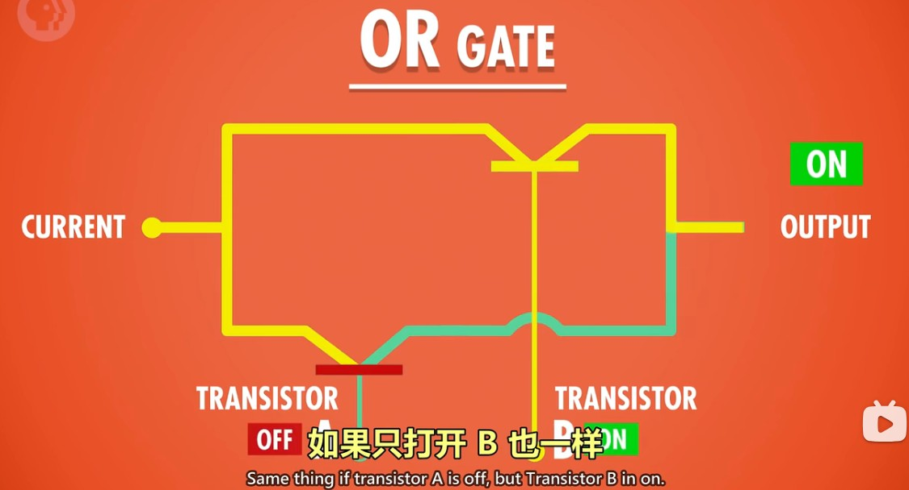

门电路的制造从机械构造发展到二极管、三极管，而现在的门电路多为晶体管制造。晶体管为固态，不像二极管那样类似灯泡，晶体管的性能和可靠性都要高很多。
  
在场效应晶体管（FET）中，有源极（Source）和漏极（Drain）两个术语。以下是它们的简要解释：

**GPT：**
源极（Source）：源极是FET的一个主要极端，它通常用于连接到电源的一个极，以提供电流。对于N沟道场效应晶体管（N-channel FET），源极通常与负电源（地或零电位）连接，而对于P沟道场效应晶体管（P-channel FET），源极通常与正电源连接。

漏极（Drain）：漏极是FET的另一个主要极端，它通常用于连接到电路的另一部分，以输出电流。对于N沟道FET，漏极通常连接到负载电阻或其他电路组件，而对于P沟道FET，漏极通常连接到正载荷。

总结一下，晶体管的源极通常是FET（场效应晶体管）中的一个主要极端，用于提供电流。在BJT（三极晶体管）中，代替源极的是发射极，而在FET中，使用源极和漏极来描述电流的流动。因此，在讨论晶体管时，要根据具体的晶体管类型来确定使用的术语。

使用晶体管制造门电路，都会有一个或两个（不确定是否有多个）输入电流，用于输入0或1（根据电流的高低电平判断），还有一个输入是源极（很重要，和输入一起配合得到需要的输出），一个输出是漏极。

#### 非门
当源极合输入都为1（高电平）时，电流会引导到下面那根线，从而输出为0。
  

当输入为0（低电平）时，源极的高电平就不会引导到下面的线上，从而输出为1（高电平）。
  

**GPT：** N沟道FET通常有三个引脚：源极（Source）、栅极（Gate）和漏极（Drain）。当输入 A 为高电平（逻辑1）时，对栅极施加正电压。这个正电压改变了栅极和源极之间的电场，使电子能够流从源极流向漏极，导致FET处于导通状态（导通后电流流向下方的漏极）。当输入 A 为低电平（逻辑0）时，栅极上的电压太低，无法形成足够的电场，电子无法流动，因此FET截止（截止表示未导通，源极的电流就流向了输出端）。

#### 与门
与门的电路设计中，输入为0时则开关不接通，输入为1时接通。
  
  

#### 或门
或门只要有一个开关接通则电流能通过输出。
  

#### 异或门
异或门由与门、或门、非门组合而成。上方的与门和非门实现了当 AB 都为1时，输出为0，最后的与门也肯定为0,。下方的或门实现了当 AB 都为0时，输出为0，最后的与门也肯定为0。其它情况就是一个为0，一个为1，上下两条线都会输出1，最终结果为1.
  
