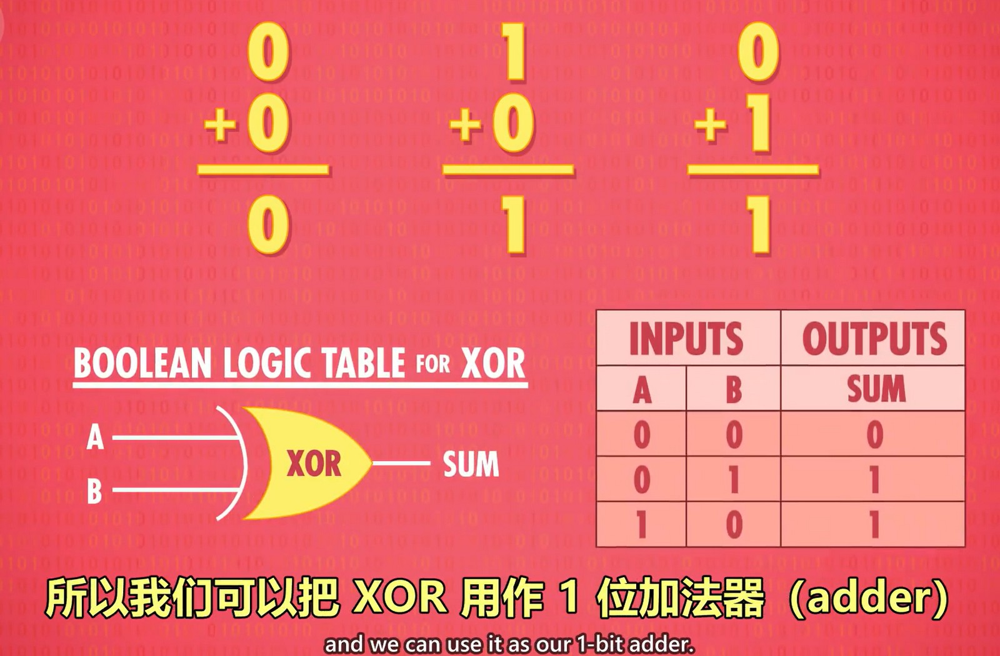
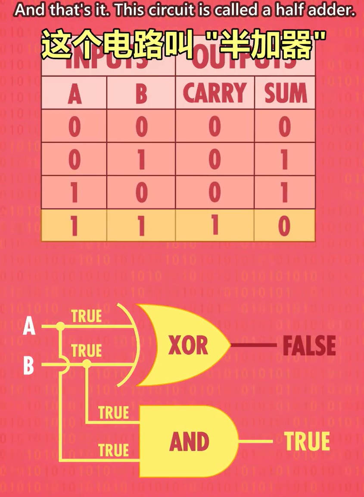
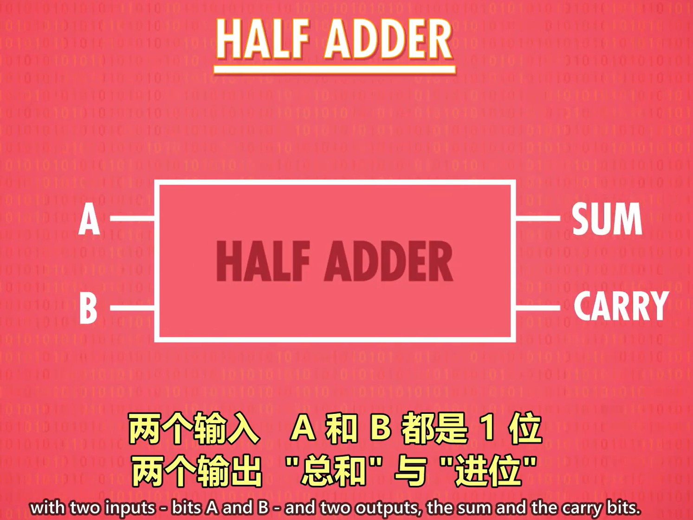
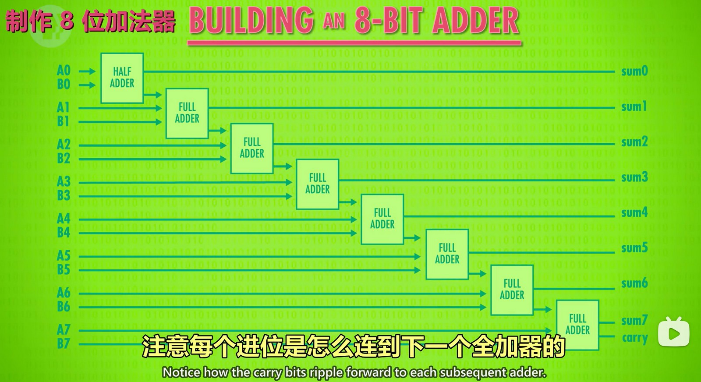
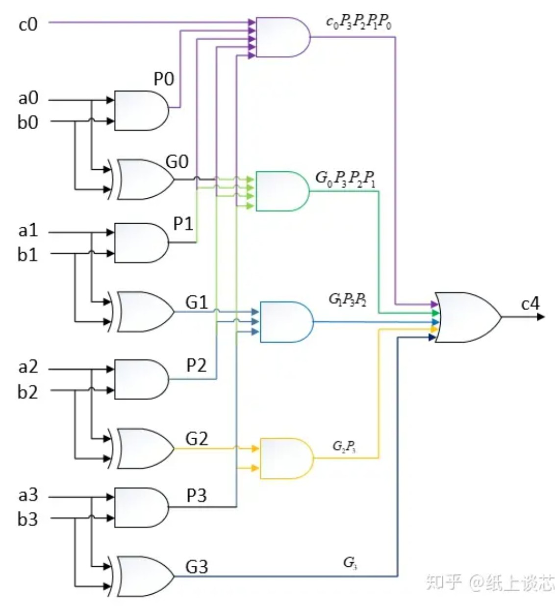
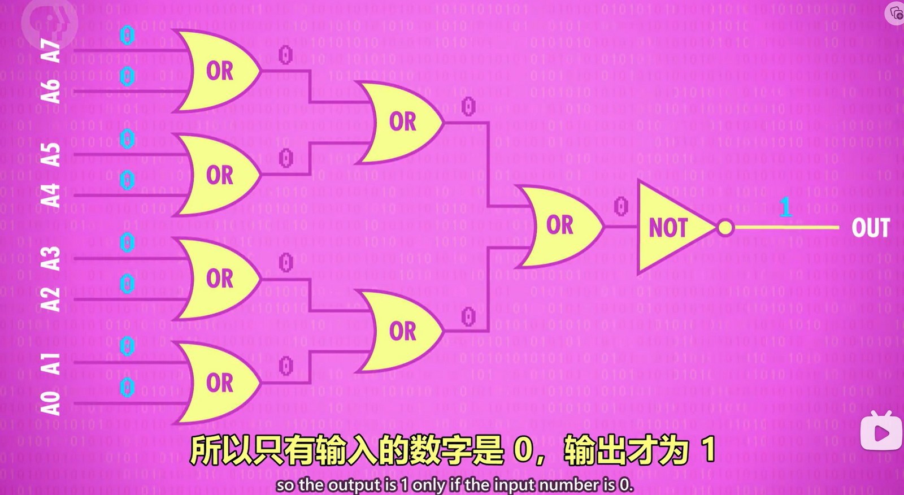
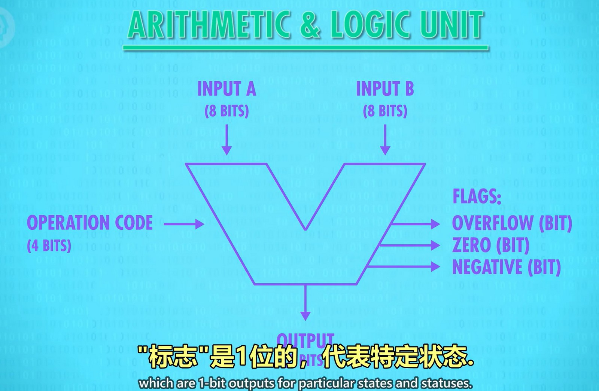

ALU 有2个单元，1个算数单元和1个逻辑单元。

## 算数单元
算数单元用作数学计算，如加减法。
#### 半加器
可以使用异或门作为1位加法器，异或门在当前位上的输出结果和1位二进制数相加的结果相同。
  
但是当两个数都为1时，需要面临进位的问题。通过在异或门上并联一个与门，当两个都为1时与门输出才为1，与门的输出表示进位的值。
  

忽略内部细节，就封装成了一个叫半加器的模块，两个1位输入得到1个当前位的值和进位的值。
  

#### 全加器
半加器只能处理两个1位的数相加，但是在实际运算中，除了将当前的两个1位数相加外，还需要和低位的进位数进行相加。这样的3个1位数相加的模块叫全加器。
  
上图中，第一列的 A,B 是当前位的数据， C 是低位的进位。当前位的数据 A,B 的和有进位（A,B 都为1），或者 A,B 的和加上 C 有进位（A 或 B 为1，C 为1），那么就说明这3个数相加也有进位。

#### 8位加法器
8位加法器电路像下图那样设计即可，第一个是最低位相加，不会有进位，所以可以使用半加器，其它的位使用全加器接收低位的进位并向高位进位。注意最后一个全加器输出的进位为1时，说明这两个8位数相加发生了溢出。
  

上述的加法器是原始的实现方式，学名叫“行波进位加法器”，性能较低，需要从低位到高位一位一位的运算。现代的加法器的电路设计有所不同，叫“超前进位加法器”。
  

## 逻辑单元
逻辑单元的作用是实现逻辑操作，通常输出1位数，表示 true 或 false。

比如这是一个检查是否都为0的模块，如果都为0则输出1：
  

## ALU 单元
将各种算数模块、逻辑模块封装后，就组成了 ALU（Arithmetic logic unit）。下图是一个可对8位数进行算术逻辑运算的 ALU，可输入两个8位数，输出1个8位数。当数字输入时还需要输入一个操作码（operation code）表示要执行的操作，如1000表示加法。输出除了运算结果外，还有额外的标识（flags）输出，方便我们进行一些其它判断，如结果是否为0（zero）可以判断两个数是否相等；是否发生了溢出（overflow）；是否为负数（negative）等（不仅这3个标识）。
  
