**注意，这章所讲的都是在通电情况下的持久存储。**

比如，我们使用 ALU 计算出来了结果，我们需要想办法把这个结果存起来，那么这个存储设备就是寄存器或内存。
让数据存储起来的实现原理是将数据的输出端又连接回输入端，这样这个数据（高低平电流）就在我们制造的这个元件中循环流动，这个数据就被存储下来了。

#### 存储1的或门电路
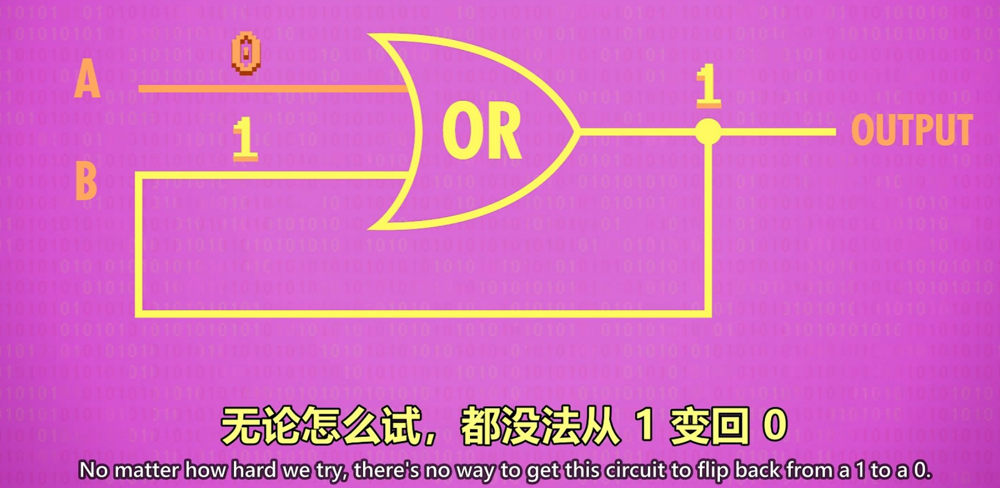  
首先看这个或门电路，将输出接到输入的其中一个上，当输出为1时，这个电路就会永远都输出1，无论 A 输入0还是1。所以我们制造了个能存储1的元件。不过这个元件无论怎样都无法变为0了。

#### 存储0的与门电路
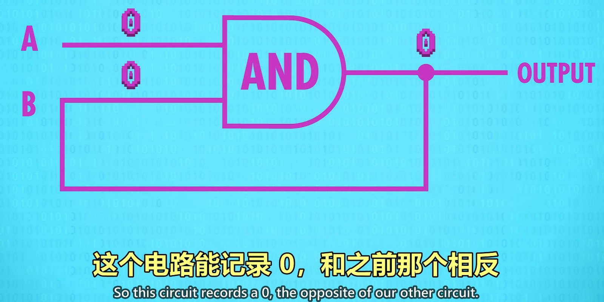  
这个与门电路，将输出接到了其中一个输入上后，只要输出为0时，电路就会永远为0。无论 A 输入0还是1。

#### and-or 锁存器
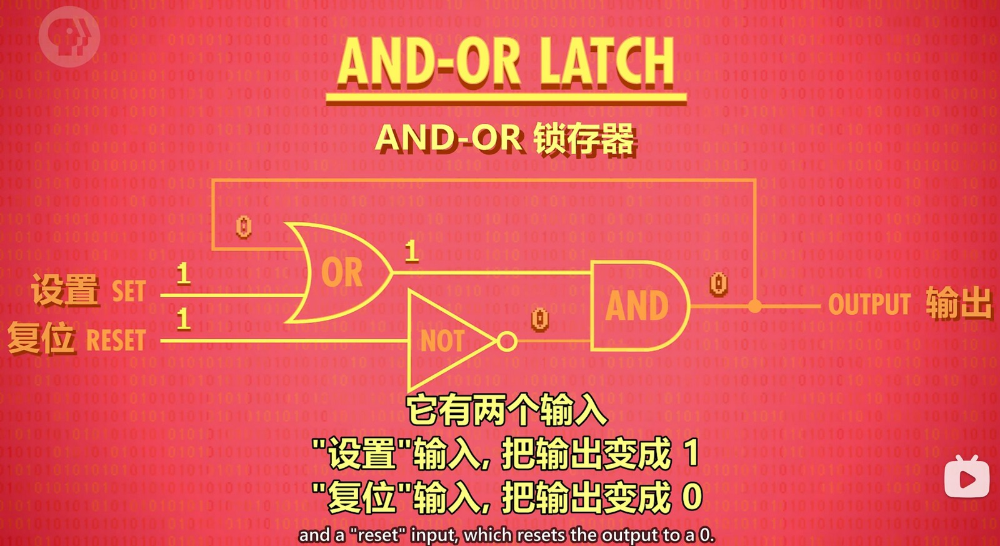  
这个模块，当设置和复位都为0时，电路会输出最后存放的内容。这个模块接收两个输入，一个 SET 和一个 RESET，当要存储1时，SET 输入1，RESET 输入0，那么经过或门，非门，与门后，会得到1，所以整个电路中会有1在循环流动。而这时想改为0，如果是将 SET 输入为0，因为内部流动的时1，所以或门上面那条线的输入是1，导致或门的输出时钟为1，所以不能通过 SET 输入为0来存储0。要存储0就需要将 RESET 输入1，即表示复位为0，RESET 输入1后经过非门会变为0，再经过与门就始终为0，所以当 RESET 输入1的时候整个电路就存储了0。当 SET 和 RESET 都为0时，或门那里的输出会根据上面那个输入（即当前电路存储的值）是什么输出就是什么，与门那里由于 RESET 输入为0，所以经过非门后为1，再经过与门，也是根据上面那根输入决定输出，结果就是值不会变。
  
所以，整个电路的运行原理为：默认时 SET 和 RESET 都为0，内部数据也为0。当要保存1的时候，SET 输入一次1，内部就变为了1，SET 会恢复默认的0；当要保存0时，RESET 输入一次1，内部就变为了0，RESET 也会恢复默认的0。只需在改变的时候进行一次短暂的高平电压输入即可修改存储的值。

#### 门锁
在 and-or 锁存器基础上，在加上一根控制是否可写入的线以及几个与门、非门可以组成门锁模块。
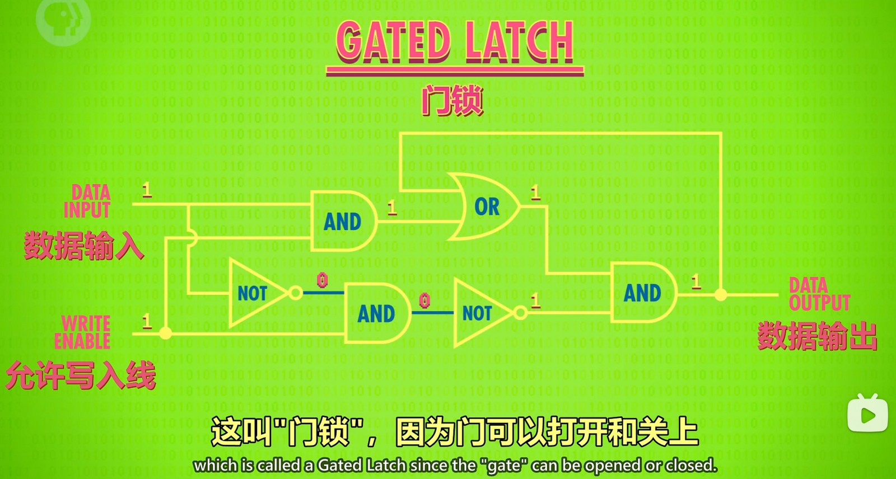  
这样我们就可以控制1位的数据是否可写了。
将门锁抽象为一个模块可以忽略细节方便理解。
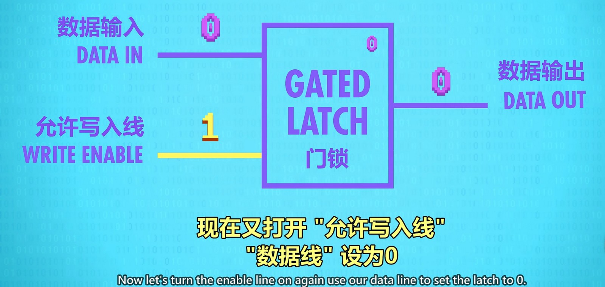  

#### 寄存器
一组门锁这样的锁存器组成的元件叫“寄存器”，寄存器能存一个数字，这个数字有多少位叫“位宽”。写入寄存器前，要先启用里面所有的锁存器，锁存器用一条线路并联上就能同时控制，
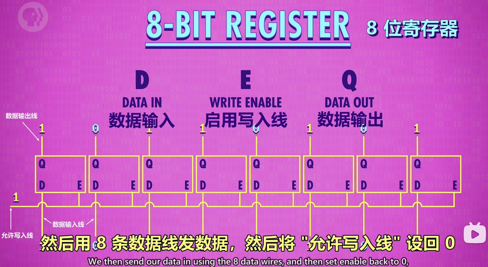  
先将允许输入线设为1，所有锁存器打开，然后通过各自的数据输入线输入数据，再将允许输入线改为0，8位寄存器就存储了8位数据。

但是这样并排布局，如果位数多了会比较浪费空间和线，所以使用矩阵的方式布局可以节约空间和线。
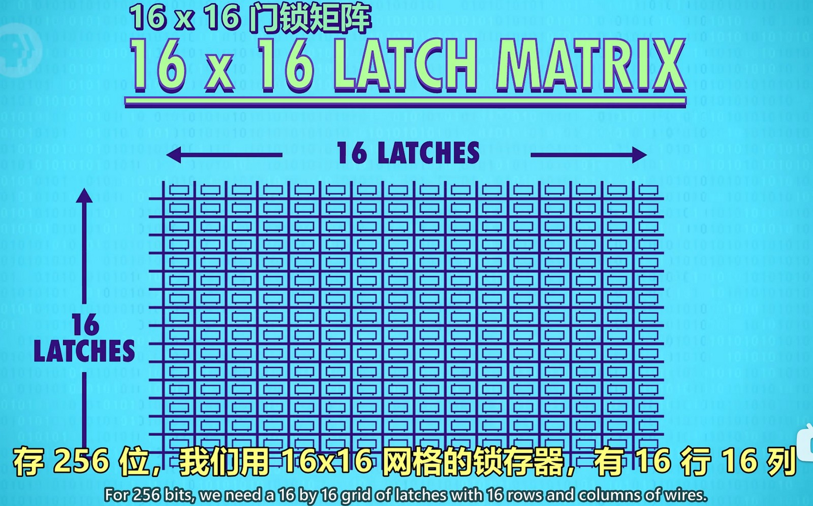  
每个锁存器内部又进行了改造，不仅有允许写入线，还有了允许读取线。
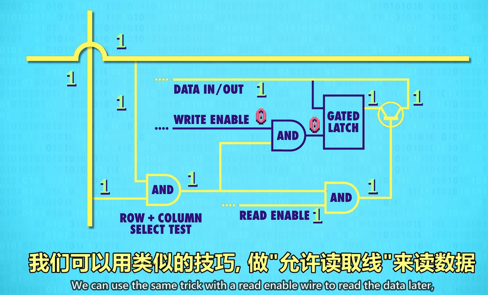  

由于在矩阵中有行和列，我们需要对某个位置进行读写操作，需要指定哪行哪列，如10000111，表示第8行（1000）第7列（0111）。所以我们又需要多路复用器来进行地址的选择。
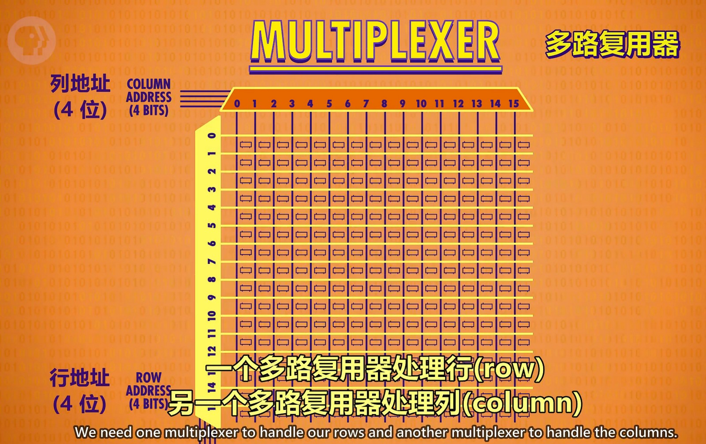  

这样一个16*16位的寄存器我们又可以封装成一个256位的寄存器看待：
  

将8个256位的寄存器组合，又可以得到256个字节的寄存器：
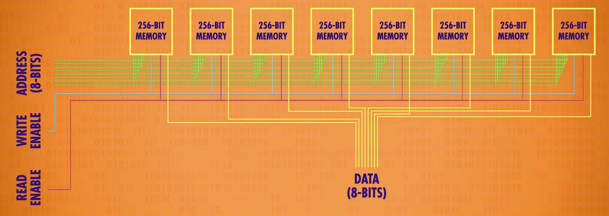  

将这8个字节的寄存器以另一种方式看待，可以看做是8个字节的内存：
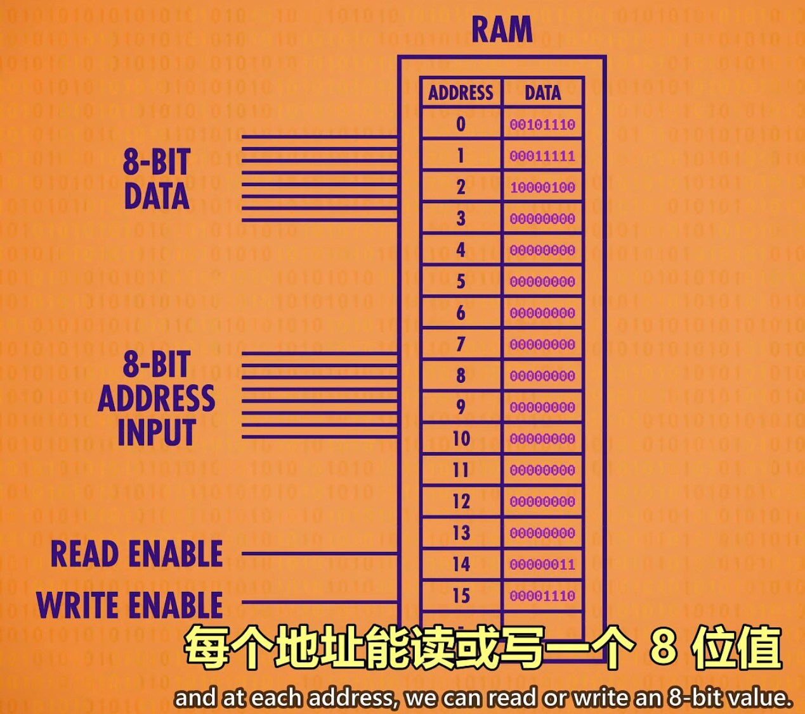  

更大的内存就是由这样的小块组成的，只是大内存地址更长，线更多。
以下是对内存进行放大观测的效果：
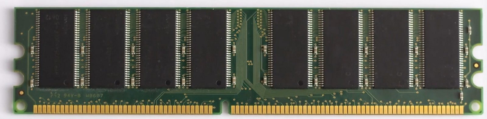  
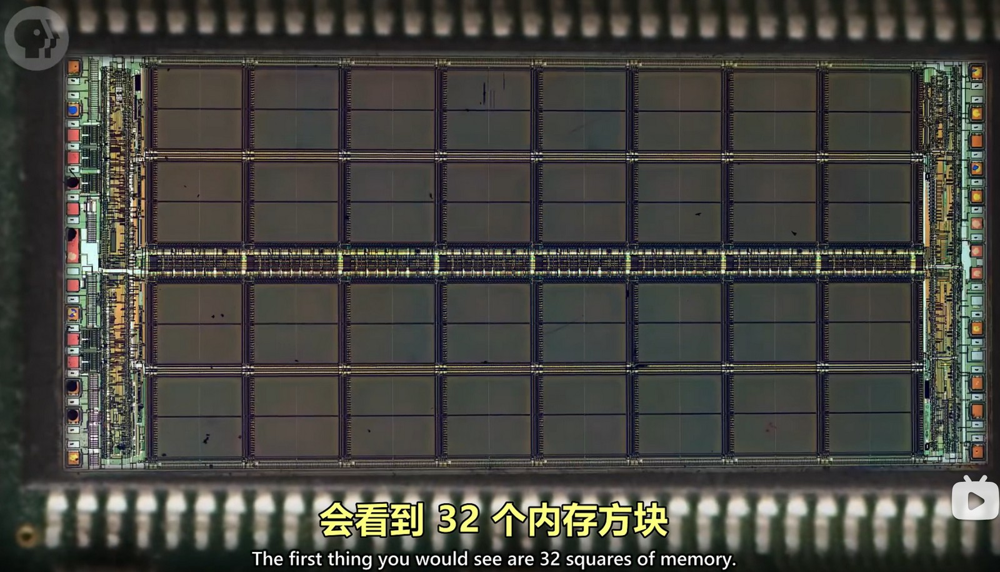  
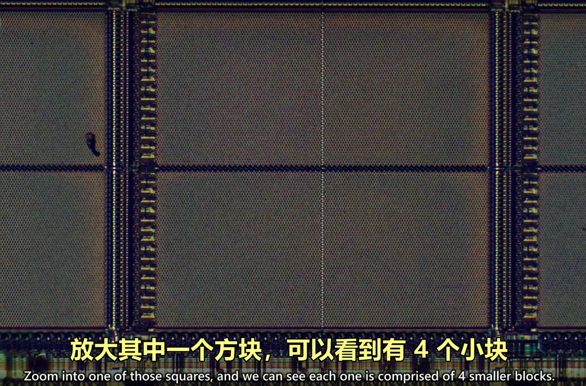  
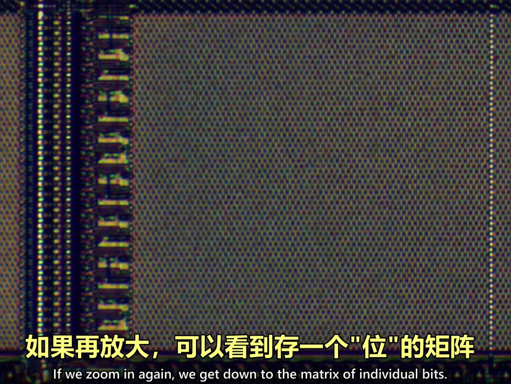  
