### 指令
指令和普通的数据一样存储在内存中，一条指令包含操作码和操作数据的地址或寄存器。
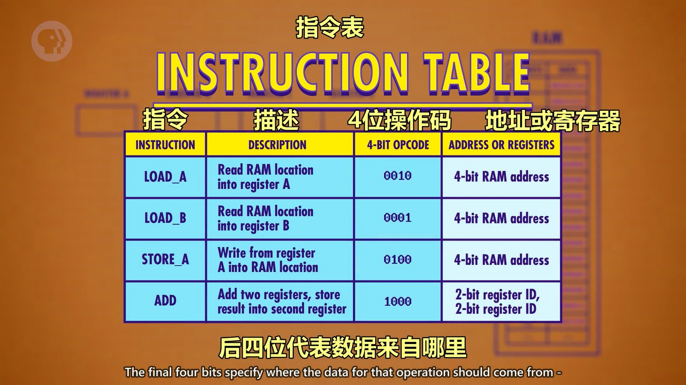  

首先我们需要一个内存（RAM），4个寄存器ABCD用于临时存储数据，还需要一个寄存器追踪程序运行到哪里了，我们叫它“指令地址寄存器“，存储当前指令的内存地址。另一个寄存器存当前执行的指令，叫“指令寄存器”。
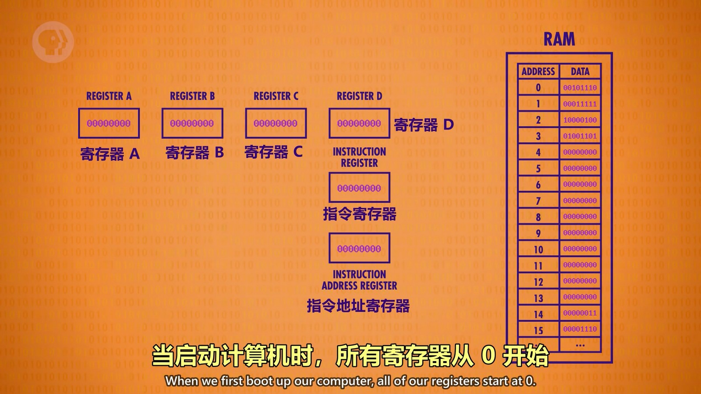  
如图中地址0的值就是条指令，00101110，前四位是0010，说明这条指令的功能是读取一条内存中的数据并放到寄存器A中；后四位1110，说明读取的数据时内存地址1110（即14）的数据。这条指令就会把内存14的数据读取后放到寄存器A中。

当启动计算机时，所有寄存器从0开始，所以寄存器中的值都为0。CPU 运行的第一个阶段叫“取指令阶段”，指令地址寄存器连接到内存，由于值为0，所以从地址0获取数据，数据存储到指令寄存器中。
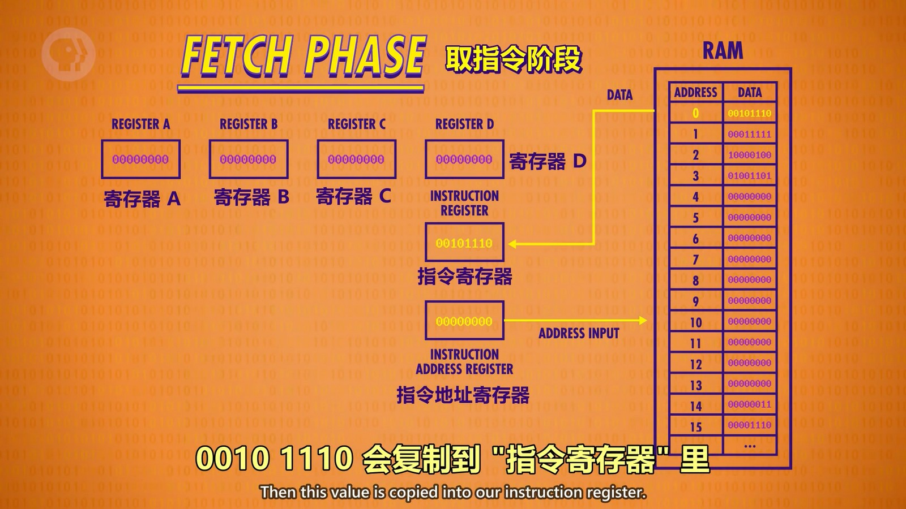  

指令寄存器获取到指令后，会对这个指令进行解码，就像上面所述的那样。前四位会使用电路来判断是什么指令（图中只画了0010这种电路，实际上每个指令都有对应的电路，个人猜测类似 if else 那样执行流程）。
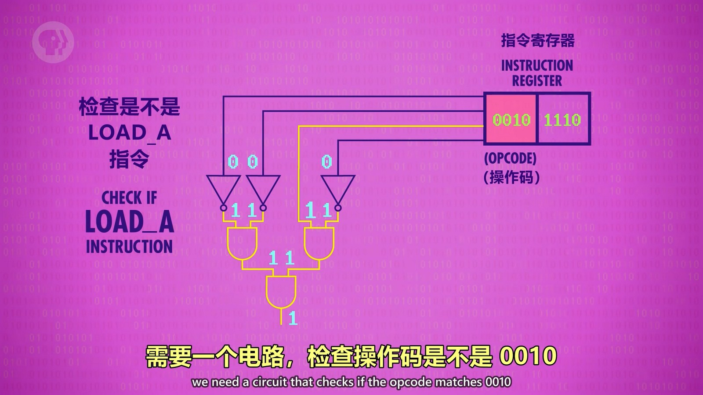  

发现是取指令后，会通过电路连接到内存读取后四位（内存地址14）的数据，通过顶部的那根线将数据存储到寄存器A中，操作完成，指令地址寄存器数字+1，然后关闭电路。
  

忽略指令判断的各种电路，将其封装为控制单元：
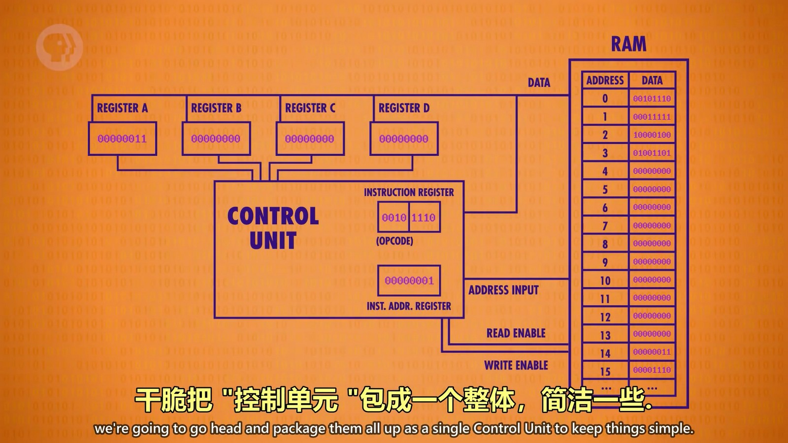  

然后程序执行指令地址寄存器指向的下一条指令，重复上述过程就能又一次执行一条指令：
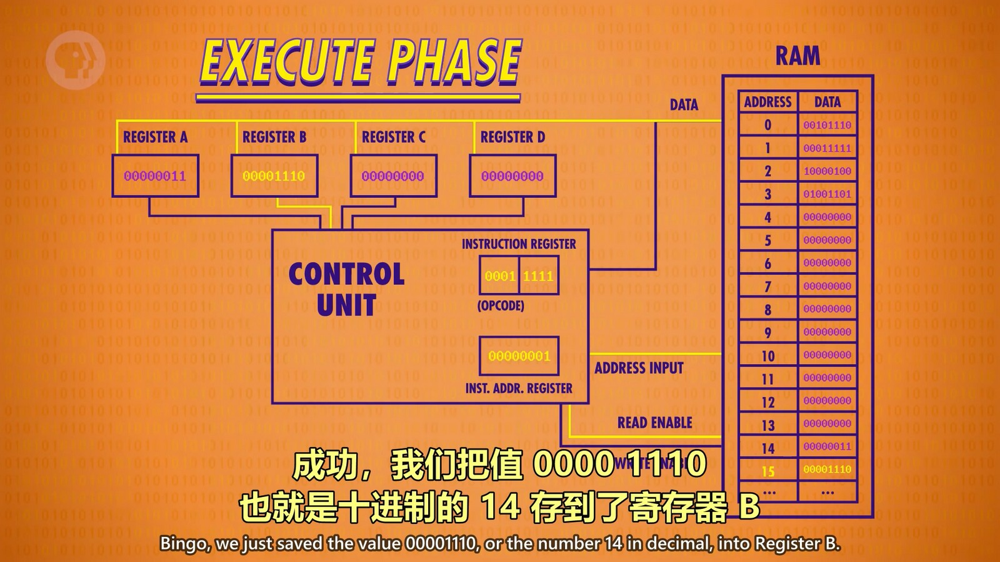  

继续执行第三条指令，这次的指令有点不同，是10000100，1000表示是个相加指令，并将结果存储到第二个寄存器中，相加指令就不再是读取内存中的数据，而是寄存器中的数据。由于是相加指令，后四位的解析也有所不同了，会按照两位两位的进行解析，每两位代表一个寄存器，01代表寄存器B，00代表寄存器A，由于是4个寄存器，所以两位正好能表示4个。（结果存储到第二个寄存器是这里的0100中的00，即寄存器A）
由于是相加操作，所以我们将 ALU 算术逻辑单元加入进来进行计算，将寄存器中的数据和指令寄存器中解析出来的操作传给 ALU 进行计算后输出：
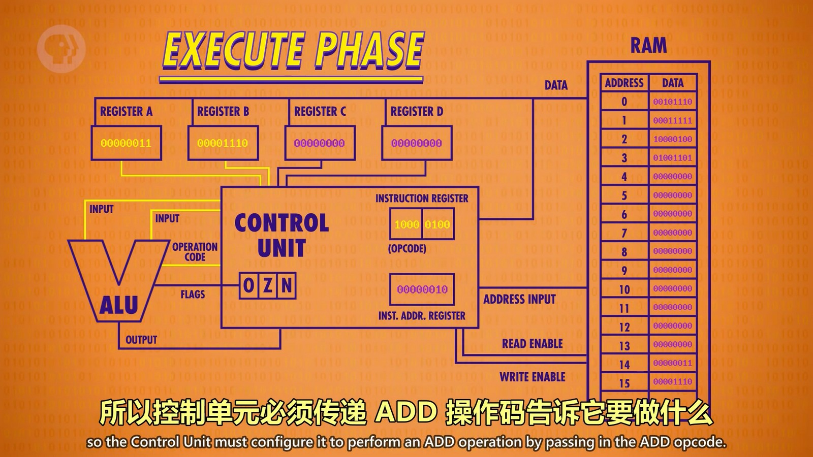  
输出结果会先存储到控制单元中的一个寄存器中（用于临时存储，图中没画），因为这时如果直接输出到A中，A的数据又会传给 ALU 进行相加。存储到控制单元的临时寄存器中后，ALU 的电路会关闭，再将临时寄存器的数据传输到寄存器A中。
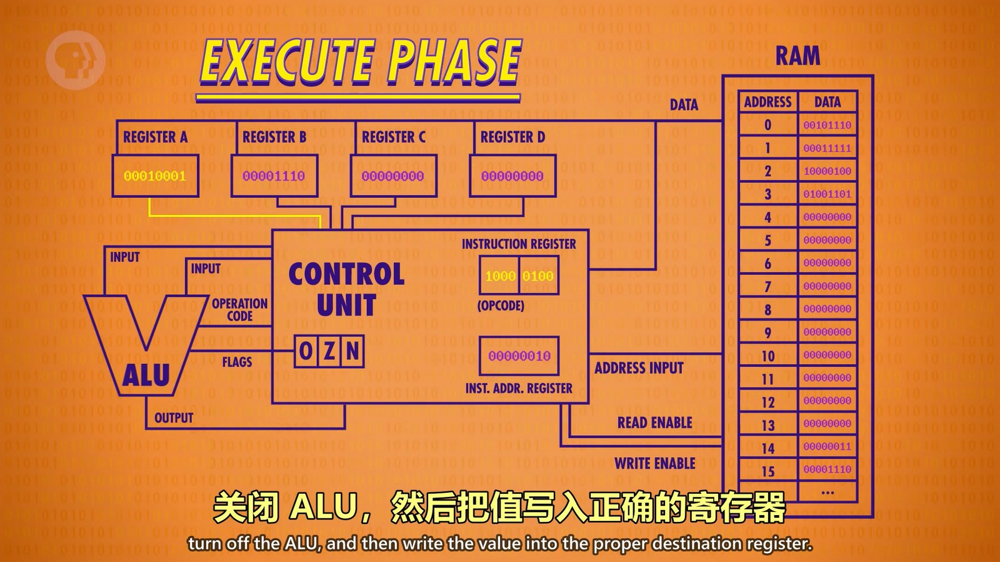  

最后一条指令是01001101,0100是把寄存器A的值写入内存，所以允许写入的线开启，然后数据线开启将寄存器A的数据写入到1101（13）位置的内存中。
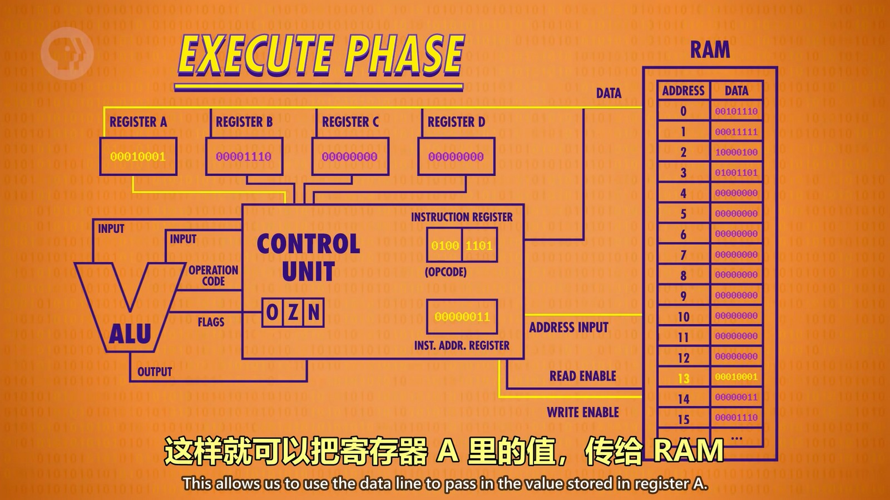  

实际上这整个过程是通过“时钟”来控制的，“时钟”会以精确的间隔释放电信号，控制单元会用这个信号推进 CPU 内部的操作。CPU 取指令->解码->执行 的速度叫“时钟速度”，用单位赫兹表示，1Hz 代表1秒一个周期，现代处理器的时钟速度可以达到数十亿赫兹，也就是1秒数十亿次时钟周期。
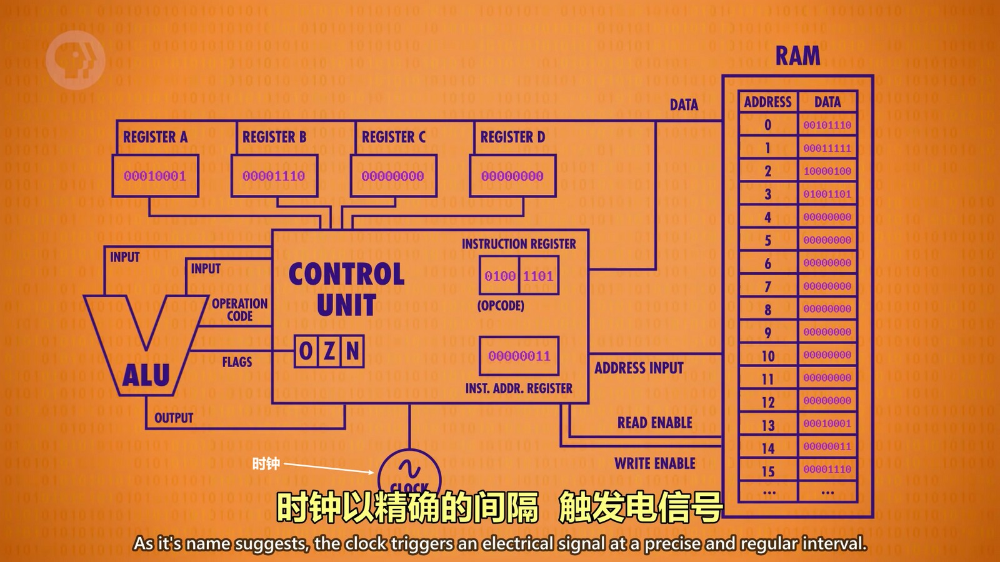  
超频或降频就是加快或减慢时钟信号。但是超频时时钟信号发射加快，超过了指令最快的执行速度后（个人猜测，默认频率下两个始终信号间 CPU 执行完操作后还会有冗余时间，所以存在超频空间），就会导致程序出现问题。降频就是减慢时钟信号的频率，从而降低执行速度，可以节能。

最终这一坨就组成了基础的 CPU：
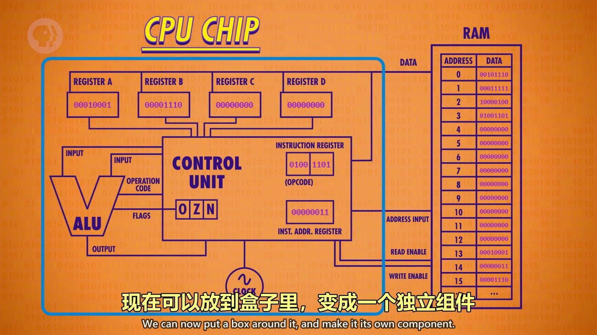  
