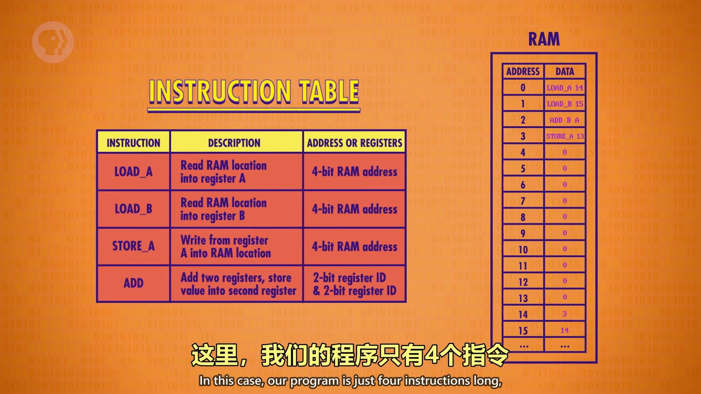
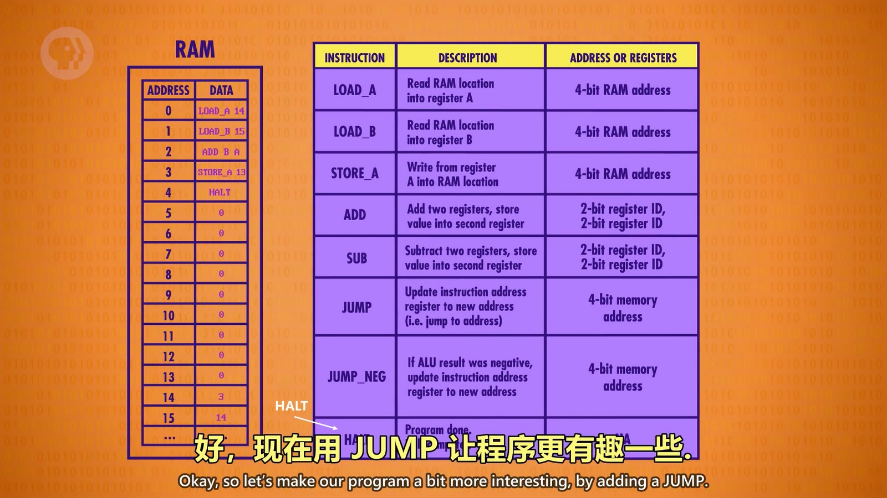
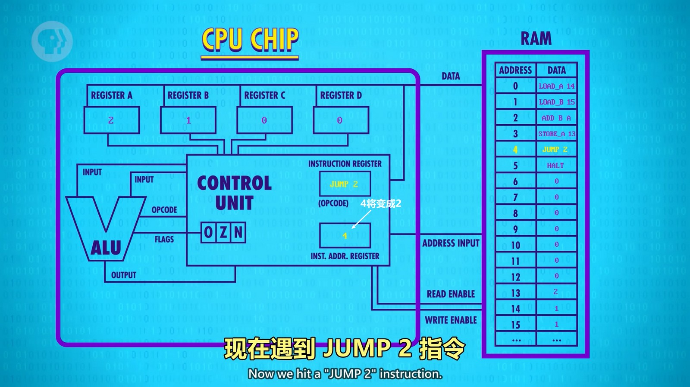
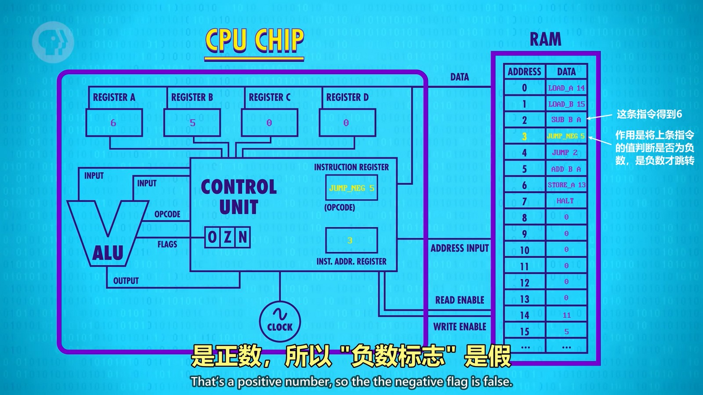
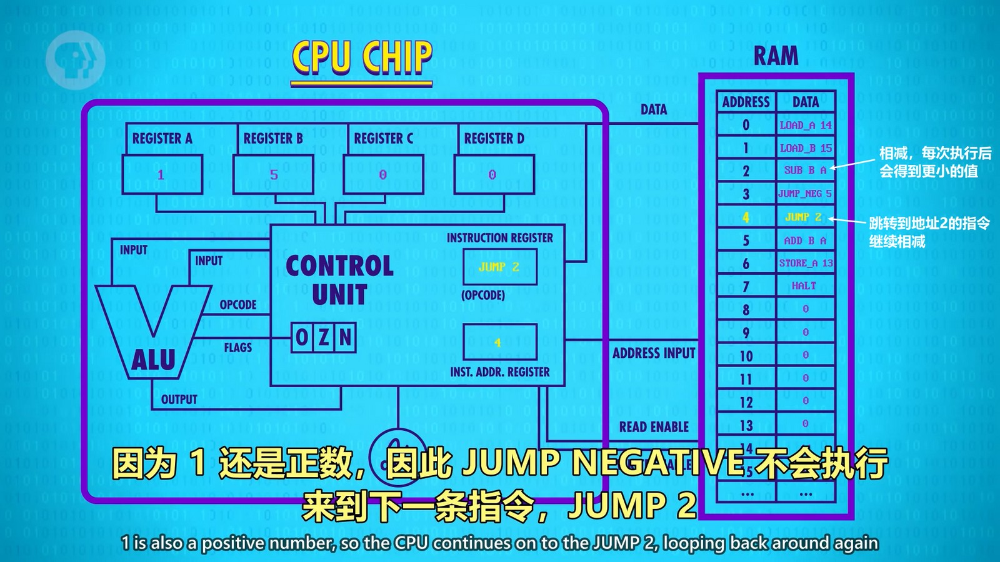

将上篇中的二进制数翻译成更方便阅读的文本和数字，可以得到下图：
  
如指令 0010 就翻译为 LOAD_A，表示读取内存数据存到寄存器A，内存中的值也转换为十进制表示。实际上可以看出这就类似于汇编了。

下面新增几条指令让程序变得更有趣：
  
JUMP 指令是把后四位的值直接覆盖掉“指令地址寄存器”的值，实现跳转到指定位置开始执行。
HALT 指令告诉程序停下来，不再继续往下执行。像上篇中的程序那样，没有 HALT 指令，程序会继续执行，位置4的值是00000000，CPU 无法识别此指令，就会出现问题。

新的加入了 JUMP 和 HALT 指令的程序。当遇到 JUMP 指令时，指令地址寄存器的值会变为2，从而回到内存地址为2那里继续执行。
  
目前这个程序遇到 JUMP 后会回到2，继续执行后又会遇到 JUMP 回到2，所以是个无限循环的程序。
所以我们需要带条件的 JUMP，如 JUMP_NEGATIVE，或是其它类型的条件跳转：JUMP_IF_EQUAL, JUMP_IF_GREATER 等。这样带条件的跳转指令就可以通过指令后几位表示的内存地址获取到对应数据进行比较等，再决定是否跳转。

  
上图由于没满足条件就不会跳转，继续执行内存地址为4的指令。

  
JUMP 2 指令跳回去继续相减，直到值为负数后，执行地址3的指令，就会跳到地址5继续执行，从而跳出循环。最后执行地址7的 HALT 执行结束程序。

现在内存每个地址的数据只有8位，所以一条指令最多只能用8位来表示，这叫做指令长度（操作码+地址码）。现在高级 CPU 会有更多的指令，可能需要32位或64位来表示。另外还有变长指令，操作码的长度和地址码的长度都是不定长的，不过对指令进行解析会更复杂。