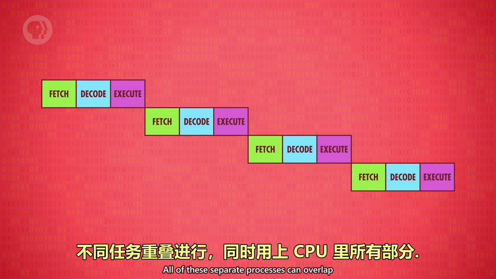
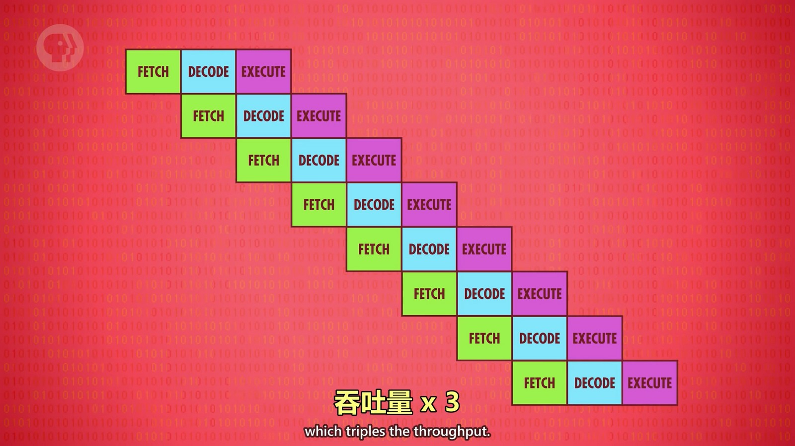
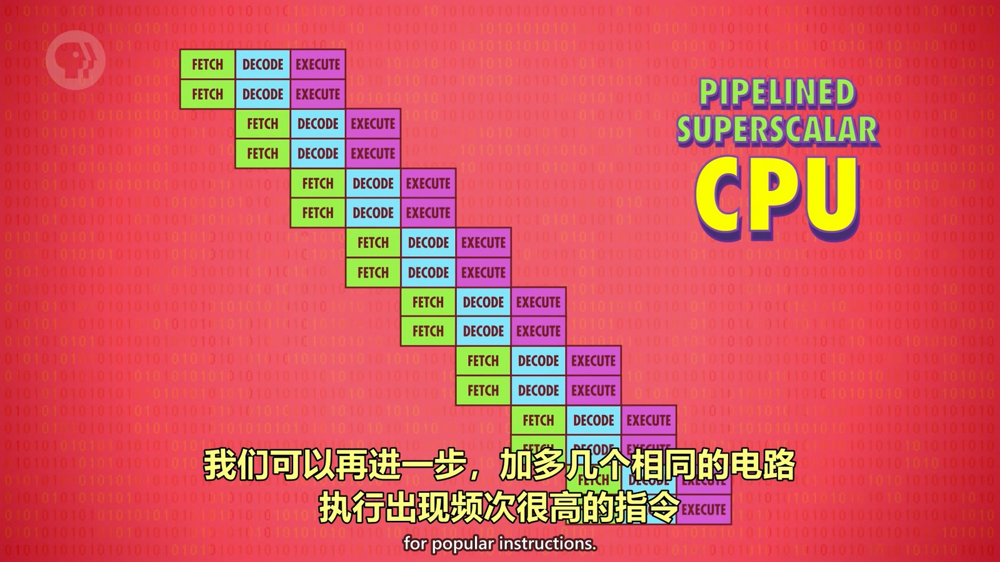
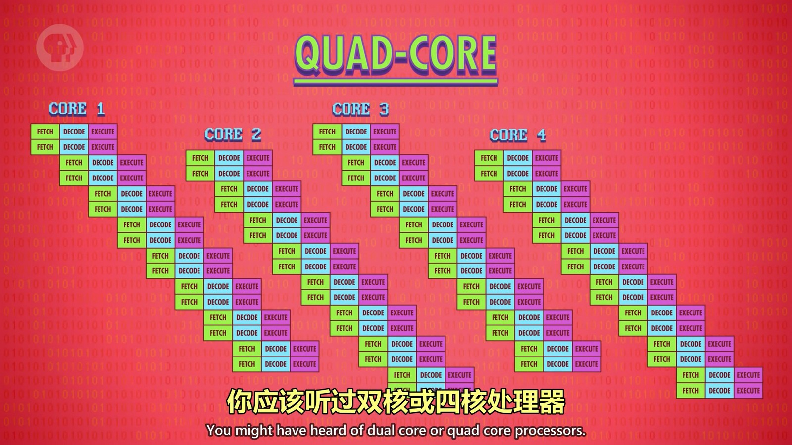

前文中的 CPU 功能很简单，比如要做乘法需要使用多次加法来实现。所以高级 CPU 会使用门电路直接实现乘法运算单元。高级 CPU 会有专门的模块来处理图形操作、解码压缩、加密文档等，从而提升性能，所以 CPU 支持的指令也是性能的关键所在，而不仅是时钟频率。不过为了兼容性，CPU 还会对旧指令进行支持，这也会对性能有一定的影响。

超高的时钟速度也带来了另一个问题，如何快速将数据传给 CPU。这时，RAM（内存）就开始成为瓶颈。解决办法是在 CPU 加 RAM（缓存）。CPU 从 RAM 拿数据时，RAM 不用只传一个而可以传一批，比如将前文中的内存地址为0,1,2,3都传给 CPU 存到缓存中（实际会传很多条）。CPU 就可以从缓存中取指令或数据。CPU 解析指令后取数据，通过地址线取缓存中判断这个地址的数据是否在缓存中，如果在则缓存命中；如果不在则缓存未命中，再去内存中这个地址的位置取数据（个人猜测 RAM 中的数据批量复制到缓存后，缓存中也是使用相同的地址编号）。
CPU 进行计算后要往内存写数据，也会先写入缓存，此时缓存和内存数据不同，需要将这个缓存位置标记为“脏位”，然后会同步到内存。同步通常发生在缓存满了又要写缓存的情况，就会先进行脏检查，将这些脏位的数据写到内存中。

缓存也可以当做临时空间，存一些中间值，适合长/复杂的运算。

另外 CPU 也可以通过“指令流水线”的形式提升性能，如执行一个指令时可以同时对下一个指令进行解码，而不用等到执行完后再加载下个指令进行解码，就像流水线一样。
  
  

不过这样也会带来问题：
第一个问题是指令之间的依赖关系。如读取某个数据时，正在执行的指令会修改这个数据。所以流水线处理需要先弄清依赖关系，必要时会停止流水线。
第二个问题是“条件跳转”，如 JUMP 类指令，这类指令会改变程序的执行流，简单的流水线处理器会停一会儿等待条件值确定下来。高端的处理器会预判条件的结果，然后预加载指令，如果预判错了会清空加载的指令重新执行（现代处理器通过复杂的设计预测正确率能超过90%）。
此时“超标量处理器”出现了，一个时钟周期能处理超过一条指令。

另外，还可以并行处理多个指令，如一个 CPU 中可以设计多个 ALU 并行计算，当然这又会产生很多问题并需要解决。 
  

使用多核 CPU 或多 CPU 也是提升性能的方式，当然又要解决各种同步导致的问题。
  
