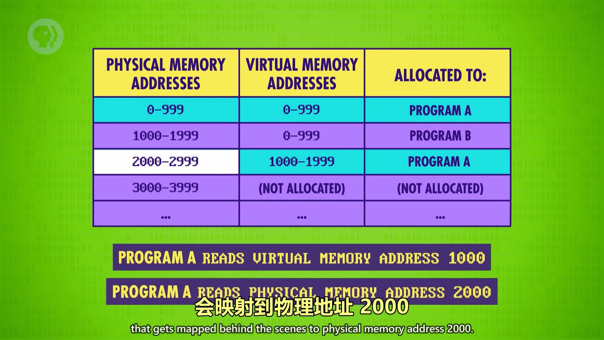

## 操作系统
早期的程序员开发一个程序需要自己对各种不同型号的硬件设备进行兼容（比如不同型号的打印机提供的 API 可能不同，那时的程序员只能通过文档和连接硬件进行调试来开发程序），这显然是非常难的。而操作系统的出现解决了这个问题。操作系统也是一种程序，不过它更底层，连通了各种硬件，同时它可以管理运行其它的程序。我们现在开发的程序绝大部分都是运行在操作系统上的，我们要使用硬件的能力也需要通过操作系统提供的 API 来实现（设备驱动程序），当然，操作系统也为我们对硬件的操作做了兼容处理，让我们操作同类型的不同硬件时（比如不同型号的打印机），我们能通过同一个 API 来实现对不同打印机的操作。

## 多任务处理
由于 CPU 运行速度很快，操作系统可以让 CPU 快速在不同程序之间切换运行，而这个切换速度远低于人类能感知的程度，所以我们会感觉多个程序在同时运行。当然，后面出现了多核、超线程等技术也提升了多任务运行的能力。

## 虚拟内存
由于内存很大，而一个程序在运行时处理的内存中的数据可能分布在各个地方，并不是连续的，这让程序在处理内存时加大的难度，因此，操作系统实现了“虚拟内存”功能。
每个程序都有自己的虚拟内存，在程序自身看来都是从0开始的，并且是连续的内存。分布在不同地方的内存操作系统都会将实际内存地址映射到这个程序的虚拟内存上，让其看起来是使用的连续存储空间。
  
图中程序A使用的物理内存地址不是连续的，但是虚拟内存地址是0-1999连续的。当程序A读取内存地址1000的数据时，读取的是虚拟内存地址1000的数据，而操作系统会获取到物理内存地址2000的数据并返回。

## 内存保护
虚拟内存也形成了内存保护，让一个程序不会影响到另一个程序使用的内存。当然这只是通常情况下，外挂、病毒等也会通过特殊手段修改其它程序的内存数据。

## UNIX
UNIX 把操作系统分成两个部分，一个是操作系统的核心部分，如内存管理，多任务和输入/输出处理，这叫做“内核”，第二部分是一堆有用的工具，比如程序和运行库。