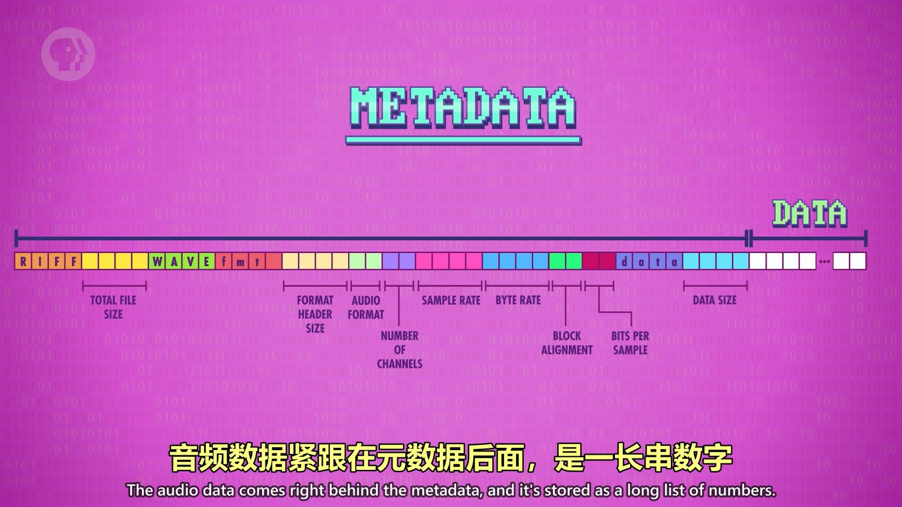
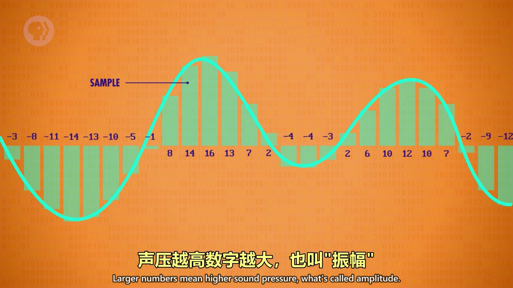
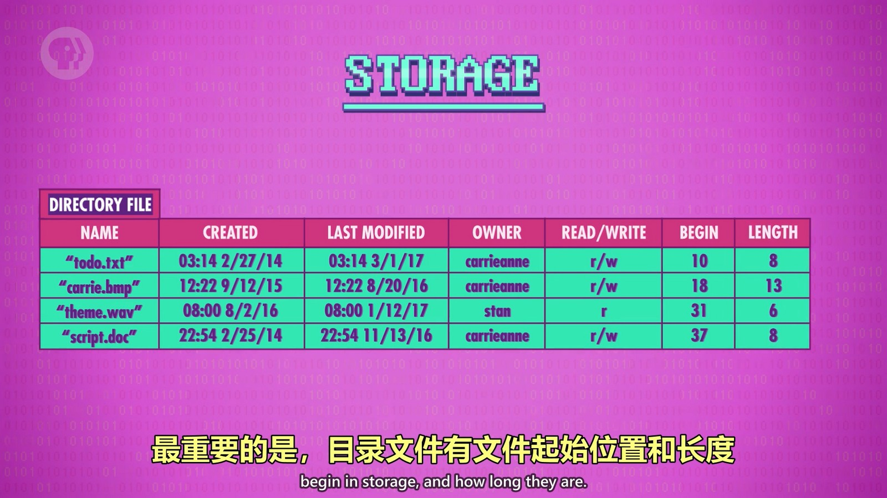
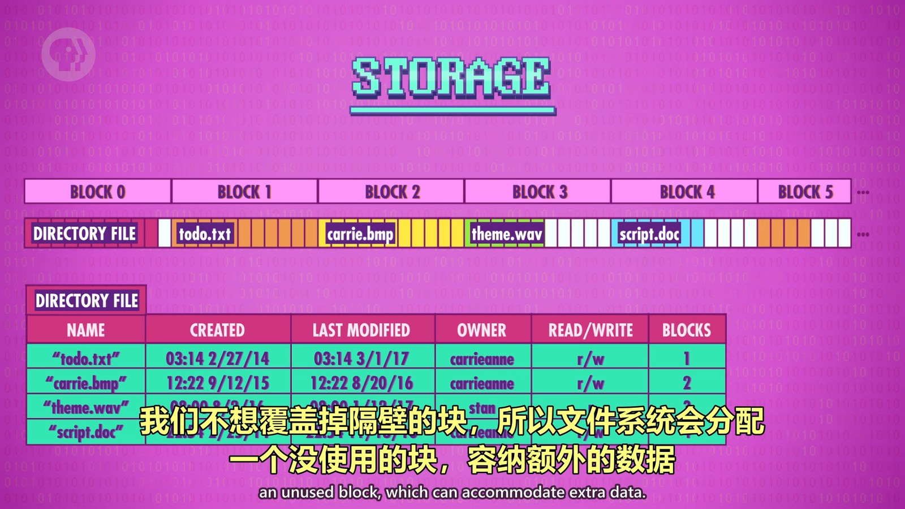
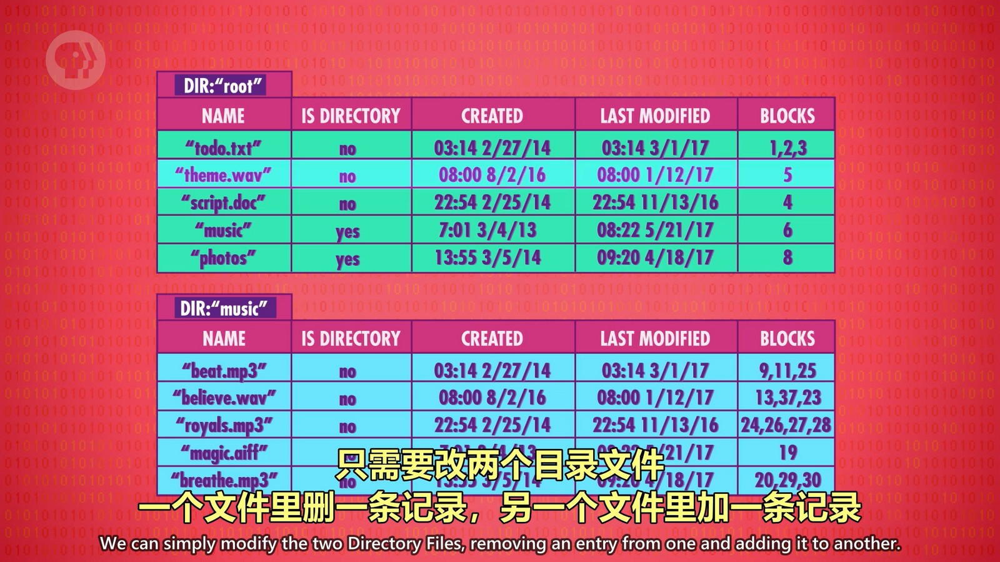

## 文本文件
文本文件通过 ASCII、Unicode 等编码方式在二进制和文本之间进行转换。

## 音频文件
传输音频文件的时候会包含头文件，头文件中描述了此音频文件的一些信息。头文件后紧跟数据，使用二进制记录声音的振幅。
  
麦克风每秒对声音进行上千次采样，将采样的数据转为振幅使用二进制存储。
  
播放声音文件时，扬声器会产生相同的波形，从而将声音还原出来。

## 位图
位图也有头文件描述基本信息，数据文件中记录每个像素的 RGB 值。
  

**各种文件在计算机中都是以二进制存储的，只是编码/解码方式不同。**

## 目录文件
一个文件会被系统封装为“目录文件”（不是目录），我们看到的 .txt，.js 这样的文件就是个目录文件。目录文件会为原文件添加一些有用的信息，如创建时间、修改时间等，最重要的事记录了文件的起始位置和长度。
  

现代系统中有专门的文件管理系统，当文件创建、修改、删除等操作时都要经过文件管理系统来处理。文件管理系统将存储空间分成一块一块的，写入一个文件到其中的块后可能后面还会有剩余空间，当修改文件新增内容的时候不会覆盖掉后面文件的内容。如果块被占满了还在新增内容，就会将文件分布到不同的块中进行存储。目录文件就会记录这个文件所占用哪些块，读取的时候就可以按照这些块进行读取。
  

删除文件时只会删掉那条目录文件，并不会实际的将硬盘中的数据删除。当然，这个文件所占用的块也会空出来，有其它文件写入这些块后，这个文件才真的消失了。

上面所说的文件太大被存在不同非连续的块中，这就叫“碎片文件”，所以系统中的碎片整理功能什么用这下就明白了。

## 分层文件系统
现代操作系统中，可以一个文件夹套一个文件夹的存储文件，这就叫分层文件系统。在分层文件系统中，目录文件不仅要指向文件，还要指向目录。
  
当移动文件时，实际修改的也是目录文件，而不会移动文件在硬盘中的位置。