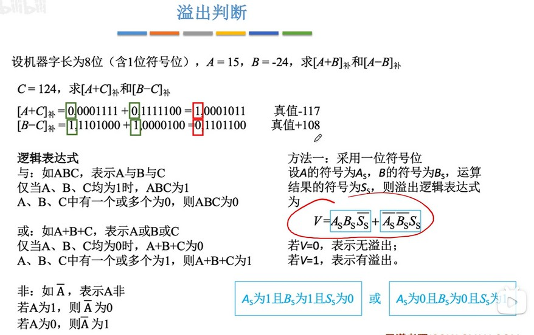
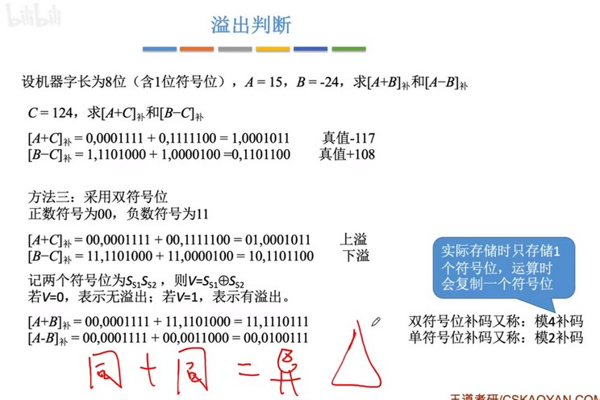
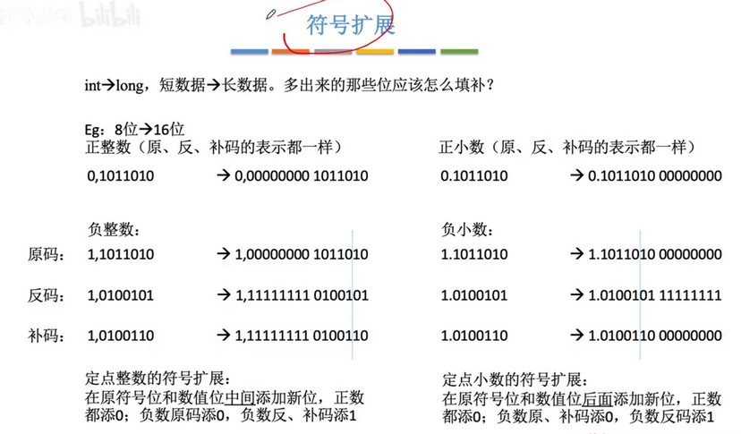
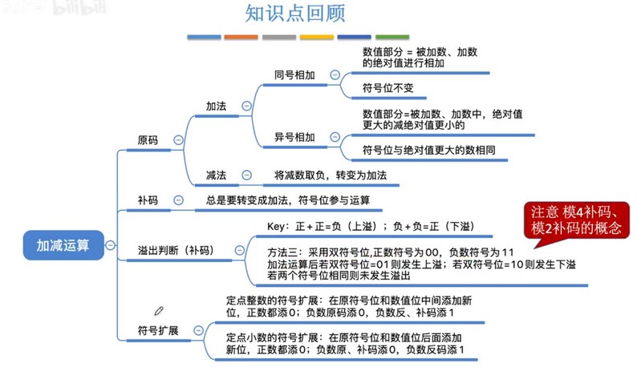

##### 溢出判断
c 语言中两个数相加通常都是同类型的数相加，那么两个数的位数是相同的，得到的数也是相同位数。
  
只会出现正数+正数上溢和负数+负数下溢的情况。不会出现正数+负数还上溢或下溢的情况，因为这种情况只会出现不同类型的数相加时，比如一个 int 加上一个很小的负数 float，如果值强转为 int，那么就可能还是下溢，但是如果用 float 保存则不会。所以不同类型的数进行计算得到的值的类型只能是位数更大的那个类型。

  
表达式的意思实际就是：两个正数的结果是负数 或者 两个负数的结果是正数，最终结果 V 就是1（true），表示有溢出。
之所以要把逻辑判断用数学表达式来表示，是因为当我们用数学表达式表示出来后，就可以用与门、或门、非门等来进行设计，也就是逻辑电路被表达出来了。    

  
第二种方法是判断最高位的进位和溢出符号位的进位是否相同。相同则无溢出，不同则溢出。

  
方法三是在最高位之前复制一个符号位的值，如果运算后最高位和符号位不相同，则说明有溢出。（最常考）

实际上三种方法都是通过相同符号的数相加后，得到的结果符号变了，从而判断发生溢出。

##### 符号扩展
分为正整数、负整数、正小数、负小数四种情况。
  
正整数在符号位和数值位之间补0就行，负整数的反码和补码需要补1，因为都在原码基础上取反了。小数是在末尾填补，只有反码是补1，其它都补0，因为补码是由反码+1后得到的，在末尾补1的反码+1就会不断变成0，从而进位到未扩展之前最后一位并进行计算。

##### 总结
  
