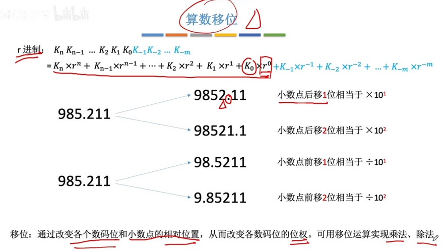
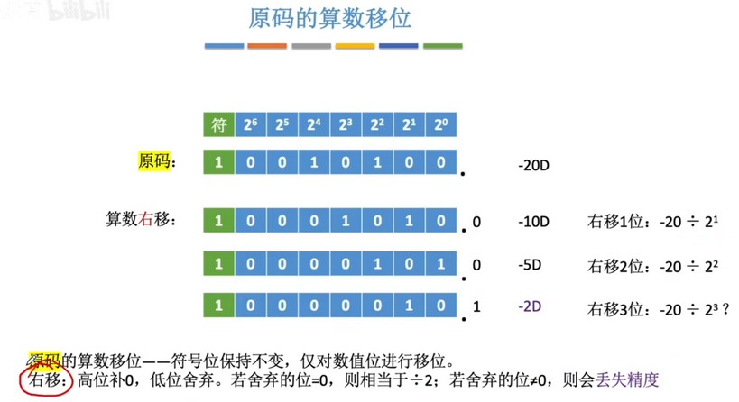
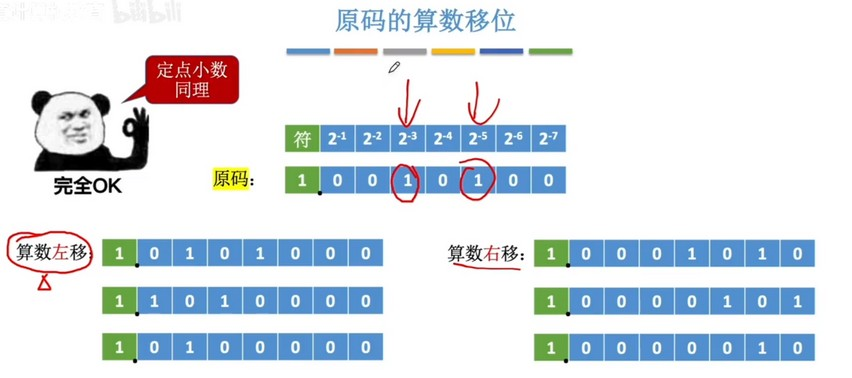
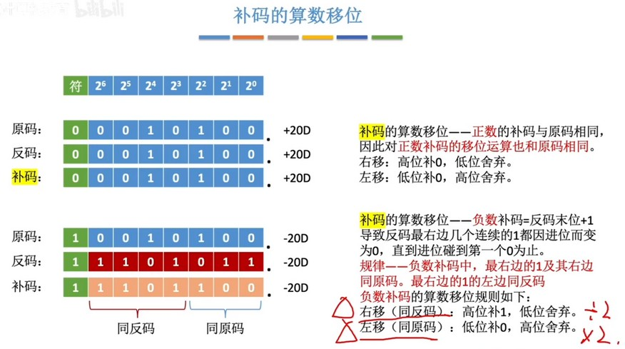
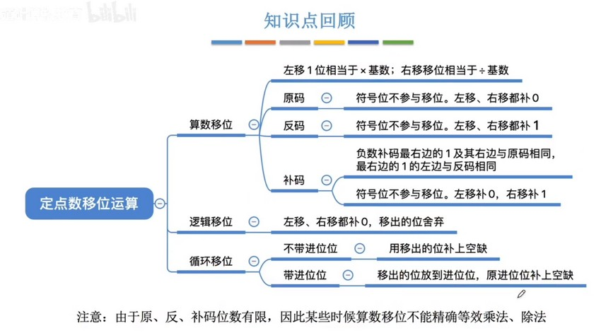

移位运算就是位运算的左移右移。也就类似于将小数点右移（补0），左移（低位舍弃）。在十进制中，小数点左移右移n位就是除以10的 n 次方或乘以10的 n 次方。那么二进制也一样，只是变成了 2 的 n 次方。

十进制的移位：
  

二进制的移位：（符号位不参与移位）
  
当舍弃位不为0时，就不是绝对的$2^n$，而会丢失精度。

  
左移时丢弃最高位，如果不为0，那么就是计算结果溢出，会导致很大的误差。

定点小数计算方式相同：
  

反码负数进行移位应该补1：
  

补码右移补1，左移补0：
  

简单总结：
  

##### 示例：
计算机进行乘法运算可以通过移位实现：
  

使用连续内存存储 RGB：
  

##### 循环移位
左移就将溢出的最高位放到最低位，右移就将溢出的最低位放到最高位的一种移位方式。

### 总结
  
