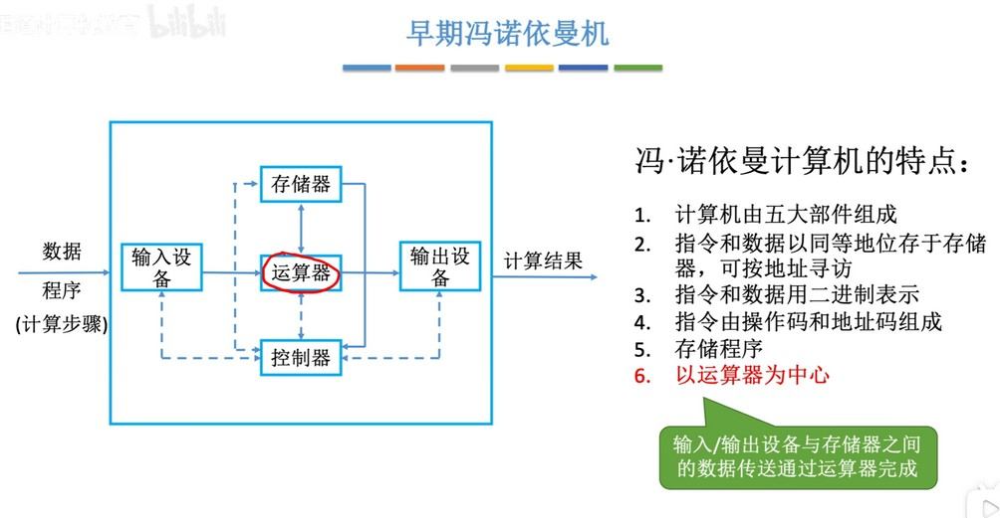
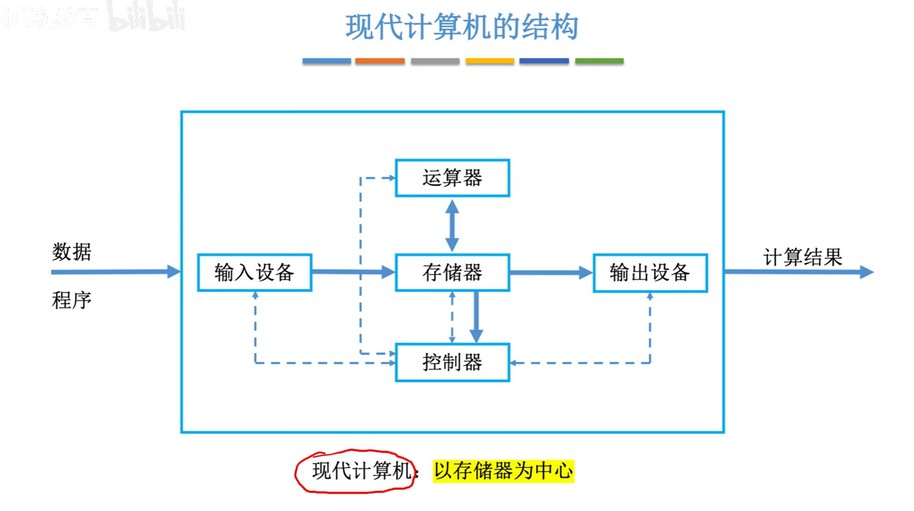
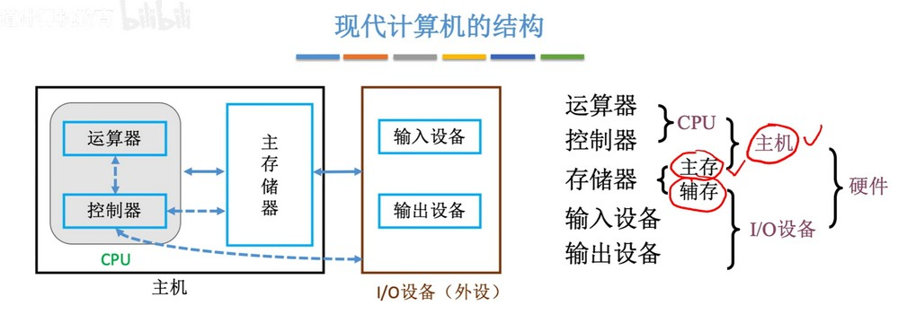
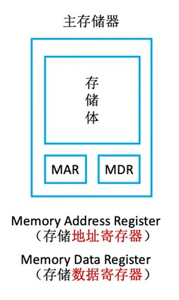
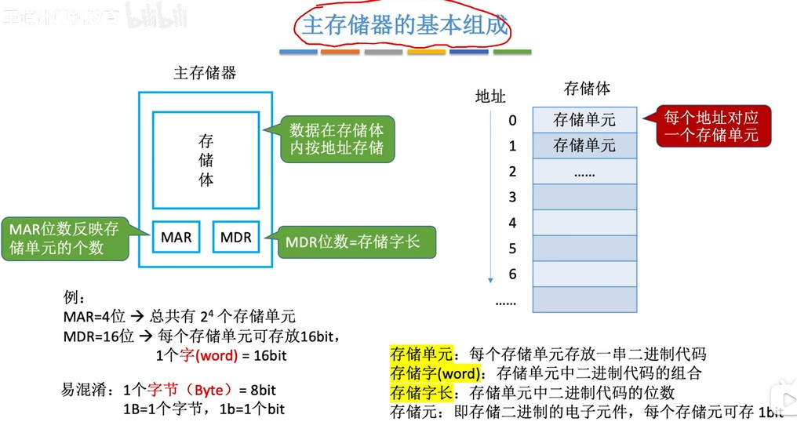
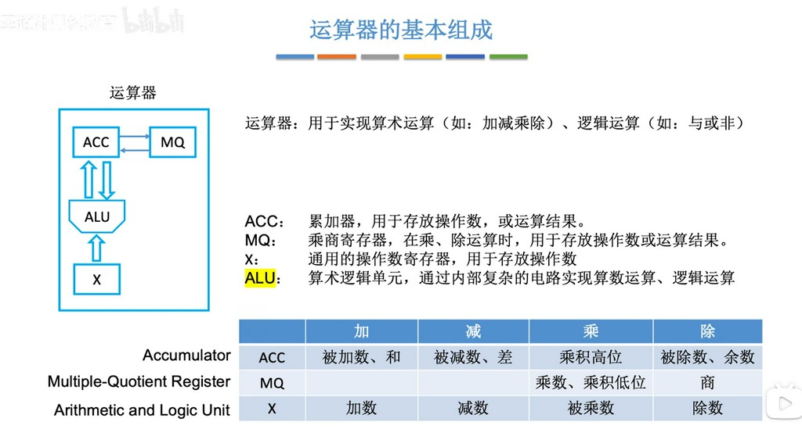

[王道计算机考研 计算机组成原理](https://www.bilibili.com/video/BV1ps4y1d73V/?spm_id_from=333.1007.top_right_bar_window_custom_collection.content.click&vd_source=8220e726dcb3a350fd156cea947bd58b)

### 冯洛伊曼计算机
冯诺依曼计算机是以运算器为中心，这就导致运算器需要与输入设备、存储器、输出设备各方面通讯，计算量庞大，性能损耗大。
  

### 现代计算机
现代计算机以存储器为中心，从而减轻运算器的压力，使得运算器能更专注处理运算任务。
  

经过演化，CPU 就集成了运算器和控制器，存储器就是内存，而硬盘是辅存属于 I/O 设备。
 

### 主存储器的基本组成
主存储器包括存储体、MAR（存储地址寄存器）、MDR（存储数据寄存器）。存储体是主要存储数据的地方；MAR 负责管理地址，通过 MAR 可以快速获取到数据所在地址；MDR 用于在获取数据时 通过 MAR 从存储体拿到数据交给 MDR 再交给 CPU，写入数据时 CPU 通过 MAR 指明要写入的地址和 MDR 要写入的数据，然后写入到主存储器中。
  

存储体是内存主包保存数据的地方，拥有内存最大的空间。存储体里包含若干存储单元，存储单元的大小是1个字（word）。MAR 就记录了存储体里的每个存储单元的地址。
  

### 运算器的基本组成
运算器里也包含 ACC（累加寄存器）、MQ（乘商寄存器）、X（通用寄存器，可以有多个）和 ALU（算数逻辑单元）。其中 ALU 最为重要，用来实现各种运算，而寄存器只是用来存放数据的。
  

### 控制器的基本组成
控制器的核心是 CU，用于分析执行指令。
  

### 计算机的工作过程
有点复杂，看视频解析。
[视频链接](https://www.bilibili.com/video/BV1ps4y1d73V?p=5&vd_source=8220e726dcb3a350fd156cea947bd58b)
  
  
  
