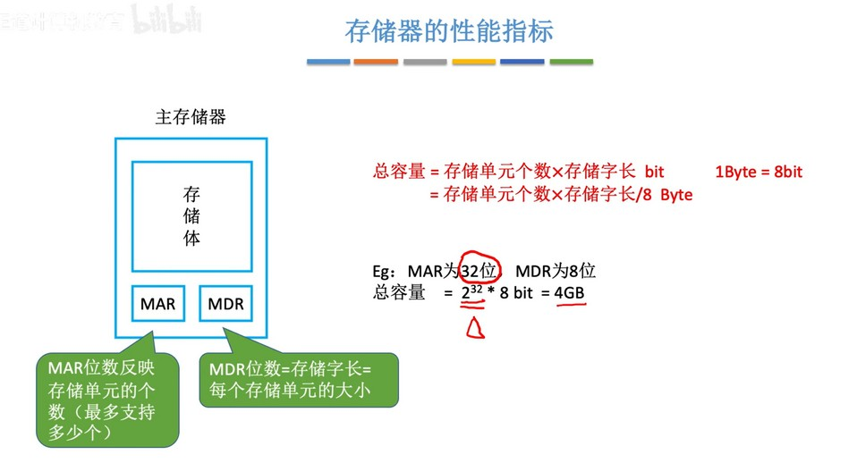
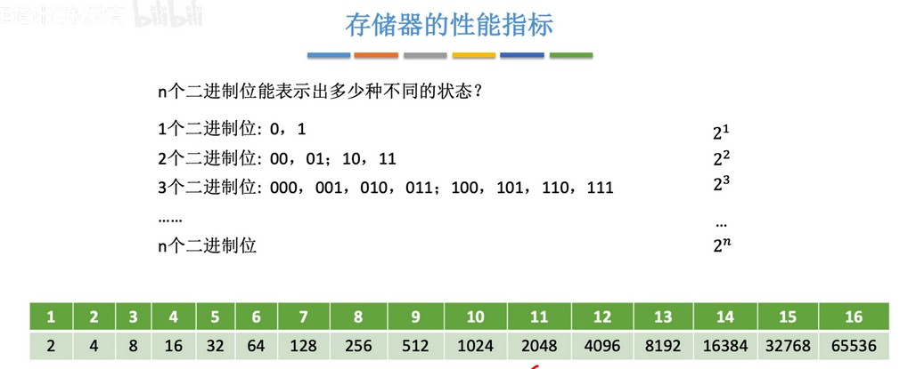
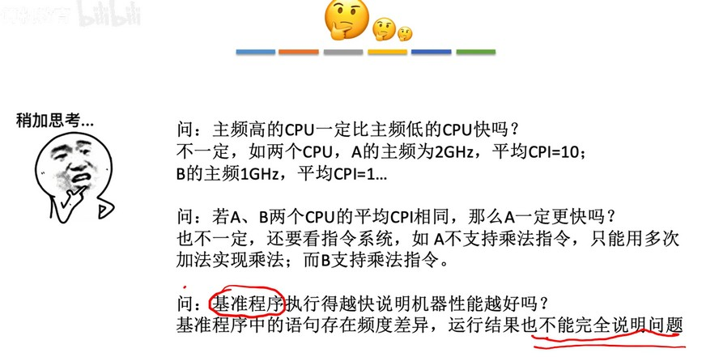

### 存储器的性能指标
  
MAR 和 MDR 决定了存储器的容量大小。

  

常用容量与二进制的关系：KB: $2^{10}$，MB: $2^{20}$，GB: $2^{30}$，TB: $2^{40}$

### CPU 的性能指标
  
1. 主频和时钟周期互为倒数关系。主频越高，时钟周期就越短，速度就越快。
2. 如主频为10Hz，表示每秒钟能发出10个脉冲信号。
3. 除了主频还有其它很多影响 CPU 性能的因素，如 CPI、IPS、FLOPS 等。

计算 CPU 执行时间的例题：
  

### 系统整体的性能指标
  
1. 如数据通路带宽为8bit，那么传输16bit数据就需要传输两次。
2. 比如淘宝每秒能处理的 http 请求数就是种吞吐量。

  
基准程序就是跑分软件。程序中会出现各种指令，然后根据这些指令处理的耗时来进行计算。

  

### 总结
  
