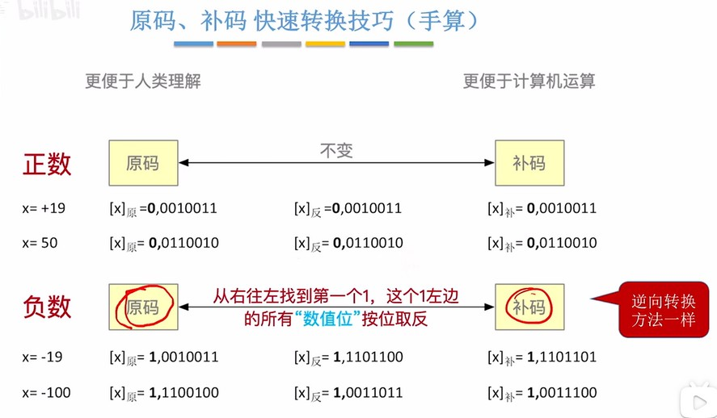
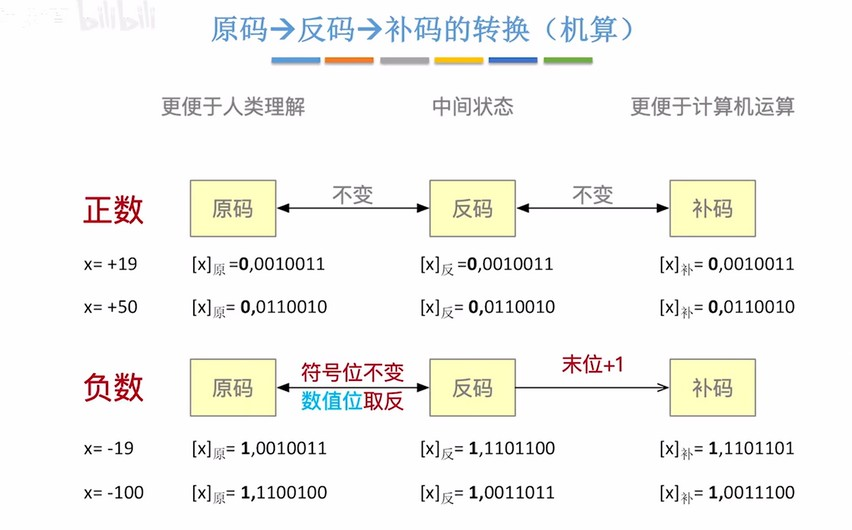
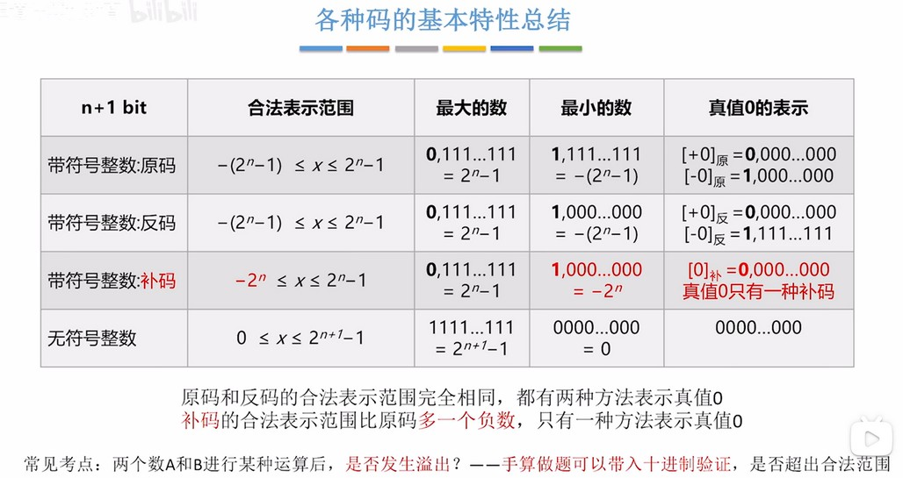

### 快速运算技巧
整数的原码、反码、补码都相同。负数的反码是符号位不变，其余位取反，补码是反码+1。还有个技巧是原码从右往左找到第一个1，这个1左边的除符号位都取反就是补码。那么负数的补码转原码也一样，找到第一个1，左边进行取反就是原码了。
  

  

两个数相加时，符号位需要参与运算。如果高位溢出，直接舍去。

  

  

### 关于-128
-128的补码是10000000，因为补码00000000表示0，用补码100000000表示-0吗？当然不可能，所以补码10000000就表示128。并且-128没有原码和反码，因为无法表示。
另外-127原码是11111111，反码是10000000，补码是10000001。那么-127-1就是-128，所以-128是：
-127+(-1)=10000001+(11111111)=110000000=10000000(去掉溢出的高位)。