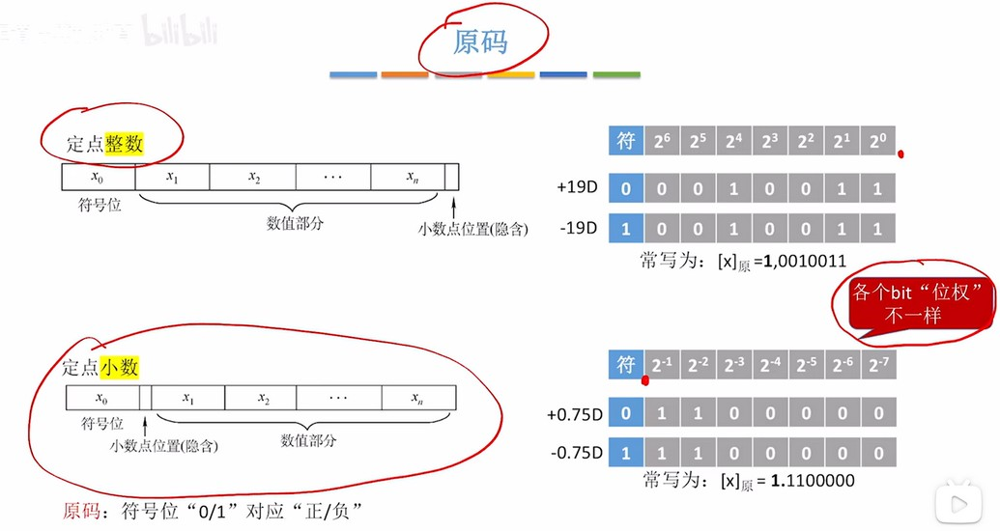

### 定点整数、定点小数
定点的意思是小数点的位置固定。整数可以看做是小数点定在最末尾。小数没有移码。小数点后面位代表的值是$2^{-1},2^{-2},2^{-n}$。
这里也就是小数在内存中的表现形式。
  

### 原码
  

### 反码和补码
和整数一样的运算方式。
  

### 定点小数的加减法
和整数也一样。
  

### 定点小数 vs 定点整数
  
定点小数最小值是-1。